# Glasses

*Eyewear from functional to fashionable.*

---

## Omega

**Name:** Omega

**Image Files:**

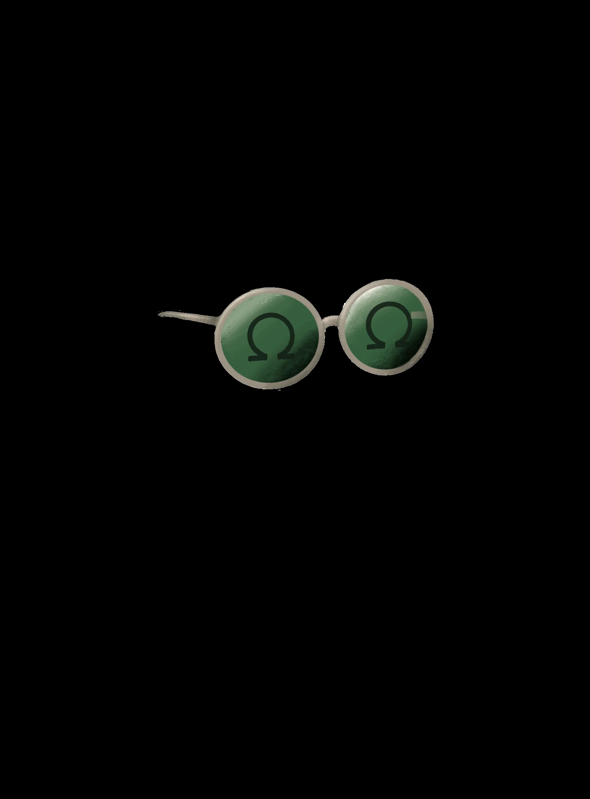

**Brief Visual Description:** Glasses with a hint of dark teal with Omega logos on them; a

horseshoe shape or an upside down ‘U’ with a flat top and two vertical legs going outwards at

the bottom.

**Reasoning for Inclusion within Mibera:** OlympusDAO in Berachain history. One of Bong

Bear’s traits.

**Date created / uploaded:** December 10, 2024

**General Real World Trait History:**

**Team Anecdotes:**

**Who Introduced the Trait:** Tez

**Trait Conflicts:**

**Resources / References:**

- https://discord.com/channels/1133935527855399053/1143683806981800030/11513135764311

94212

---

## Tekno 2

**Name:** Tekno 2

**Image Files:**

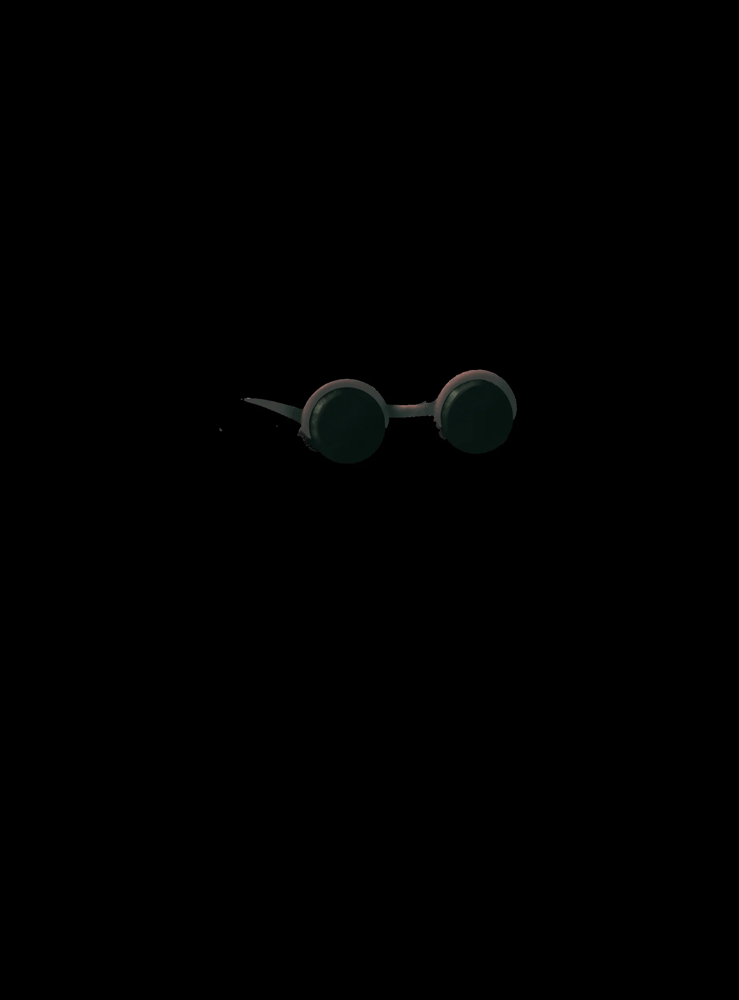

**Brief Visual Description:** Black retro round glasses, with pure black shades and rusty looking

frames in a very dark brown, framing half top part of the glasses..

**Reasoning for Inclusion within Mibera:**

**Date created / uploaded:** June 18, 2024

**General Real World Trait History:**

**Team Anecdotes:**

**Who Introduced the Trait:** Tez

**Archetype (if applicable):** Freetekno

**Trait Conflicts:**

**Sources:**

- https://discord.com/channels/1133935527855399053/1143360154734174308/11568383324211

20010

---

## Cyber Punk 1

**Name:** Cyber Punk 1

**Image Files:**

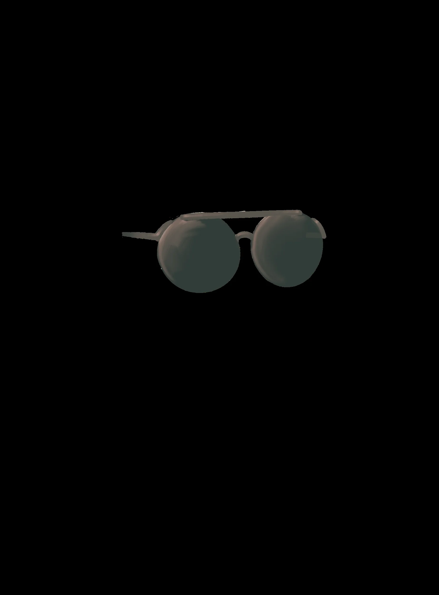

**Brief Visual Description:** Round glasses with a unique framing of a straight line only at the top

part acting as the bridge, and its temples. Both the framing and the shades are in similar shade

of dark grey.

**Reasoning for Inclusion within Mibera:**

**Date created / uploaded:** December 10, 2024

**General Real World Trait History:**

**Team Anecdotes:**

**Who Introduced the Trait:** Jani

**Archetype (if applicable):** Freetekno

**Trait Conflicts:**

---

## Rayban

**Name:** Rayban

**Image Files:**

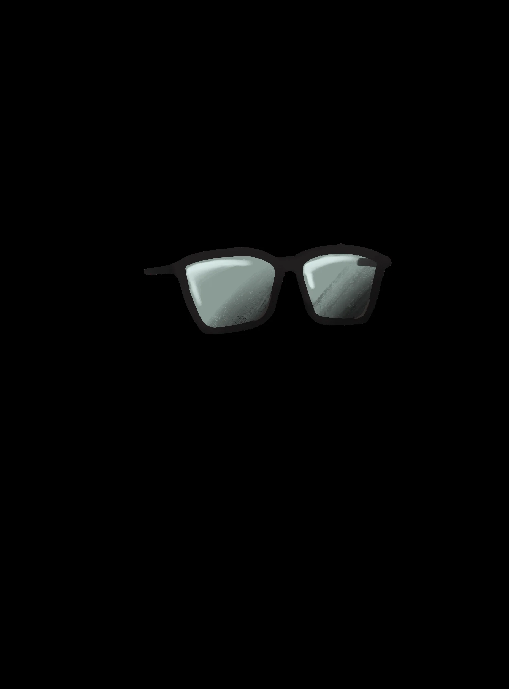

**Brief Visual Description:** Rectangular-shaped glasses with clear lenses and thick black

frames.

**Reasoning for Inclusion within Mibera:**

**Date created / uploaded:** June 18, 2024

**General Real World Trait History:** Ron Hardy

**Team Anecdotes:**

**Who Introduced the Trait:** Jani

**Archetype (if applicable):** Chicago Detroit

**Trait Conflicts:**

**Sources:**

- https://discord.com/channels/1133935527855399053/1143360212842061834/11608814206512

12840

- https://daily.redbullmusicacademy.com/2015/05/ron-hardy-at-the-music-box

- https://www.ray-ban.com/usa/electronics/RW4006ray-ban%20%7C%20meta%20wayfarer-black

/8056597769440

---

## Magenta Glow

**Name:** Magenta Glow

**Image Files:**

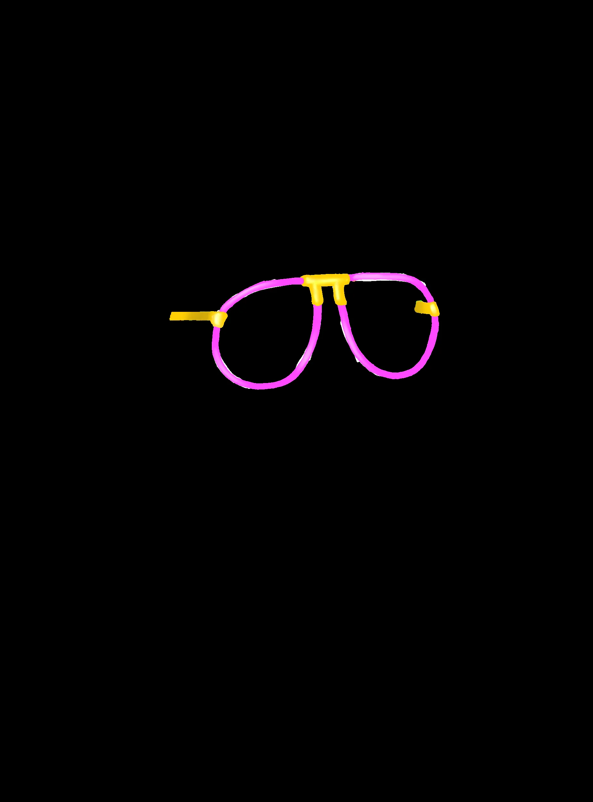

**Brief Visual Description:** Glow glasses mainly in magenta, with yellow parts on its bridge and

temples.

**Reasoning for Inclusion within Mibera:** Glow sticks being a big part of 90s rave culture,

aligning with Mibera’s.

**Date created / uploaded:** June 18, 2024

**General Real World Trait History:**

**Team Anecdotes:**

**Who Introduced the Trait:** Tez

**Archetype (if applicable):** Chicago Detroit

**Trait Conflicts:**

**Sources:**

- https://www.vice.com/en/article/the-ten-weirdest-90s-rave-customs-according-to-slipmatt/

---

## Mottega Blue

**Name:** mottega blue

**Image Files:**

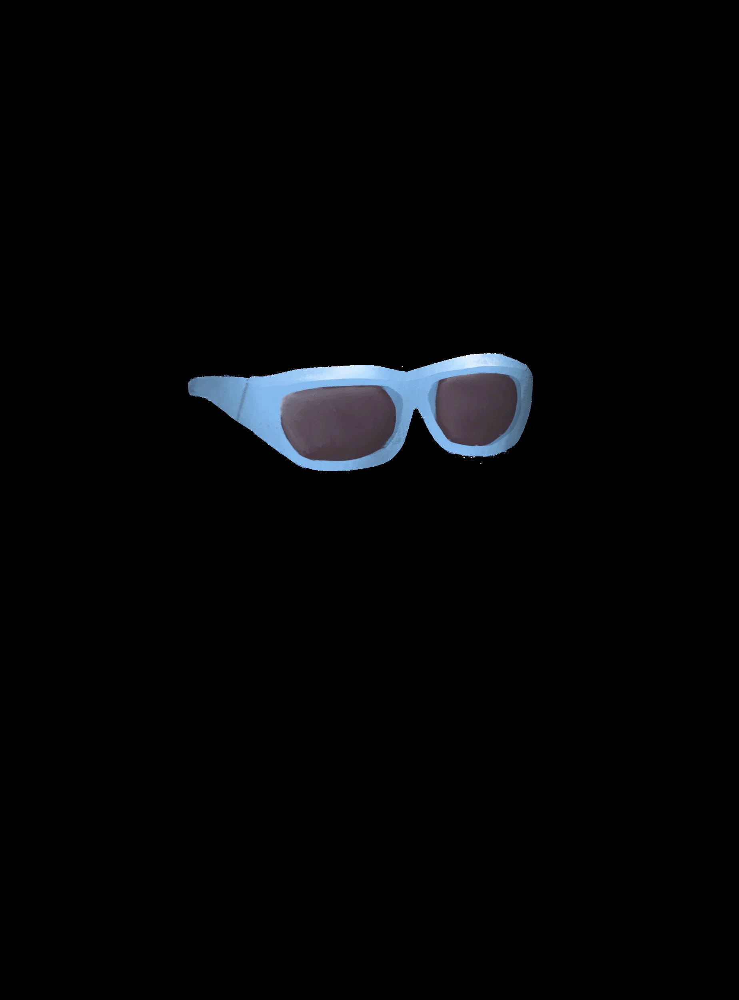

**Brief Visual Description:** Glasses with light blue lenses and thick blue frames.

**Reasoning for Inclusion within Mibera:** This is an existing trait within Milady Maker.

**Date created / uploaded:** June 5, 2024

**General Real World Trait History:**

**Team Anecdotes:**

**Who Introduced the Trait:** Gumi

**Archetype (if applicable):** Milady

**Trait Conflicts:**

---

## Harajuku

**Name:** Harajuku

**Image Files:**

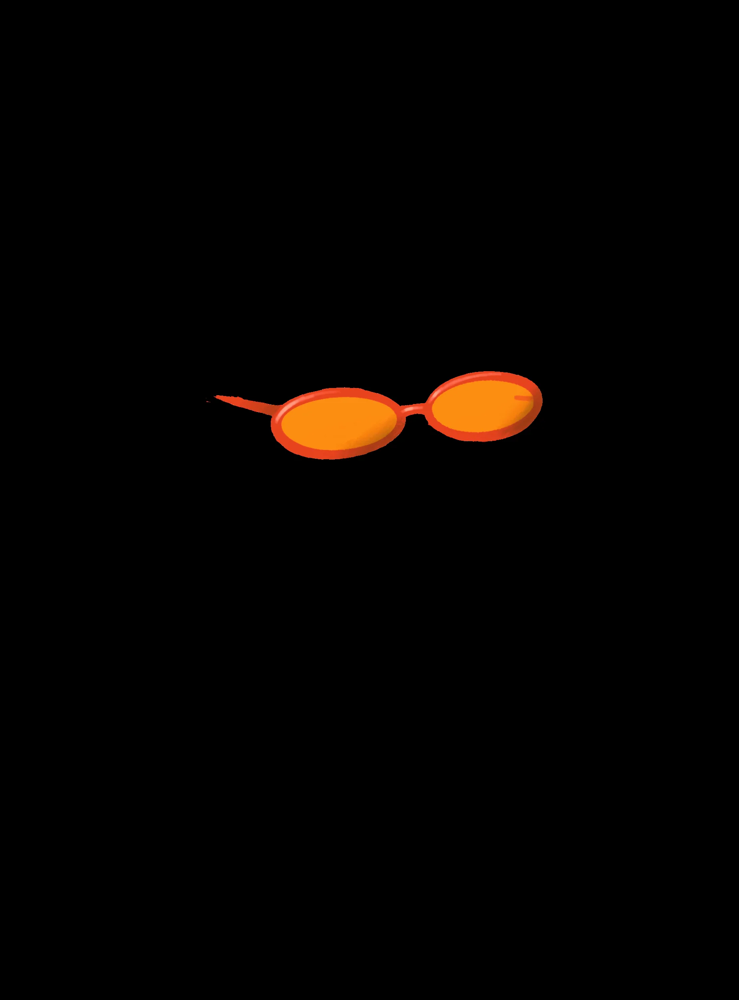

**Brief Visual Description:** red frames with orange lenses.

**Reasoning for Inclusion within Mibera:** This is an existing Milady Maker trait.

**Date created / uploaded:** June 16, 2024

**General Real World Trait History:**

**Team Anecdotes:**

**Who Introduced the Trait:** Tez

**Archetype (if applicable):** Milady

**Trait Conflicts:**

---

## Red Glow

**Name:** Red Glow

**Image Files:**

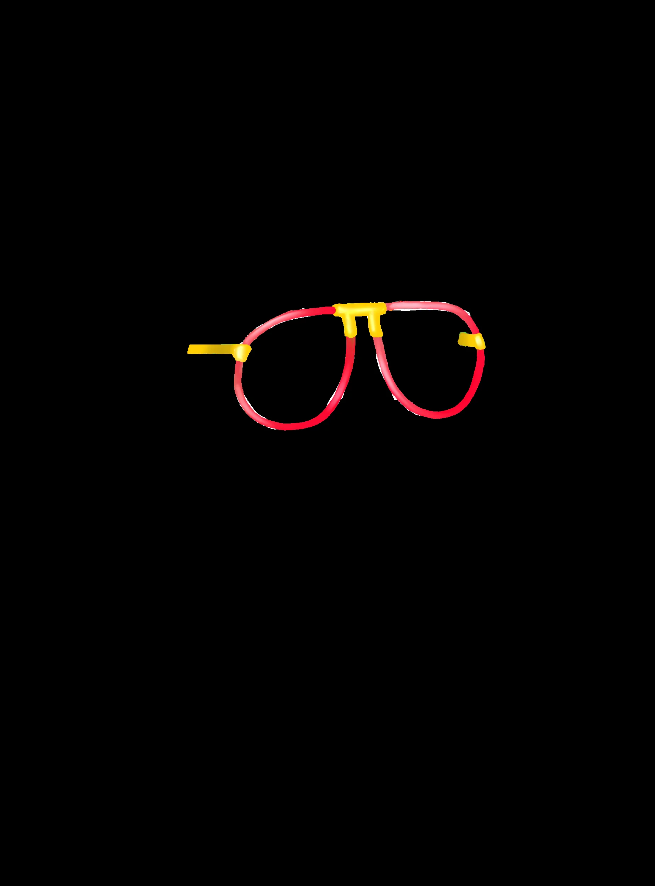

**Brief Visual Description:** Glow glasses mainly in red, with yellow on the center and sides.

**Reasoning for Inclusion within Mibera:** Glow sticks being a big part of 90s rave culture,

aligning with Mibera’s.

**Date created / uploaded:** June 18, 2024

**General Real World Trait History:**

**Team Anecdotes:**

**Who Introduced the Trait:** Tez

**Archetype (if applicable):** Chicago Detroit

**Trait Conflicts:**

**Sources:**

- https://www.vice.com/en/article/the-ten-weirdest-90s-rave-customs-according-to-slipmatt/

---

## Black Scifi

**Name:** Black Scifi

**Image Files:**

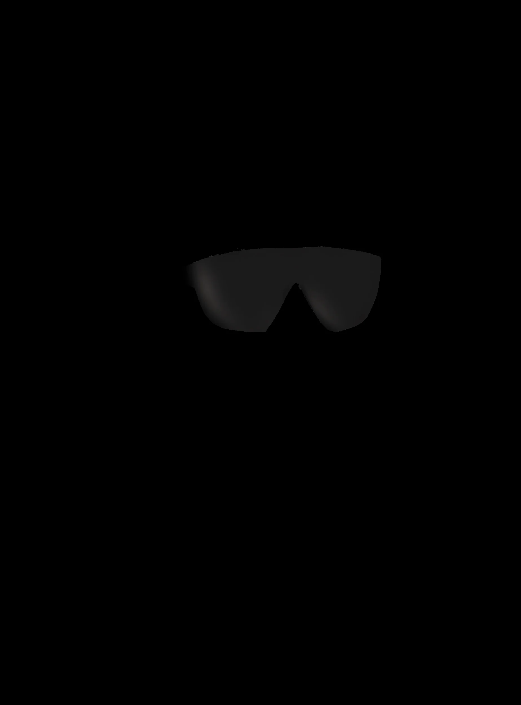

**Brief Visual Description:** all-black glasses with slightly curved top-framing and triangular cut at

the middle bottom part.

**Reasoning for Inclusion within Mibera:** Its relation to the house music history in Chicago,

highlighting the birth of the first female DJ in Chicago’s house scene.

**Date created / uploaded:** June 18, 2024

**General Real World Trait History:** The Chosen Few DJs, Lori Branch.

**Team Anecdotes:**

**Who Introduced the Trait:** Jani

**Archetype (if applicable):** Chicago detroit

**Trait Conflicts:**

- https://discord.com/channels/1133935527855399053/1143360212842061834/11608863263049

85178

- https://www.312soul.com/1984-1990

**Summary:**

The article focuses on the history of house music in Chicago from 1985 to 1990. Highlighting the

genre's development, key figures like Larry Heard (Mr. Fingers) who pioneered deep house, and

the emergence of sub-genres like soulful house and acid house. It also recognizes Lori Branch,

the first female DJ in Chicago’s house scene, and her contributions.

It is part of a broader retrospective on Chicago’s Black music history.

---

## Red Sunglasses

**Name:** Red Sunglasses

**Image Files:**

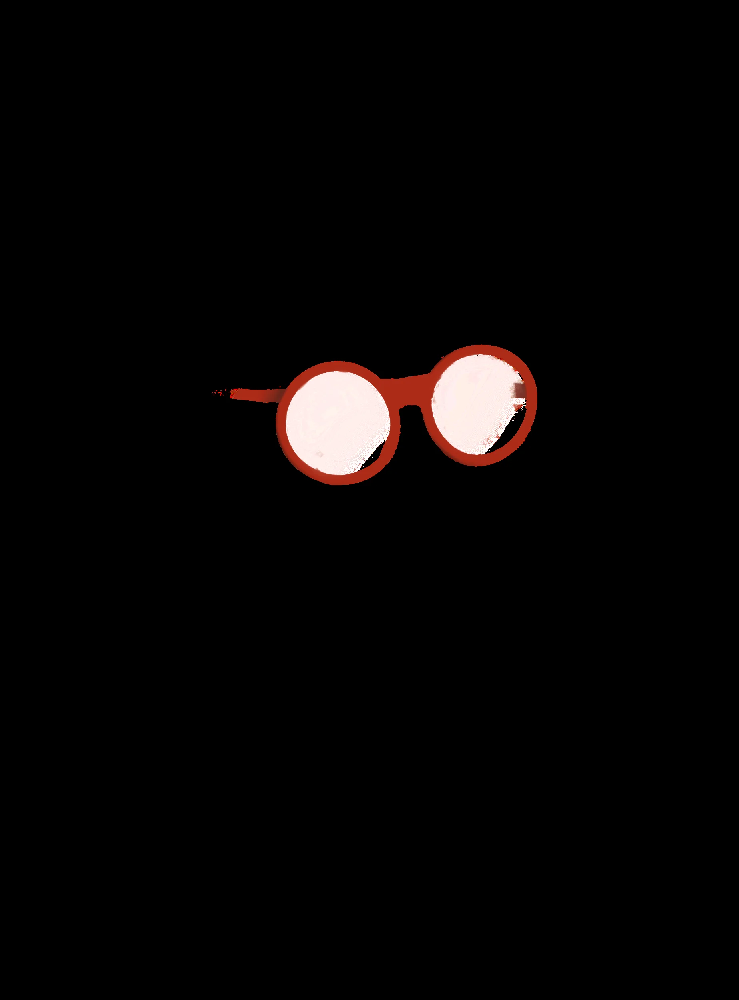

**Brief Visual Description:** Round transparent sunglasses with a thin red framing.

**Reasoning for Inclusion within Mibera:**

**Date created / uploaded:** December 10, 2024

**General Real World Trait History:**

**Team Anecdotes:**

**Who Introduced the Trait:** Jani

**Archetype (if applicable):** Chicago Detroit

**Trait Conflicts:**

- https://discord.com/channels/1133935527855399053/1143360212842061834/11608841784270

56219

- https://ra.co/features/1597

**Summary:**

The article explores the origins and heyday of The Warehouse, a legendary Chicago nightclub

pivotal to the development of house music. The article details how the venue, active in the late

1970s and 1980s, became the namesake for the genre through its innovative DJ performances

and vibrant dance culture.

---

## Sunnies

**Name:** Sunnies

**Image Files:**

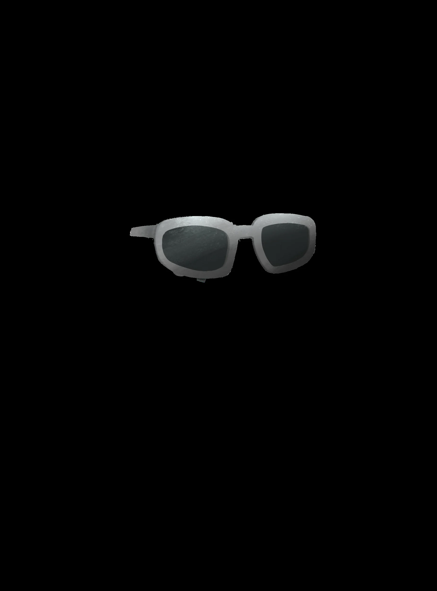

**Brief Visual Description:** Triangle-shaped glasses with grey lenses and grey frames

**Reasoning for Inclusion within Mibera:**

**Date created / uploaded:** December 10, 2024

**General Real World Trait History:**

**Team Anecdotes:**

**Who Introduced the Trait:** Tez

**Archetype (if applicable):** acidhouse

**Trait Conflicts:**

- https://discord.com/channels/1133935527855399053/1139903294219759730/11404782576245

26909

(not sure if it’s the same sunnies, but i’m assuming it is for now)

---

## Cyber Punk 2

**Name:** Cyber Punk 2

**Image Files:**

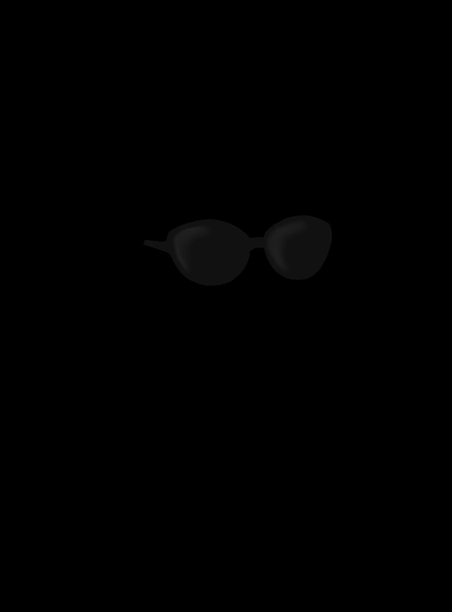

**Brief Visual Description:** All-black cyberpunk style glasses

**Reasoning for Inclusion within Mibera:**

**Date created / uploaded:** June 18, 2024

**General Real World Trait History:**

**Team Anecdotes:**

**Who Introduced the Trait:**

**Archetype (if applicable):** Freetekno

**Trait Conflicts:**

---

## Round

**Name:** Round

**Image Files:**

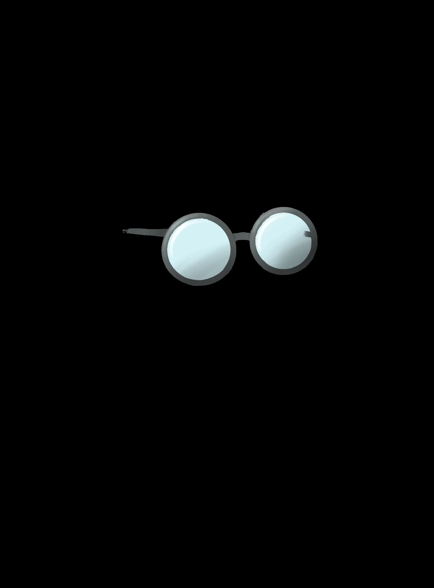

**Brief Visual Description:** Silver, circular framed glasses with clear lenses.

**Reasoning for Inclusion within Mibera:**

**Date created / uploaded:** June 18, 2024

**General Real World Trait History:**

**Team Anecdotes:**

**Who Introduced the Trait:**

**Archetype (if applicable):** Acidhouse

**Trait Conflicts:**

---

## Purple Glow

**Name:** Purple Glow

**Image Files:**

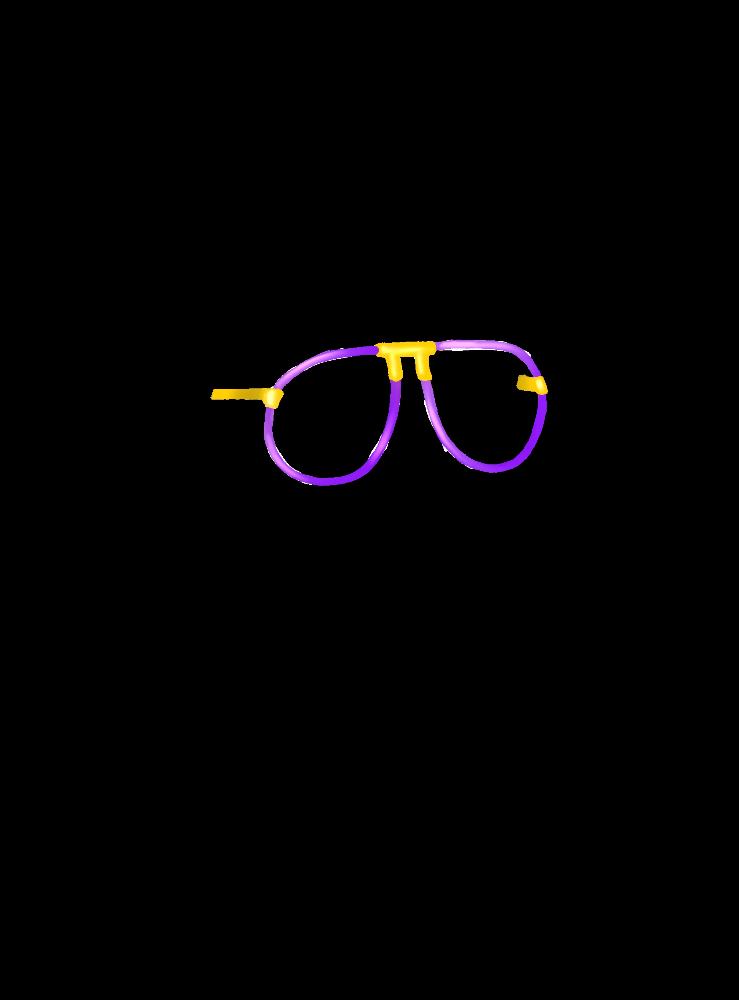

**Brief Visual Description:** Glow glasses mainly in purple, with yellow on the center and sides.

**Reasoning for Inclusion within Mibera:** glow sticks being a big part of 90s rave culture,

aligning with Mibera’s.

**Date created / uploaded:** June 18, 2024

**General Real World Trait History:**

**Team Anecdotes:**

**Who Introduced the Trait:** Tez

**Archetype (if applicable):** Chicago Detroit

**Trait Conflicts:**

**Sources:**

- https://www.vice.com/en/article/the-ten-weirdest-90s-rave-customs-according-to-slipmatt/

---

## YY

**Name:** YY

**Image Files:**

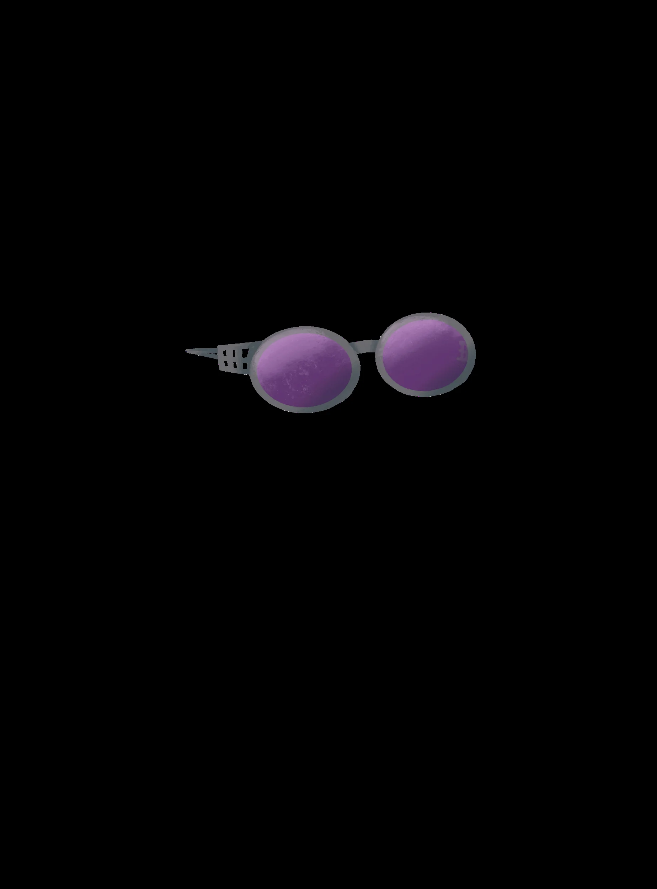

**Brief Visual Description:** Dark shades of purple glasses with dark grey framing.

**Reasoning for Inclusion within Mibera:**

**Date created / uploaded:** June 17, 2024

**General Real World Trait History:**

**Team Anecdotes:**

**Who Introduced the Trait:** Gumi

**Archetype (if applicable):** Milady

**Trait Conflicts:**

---

## Reflections

**Name:** Reflections

**Image Files:**

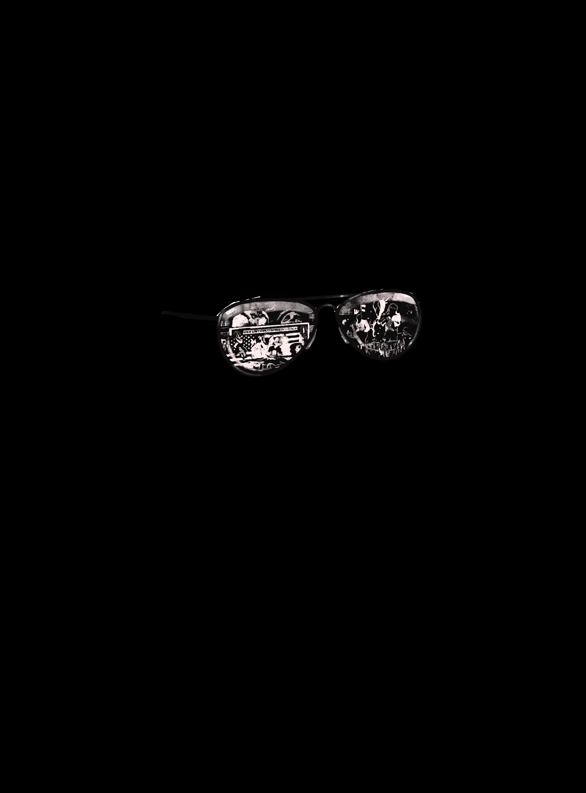

**Brief Visual Description:** Classic aviator with black and white reflections on its lenses and thin

black frames.

**Reasoning for Inclusion within Mibera:**

**Date created / uploaded:** August 3rd, 2024

**General Real World Trait History:**

**Team Anecdotes:**

**Who Introduced the Trait:**

**Archetype (if applicable):** Chicago Detroit

**Trait Conflicts:**

---

## star goggles

**Name:** Star Goggles

**Image Files:**

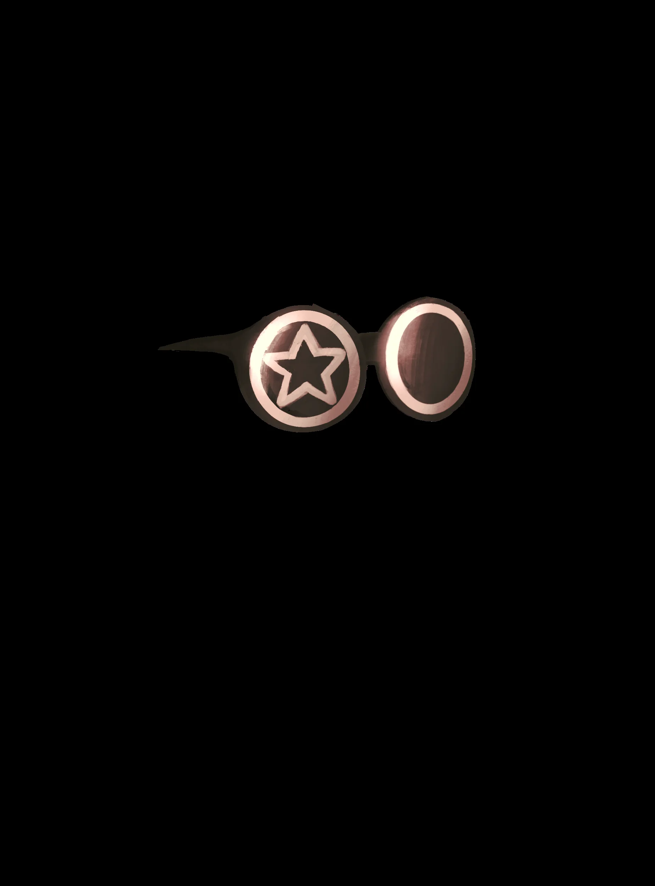

**Brief Visual Description:** Black goggles with a white star on one side.

**Reasoning for Inclusion within Mibera:**

**Date created / uploaded:** June 16, 2024

**General Real World Trait History:**

**Team Anecdotes:**

**Who Introduced the Trait:** Tez

**Archetype (if applicable):** Freetekno

**Trait Conflicts:**

**Source:**

- https://discord.com/channels/1133935527855399053/1143683806981800030/11436875916449

05513

---

## black white sunglasses

**Name:** black white sunglasses

**Image Files:**

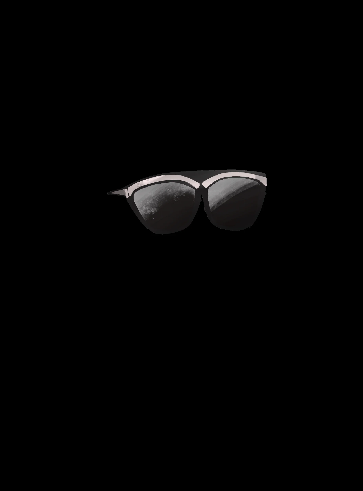

**Brief Visual Description:** a pair of sleek black sunglasses with a hint of white on the top frame.

**Reasoning for Inclusion within Mibera:**

**Date created / uploaded:** June 18, 2024

**General Real World Trait History:**

**Team Anecdotes:**

**Who Introduced the Trait:**

**Archetype (if applicable):** chicago detroit

**Trait Conflicts:**

---

## Tactical

**Name:** tactical

**Image Files:**

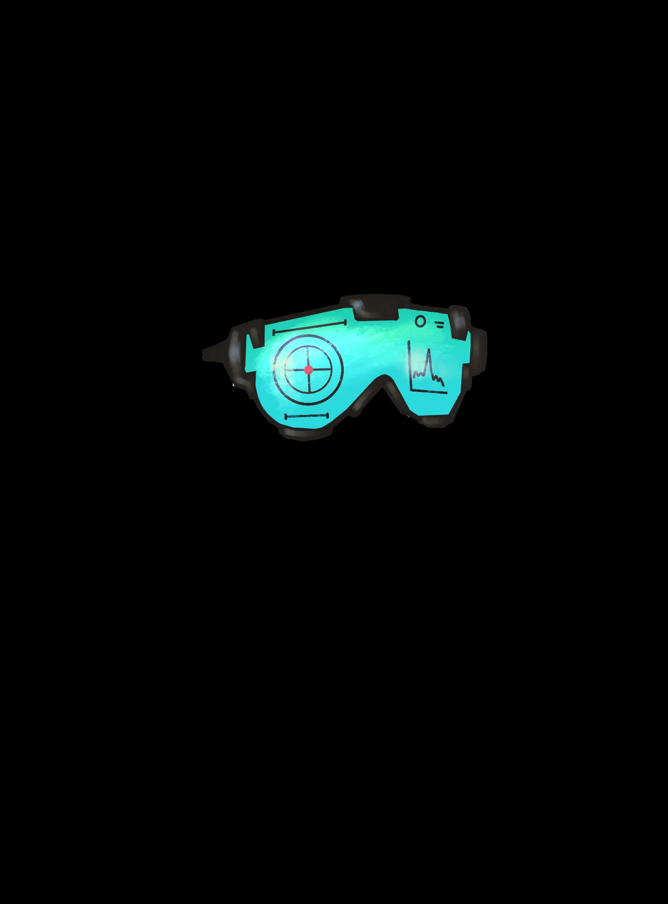

**Brief Visual Description:** big turquoise visor with stats / readings on it, in black framing.

**Reasoning for Inclusion within Mibera:** Based on a Bong Bear’s trait / art tactical glasses.

**Date created / uploaded:** December 10, 2024

**General Real World Trait History:**

**Team Anecdotes:**

**Who Introduced the Trait:** Tez

**Archetype (if applicable):** Milady

**Trait Conflicts:**

**Sources / References:**

- https://discord.com/channels/1133935527855399053/1143683806981800030/11516747625951

47786

---

## tekno 1

**Name:** tekno 1

**Image Files:**

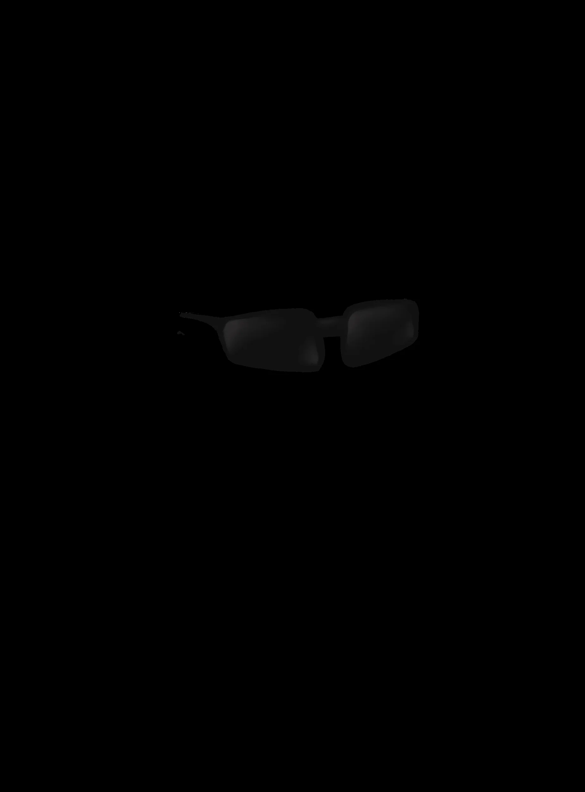

**Brief Visual Description:** all-black round glasses.

**Reasoning for Inclusion within Mibera:**

**Date created / uploaded:** June 18, 2024

**General Real World Trait History:**

**Team Anecdotes:**

**Who Introduced the Trait:**

**Archetype (if applicable):** freetekno

**Trait Conflicts:**

---

## mottega yellow

**Name:** Mottega Yellow

**Image Files:**

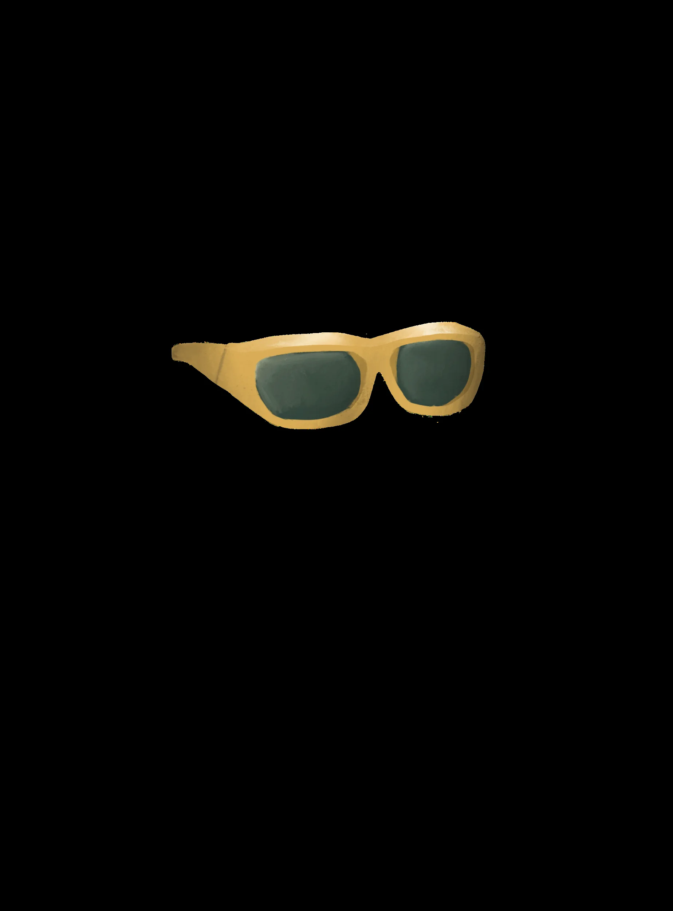

**Brief Visual Description:** Glasses with dark lenses and thick yellow frames.

**Reasoning for Inclusion within Mibera:** This trait is “invisible” in the original Milady collection.

https://opensea.io/collection/milady?traits=%5B%7B%22traitType%22:%22Glasses%22,%22val

**ues%22:** %5B%22mottega+sunglasses+yellow%22%5D%7D%5D

**Date created / uploaded:** June 5, 2024

**General Real World Trait History:** Inspired trait from the Milady Maker NFT collection.

**Team Anecdotes:**

**Who Introduced the Trait:** Gumi

**Archetype (if applicable):** Milady

**Trait Conflicts:**

**Sources:**

https://opensea.io/collection/milady?traits=[{%22traitType%22:%22Glasses%22,%22values%22

**:** [%22mottega%20sunglasses%20yellow%22]}]

---

## 3d

**Name:** 3D

**Image Files:**

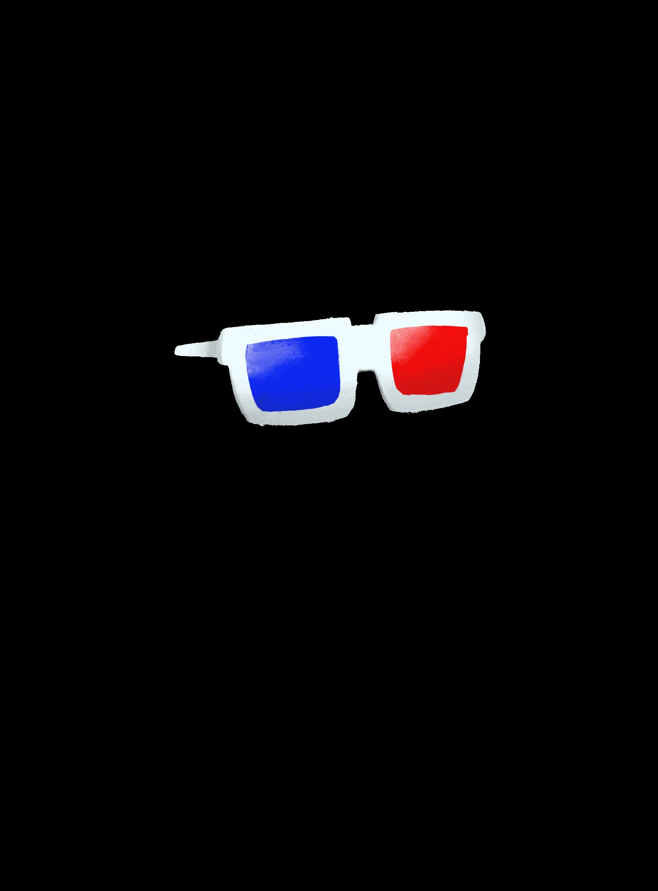

**Brief Visual Description:** Flimsy glasses with white frames. Left frame is blue and right frame

is red.

**Reasoning for Inclusion within Mibera:** One of Bong Bear traits.

**Date created / uploaded:** June 17, 2024

**General Real World Trait History:**

**Team Anecdotes:**

**Who Introduced the Trait:** Tez

**Archetype (if applicable):** Chicago Detroit

**Trait Conflicts:**

**Sources and References:**

- https://discord.com/channels/1133935527855399053/1143683806981800030/11513134432536

49528

---

## squad

**Name:** Squad

**Image Files:**

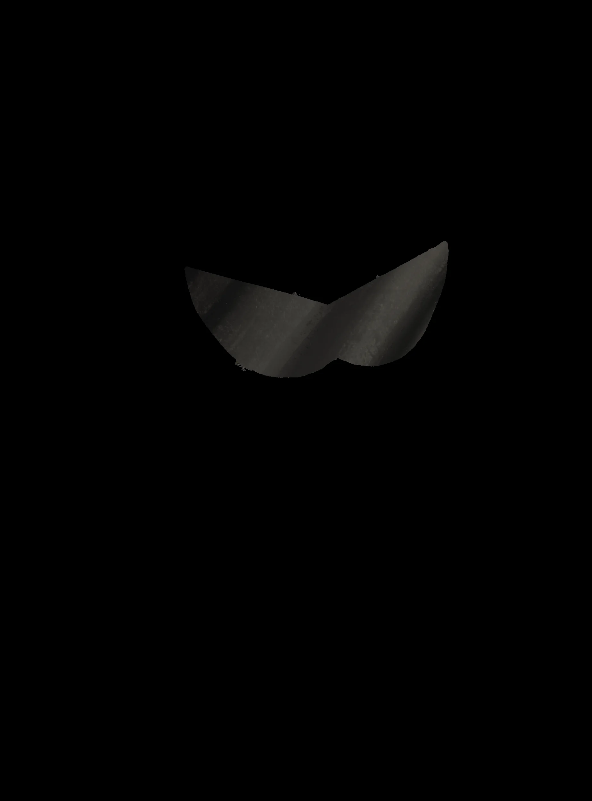

**Brief Visual Description:** Pointed all black sunglasses.

**Reasoning for Inclusion within Mibera:** Seen in the OG Bong Bears collection, on Beartull’s

1/1 - which appears to be a Squirtle itself.

- https://opensea.io/item/ethereum/0x495f947276749ce646f68ac8c248420045cb7b5e/66075445

032688988859229341194671037535804503065310441849644897976489592487937

**Date created / uploaded:** June 17, 2024

**General Real World Trait History:**

**Team Anecdotes:**

**Who Introduced the Trait:** Tez

**Archetype (if applicable):** Acidhouse

**Trait Conflicts:**

Sources / References

- https://discord.com/channels/1133935527855399053/1143683806981800030/11513139372755

72377

---

## snow goggles 2

**Name:** snow goggles 2

**Image Files:**

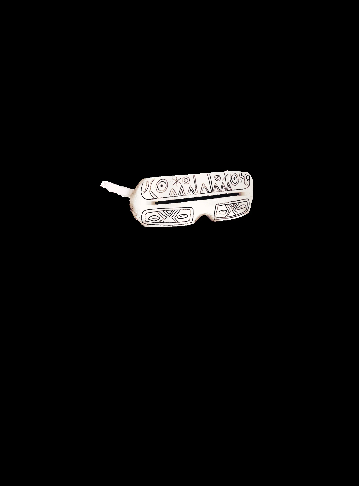

**Brief Visual Description:** white snow-goggles with thin opening in the middle and tribal art.

**Reasoning for Inclusion within Mibera:**

**Date created / uploaded:** December 10, 2024

**General Real World Trait History:**

**Team Anecdotes:**

**Who Introduced the Trait:**

**Archetype (if applicable):**

**Trait Conflicts:**

---

## Sick Sunglasses

**Name:** Sick Sunglasses

**Image Files:**

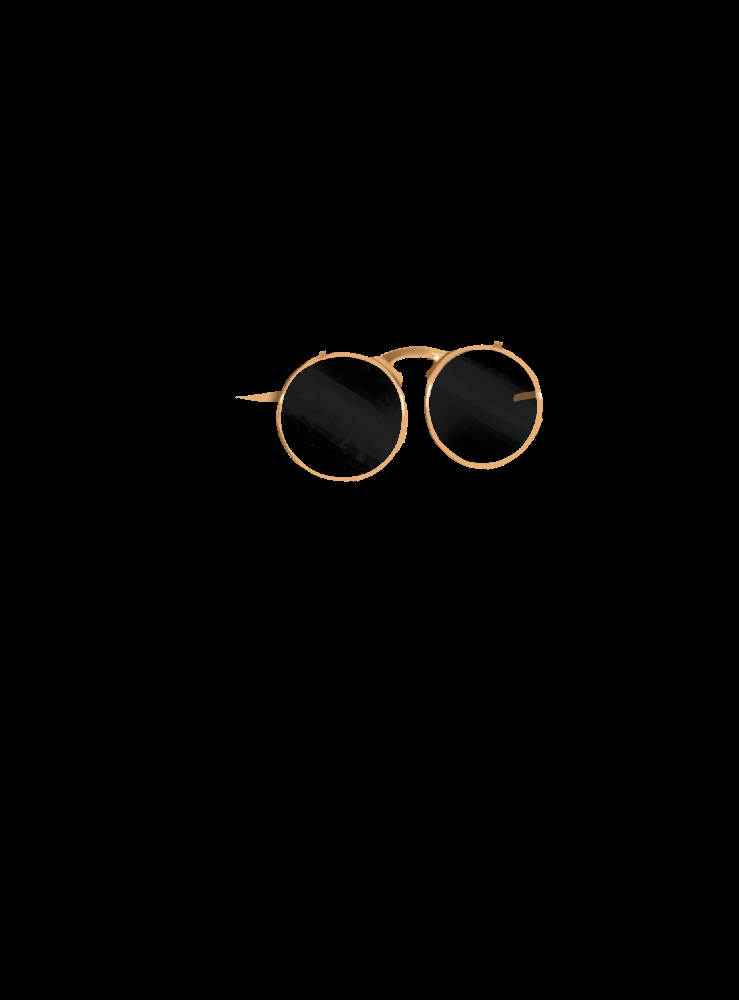

**Brief Visual Description:** Rounded glasses with slightly dark glasses and golden framing.

**Reasoning for Inclusion within Mibera:** music culture, and its association with Yung Singh

who was known for his underground performance with his Punjabi Garage mix as his main

niche.

**Date created / uploaded:** December 10, 2024

**General Real World Trait History:** Yung Singh

**Team Anecdotes:**

**Who Introduced the Trait:** Jani

**Archetype (if applicable):** Chicago Detroit

**Trait Conflicts:**

- https://earthackney.co.uk/performers/yung-singh/

---

## colourful

**Name:** Colorful

**Image Files:**

**Brief Visual Description:** Retro-style visor sunglasses in orange and yellow.

**Reasoning for Inclusion within Mibera:**

**Date created / uploaded:** December 10, 2024

**General Real World Trait History:**

**Team Anecdotes:**

**Who Introduced the Trait:** Tez

**Archetype (if applicable):** Milady

**Trait Conflicts:**

**Source / Reference:**

- https://discord.com/channels/1133935527855399053/1143683806981800030/11516747625951

47786

---

## Swimming Goggles

**Name:** Swimming Goggles

**Image Files:**

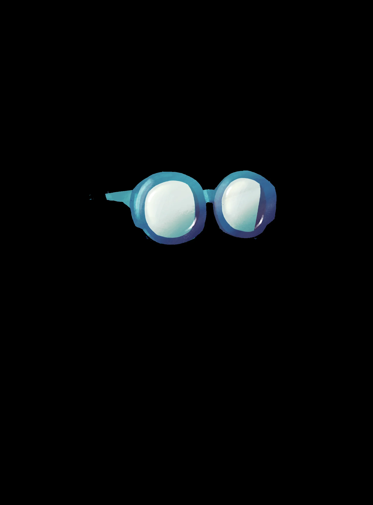

**Brief Visual Description:** Blue circular swimming goggles

**Reasoning for Inclusion within Mibera:**

**Date created / uploaded:** June 18, 2024

**General Real World Trait History:** 90s rave culture

**Team Anecdotes:**

**Who Introduced the Trait:** Fedor

**Archetype (if applicable):** Acidhouse

**Trait Conflicts:**

- https://discord.com/channels/1133935527855399053/1143685538075902095/11624257274555

96646

---

## prescription

**Name:** prescription

**Image Files:**

**Brief Visual Description:** oval-shaped glasses with clear lenses and black frames on the top

half.

**Reasoning for Inclusion within Mibera:**

**Date created / uploaded:** 18 June, 2024

**General Real World Trait History:**

**Team Anecdotes:**

**Who Introduced the Trait:**

**Archetype (if applicable):** chicago detroit.

**Trait Conflicts:**

---

## spy

**Name:** spy

**Image Files:**

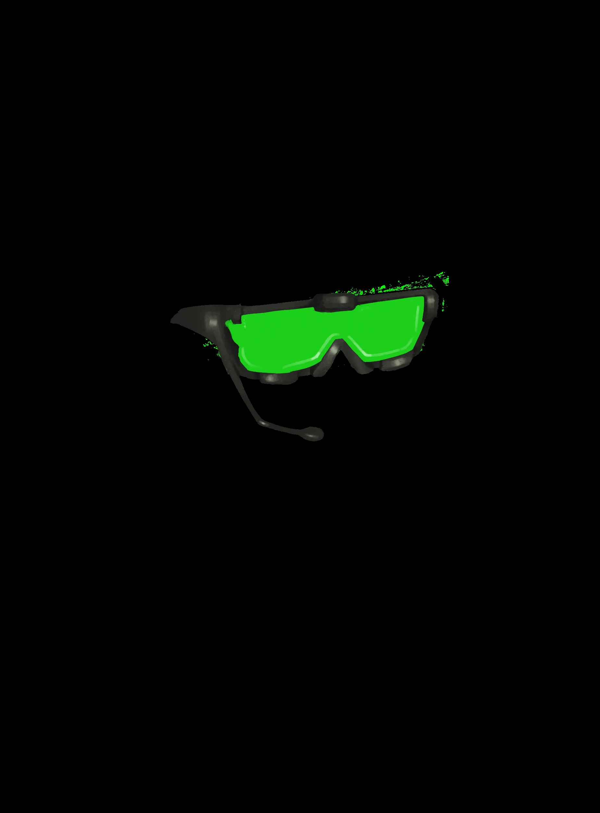

**Brief Visual Description:** big sunglasses with vibrant green lenses and thick black frames, with

a mic attached on one side.

**Reasoning for Inclusion within Mibera:**

**Date created / uploaded:** June 16, 2024

**General Real World Trait History:**

**Team Anecdotes:**

**Who Introduced the Trait:** tez / gumi

**Archetype (if applicable):** milady

**Trait Conflicts:**

---

## 96

**Name:** 96

**Image Files:**

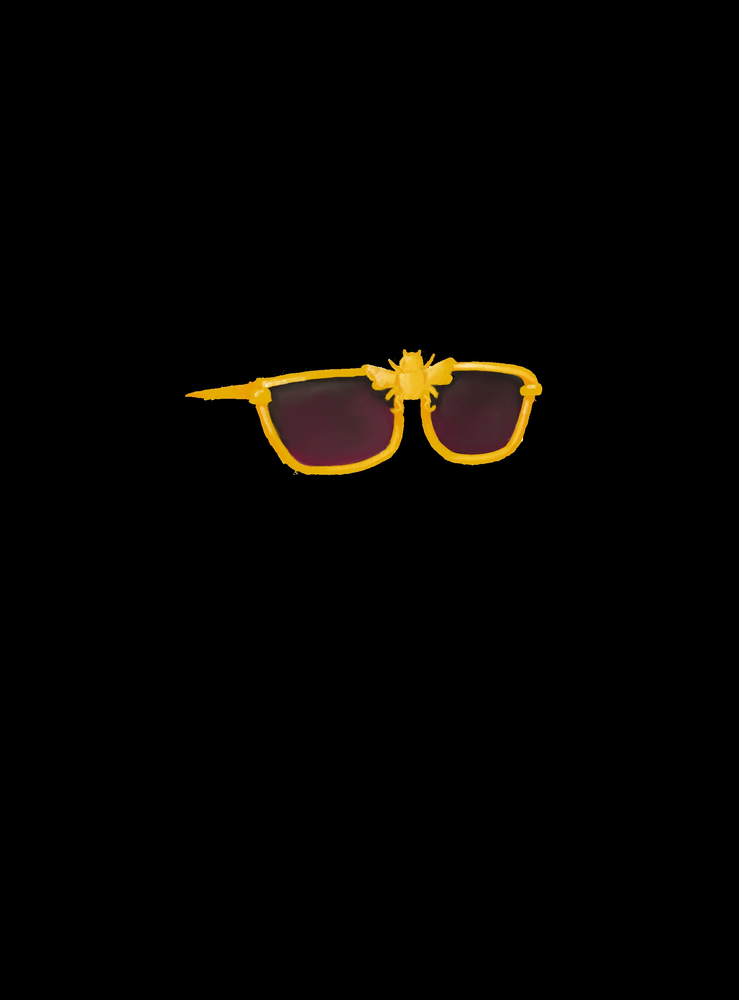

**Brief Visual Description:** square-shaped glasses with black lenses and golden rim, with a

bee-shaped visual in the center.

**Reasoning for Inclusion within Mibera:**

**Date created / uploaded:** June 17, 2024

**General Real World Trait History:** Jani’s number / House of 96 of the High Council 任侠団体 of

101 Bears.

**Team Anecdotes:**

**Who Introduced the Trait:**

**Archetype (if applicable):** chicago detroit

**Trait Conflicts:**

---

## snow goggles 1

**Name:** snow goggles 1

**Image Files:**

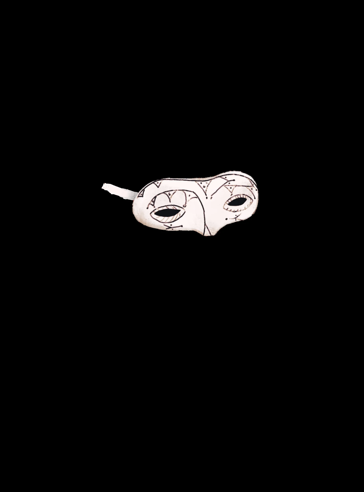

**Brief Visual Description:** white snow goggles with drawings that look like a mask / eye holes.

**Reasoning for Inclusion within Mibera:**

**Date created / uploaded:** December 10, 2024

**General Real World Trait History:**

**Team Anecdotes:**

**Who Introduced the Trait:**

**Archetype (if applicable):**

**Trait Conflicts:**

---

## scifi

**Name:** scifi

**Image Files:**

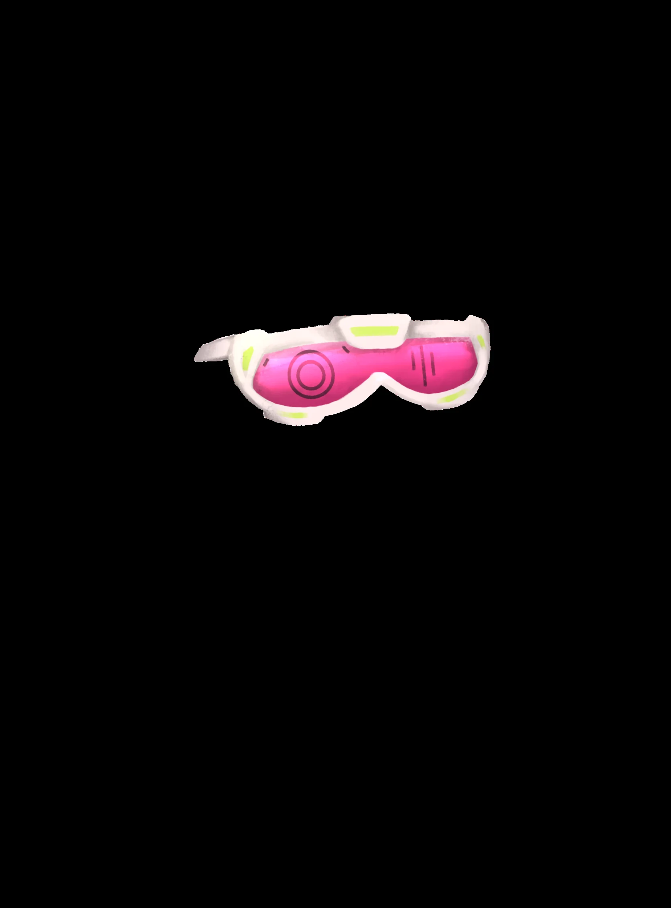

**Brief Visual Description:** hot-pink visor with thick white frames. Circles and lines can be seen

on the visor.

**Reasoning for Inclusion within Mibera:**

**Date created / uploaded:** December 10, 2024

**General Real World Trait History:**

**Team Anecdotes:**

**Who Introduced the Trait:**

**Archetype (if applicable):** milady

**Trait Conflicts:**

---

## big 80s

**Name:** big 80s

**Image Files:**

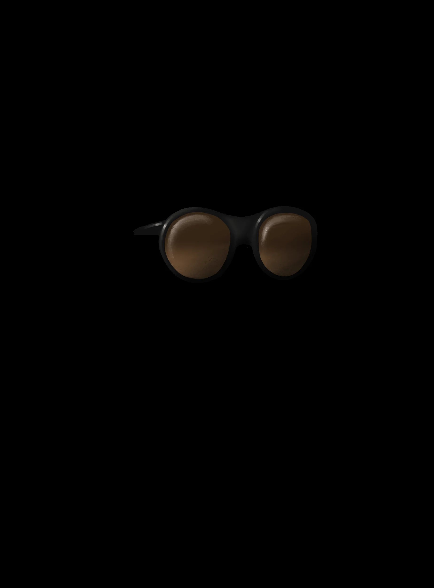

**Brief Visual Description:** big rounded 80s style glasses with black frames and dark brownish

lenses.

**Reasoning for Inclusion within Mibera:**

**Date created / uploaded:** June 18, 2024

**General Real World Trait History:**

**Team Anecdotes:**

**Who Introduced the Trait:**

**Archetype (if applicable):** chicago detroit.

**Trait Conflicts:**

- https://discord.com/channels/1133935527855399053/1143360212842061834/11608863263049

85178

- https://www.312soul.com/1984-1990

---

## blue glow

**Name:** Blue Glow

**Image Files:**

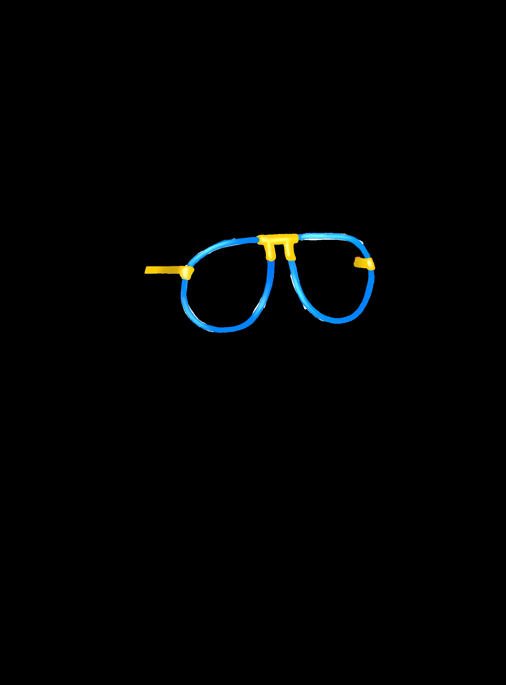

**Brief Visual Description:** Glow glasses mainly in neon blue, with yellow on the center and

sides.

**Reasoning for Inclusion within Mibera:**

**Date created / uploaded:** June 18, 2024

**General Real World Trait History:**

**Team Anecdotes:**

**Who Introduced the Trait:** Tez

**Archetype (if applicable):** Chicago Detroit

**Trait Conflicts:**

**Sources:**

- https://www.vice.com/en/article/the-ten-weirdest-90s-rave-customs-according-to-slipmatt/

---

## stars

**Name:** Stars

**Image Files:**

**Brief Visual Description:** Star-shaped rimless glasses in deep dark pink.

**Reasoning for Inclusion within Mibera:** One of Bong Bear’s traits.

**Date created / uploaded:** June 17, 2024

**General Real World Trait History:**

**Team Anecdotes:**

**Who Introduced the Trait:** Tez

**Archetype (if applicable):** Freetekno

**Trait Conflicts:**

**Sources / References:**

- https://discord.com/channels/1133935527855399053/1143683806981800030/11513134924444

63195

---

## green glow

**Name:** Green Glow

**Image Files:**

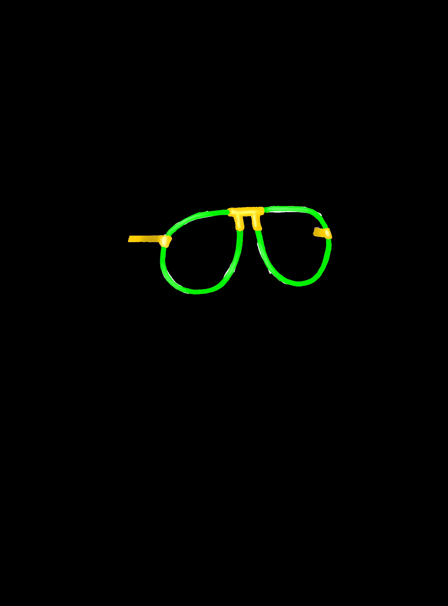

**Brief Visual Description:** Glow glasses mainly in neon green, with yellow on the center and

sides.

**Reasoning for Inclusion within Mibera:**

**Date created / uploaded:** June 18, 2024

**General Real World Trait History:**

**Team Anecdotes:**

**Who Introduced the Trait:** Tez

**Archetype (if applicable):** Chicago Detroit

**Trait Conflicts:**

**Sources:**

- https://www.vice.com/en/article/the-ten-weirdest-90s-rave-customs-according-to-slipmatt/

---

## d2 edamame

**Name:** d2 edamame

**Image Files:**

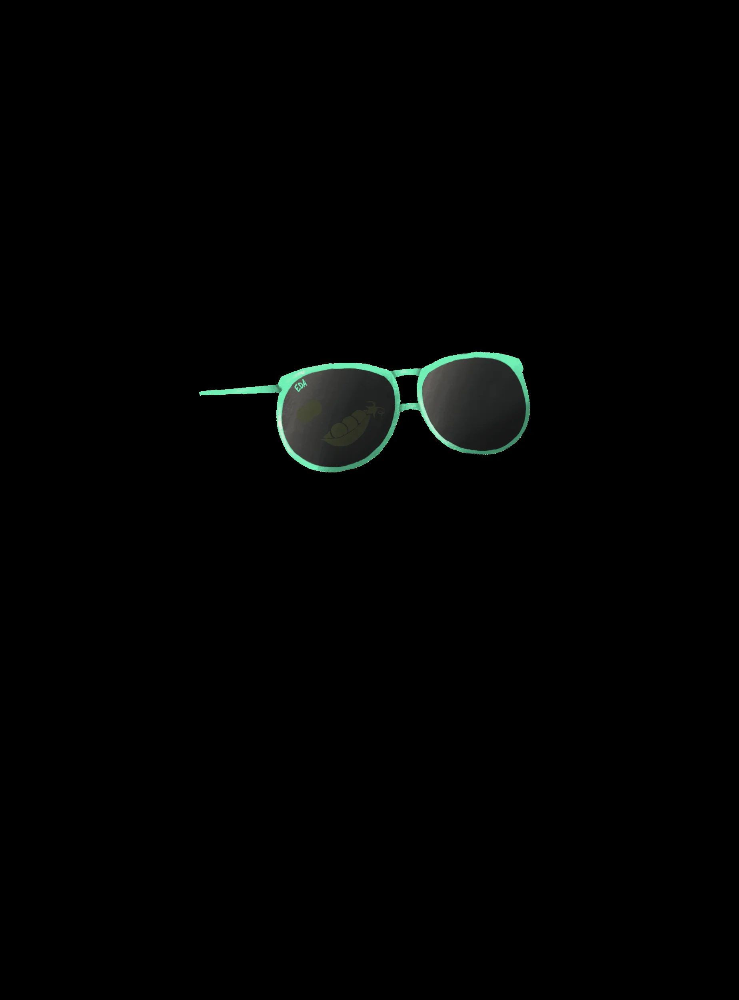

**Brief Visual Description:** aviator style glasses with light green framing and black lenses.

**Reasoning for Inclusion within Mibera:**

**Date created / uploaded:** February 28, 2024

**General Real World Trait History:**

**Team Anecdotes:**

**Who Introduced the Trait:**

**Archetype (if applicable):**

**Trait Conflicts:**

---

