# Masks

*Face coverings from ritual to rave.*

---

## Hiberanation Eye Mas

**Name:** Hiberanation Eye Mask

**Image Files:** SS3_chicagodetroit_Hiberanation Eye Mask.png

**Brief Visual Description:** Sleeping mask that looks like a sleeping bear; in brown, with two

closed eyes, two curved ears, and a snout. ‘zzz’ going upwards from the nose part of the mask.

**Dominant Colors:** Brown

**Reasoning for Inclusion within Mibera:**

**General Real World Trait History:**

**Team Anecdotes:**

**Date Created/Uploaded:** July 24, 2024

**Who Introduced the Trait:** Jani

**Trait Conflicts:**

**Ancestor (if applicable):**

**Archetype (if applicable):** Chicago Detroit

**Swag Score (if applicable):** 3

**Sources:**

- https://discord.com/channels/1133935527855399053/1161382544617508874/11634753275997

71679

- https://x.com/hiberanation

- https://x.com/retardglobal

**Summary:**

Hibernation operates as a Berachain-centric community initiative from Retard Global,

channeling a perpetual hibernation theme through bear emojis and sleep motifs.

---

## Nose Ring with Chain

**Name:** Nose Ring with Chain

**Image Files:**

**Brief Visual Description:** Two golden slim chains connected to a ring on one end..

**Dominant Colors:** Gold

**Reasoning for Inclusion within Mibera:** Rave culture as well as relevance to one of our

ancestors and archetypes.

**General Real World Trait History:** Grime, hip-hop, Punjabi garage party scene.

**Team Anecdotes:**

**Date Created/Uploaded:** June 19, 2024

**Who Introduced the Trait:** Jani

**Trait Conflicts:**

**Ancestor (if applicable):**

**Archetype (if applicable):** Milady

**Swag Score (if applicable):** 3

**Sources:**

- https://discord.com/channels/1133935527855399053/1160911774086873089/11609139145786

04133

---

## Black Mask

**Name:** Black Mask

**Image Files:**

**Brief Visual Description:** Black mask covering just the mouth and nose part..

**Dominant Colors:** Black.

**Reasoning for Inclusion within Mibera:**

**General Real World Trait History:** .

**Team Anecdotes:**

**Date Created/Uploaded:** July 24, 2024

**Who Introduced the Trait:** Jani

**Trait Conflicts:**

**Ancestor (if applicable):**

**Archetype (if applicable):** Freetekno

**Swag Score (if applicable):** 2

**Source:**

- https://discord.com/channels/1133935527855399053/1143684092467093684/11677936743069

81888

---

## Cypherpunk 3

**Name:** Cypherpunk 3

**Image Files:**

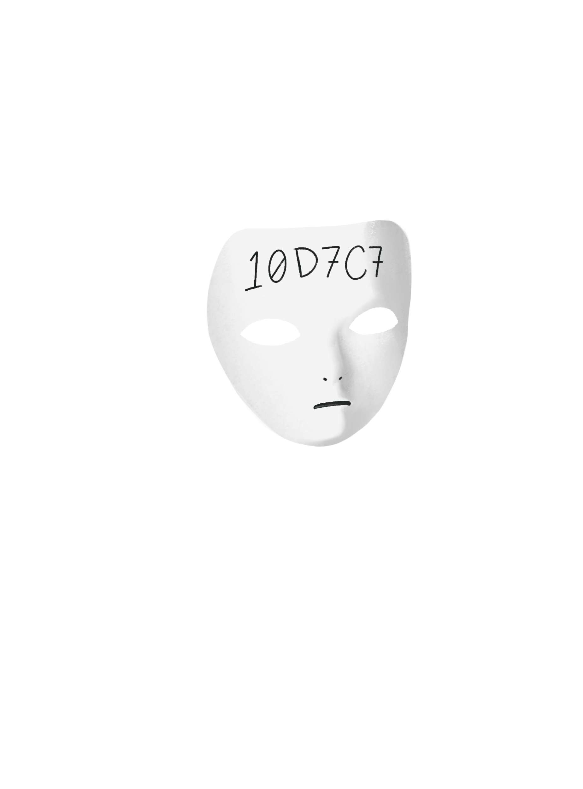

**Brief Visual Description:** White mask with ‘10D7C7’ written on the forehead.

**Dominant Colors:** White

**Reasoning for Inclusion within Mibera:**

**General Real World Trait History:** Cypherpunk; a movement of activists, technologists, and

cryptographers, originating in the late 1980s and formalized with the 1992 Cypherpunks mailing

list, who advocate for privacy and freedom through strong encryption and decentralized

technologies.

**Team Anecdotes:**

**Date Created/Uploaded:** July 17, 2024

**Who Introduced the Trait:** Jani

**Trait Conflicts:**

**Ancestor (if applicable):**

**Archetype (if applicable):**

**Swag Score (if applicable):** 3

**Sources:**

https://en.wikipedia.org/wiki/Cypherpunk#:~:text=A%20cypherpunk%20is%20one%20who,and

%20freedom%20from%20centralized%20authority.

**Summary:**

Cypherpunk is an individual who uses strong cryptography to enhance privacy and resist

surveillance, rooted in a libertarian philosophy that values decentralization and freedom from

centralized authority. The movement emerged in the late 1980s, gaining traction with the 1992

Cypherpunks mailing list, where activists and technologists discussed privacy tools and

strategies. It has influenced technologies like Bitcoin and Tor, emphasizing practical solutions

through coding over policy debates.

---

## Velvet

**Name:** Velvet

**Image Files:**

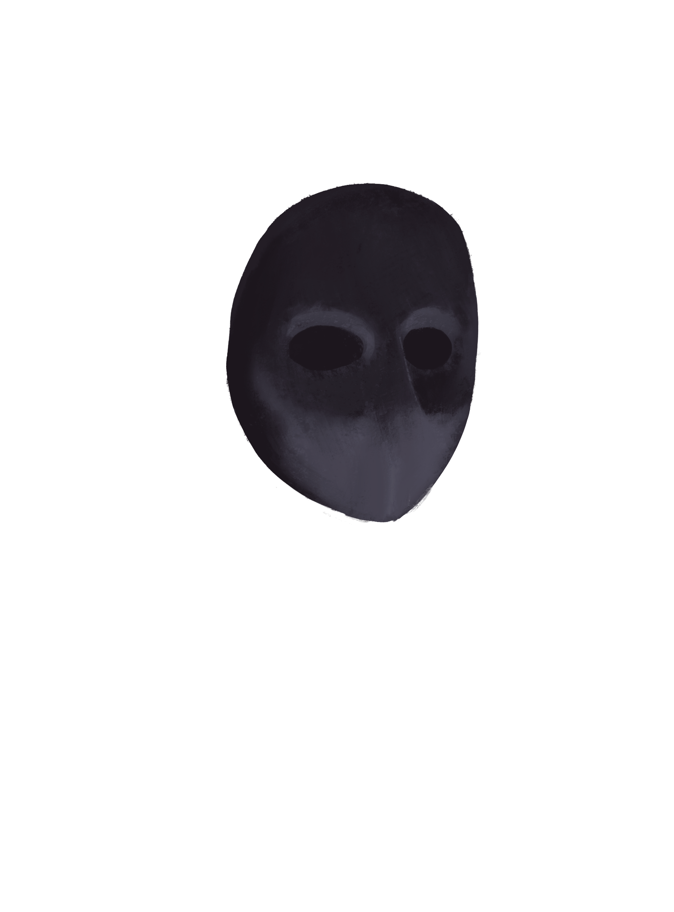

**Brief Visual Description:** Black full-face mask with velvet-y texture / complexion.

**Dominant Colors:** Black.

**Reasoning for Inclusion within Mibera:**

**General Real World Trait History:** Cyberphunk, Tim May (?).

**Team Anecdotes:**

**Date Created/Uploaded:** December 9, 2024

**Who Introduced the Trait:** Jani

**Trait Conflicts:**

**Ancestor (if applicable):**

**Archetype (if applicable):**

**Swag Score (if applicable):** 3

---

## Golden Anonymous

**Name:** Golden Anonymous

**Image Files:**

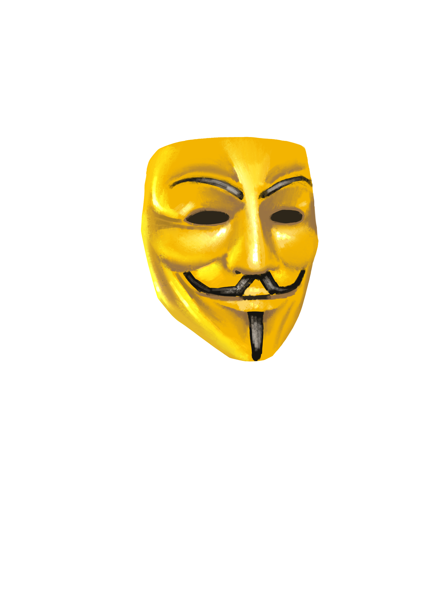

**Brief Visual Description:** Golden ‘anonymous’ mask, with 2 eyeholes, defined nose, thin

eyebrows, and thin mustache.

**Dominant Colors:** Golden, black.

**Reasoning for Inclusion within Mibera:**

**General Real World Trait History:** Illegal Covid Rave

**Team Anecdotes:**

**Date Created/Uploaded:** July 27, 2024

**Who Introduced the Trait:** Jani

**Trait Conflicts:**

**Ancestor (if applicable):**

**Archetype (if applicable):** Chicago Detroit

**Swag Score (if applicable):** 4

**Sources:**

- https://discord.com/channels/1133935527855399053/1161382544617508874/11634742480991

68318

- https://www.youtube.com/watch?si=rKiGvv2qJJBgoV4i&t=1&v=J8OzngEPGL0&feature=youtu.b

e

---

## Venetian Black

**Name:** Venetian Black

**Image Files:**

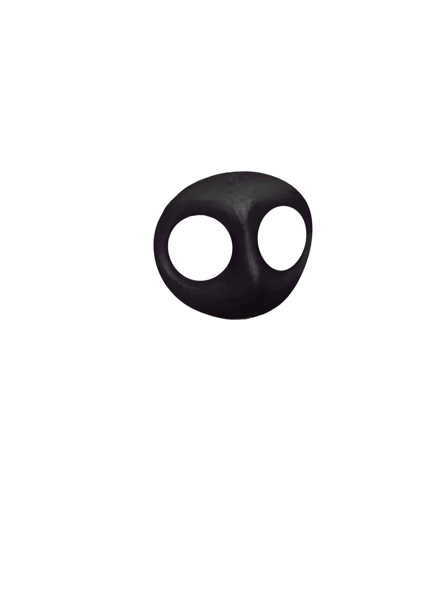

**Brief Visual Description:** Rounded black mask with much bigger eyeholes compared to usual

masks.

**Dominant Colors:** Black.

**Reasoning for Inclusion within Mibera:**

**General Real World Trait History:** The Moretta mask, is a traditional Venetian mask historically

reserved for women, popular in 18th-century Venice. Made of black velvet and round in shape,

also known as the "muta," it fully conceals the wearer’s face, symbolizing seduction and

mystery. Held in place by a button bitten by the teeth, it silenced the wearer, adding to its

enigmatic allure, and is showcased by Ca’ Macana as an authentic paper-mâché carnival mask.

**Team Anecdotes:**

**Date Created/Uploaded:** December 9, 2024

**Who Introduced the Trait:** P1A

- https://x.com/deepname99/status/1933016647281094884?s=46

**Trait Conflicts:**

**Ancestor (if applicable):**

**Archetype (if applicable):**

**Swag Score (if applicable):** 4

**Sources:**

- https://www.camacana.com/en-UK/moretta-venetian-mask.php

---

## Green Mask

**Name:** Green Mask

**Image Files:**

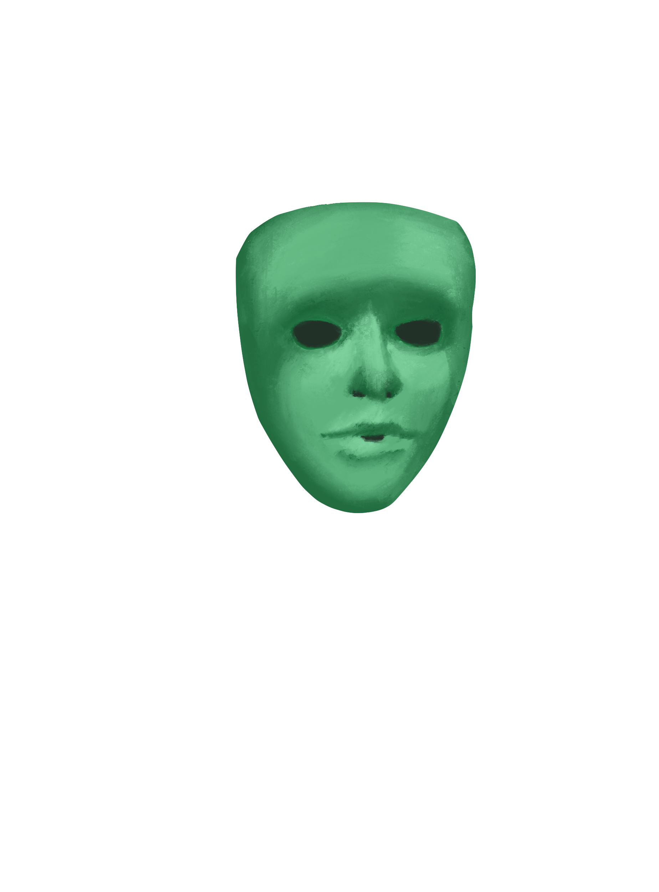

**Brief Visual Description:** Full-face green mask with a shape of a face and deep eye-sockets..

**Dominant Colors:** Green.

**Reasoning for Inclusion within Mibera:**

**General Real World Trait History:** Illegal Covid Raves

**Team Anecdotes:**

**Date Created/Uploaded:** July 27, 2024

**Who Introduced the Trait:** Jani

**Trait Conflicts:**

**Ancestor (if applicable):**

**Archetype (if applicable):** Chicago Detroit

**Swag Score (if applicable):** 4

**FOR PARTNERS TRAITS ONLY:**

**Partner:**

**Link to Partner:**

**Partner Relationship:**

- https://discord.com/channels/1133935527855399053/1161382544617508874/11634742480991

68318

- https://www.youtube.com/watch?si=YuZu8bx7jm-GOxV7&t=1&v=aGvb4Jb0TSg&feature=youtu.

be

- https://www.youtube.com/watch?v=E4ldQOkMhrY

---

## Homemade Bee Mask

**Name:** Homemade Bee Mask

**Image Files:**

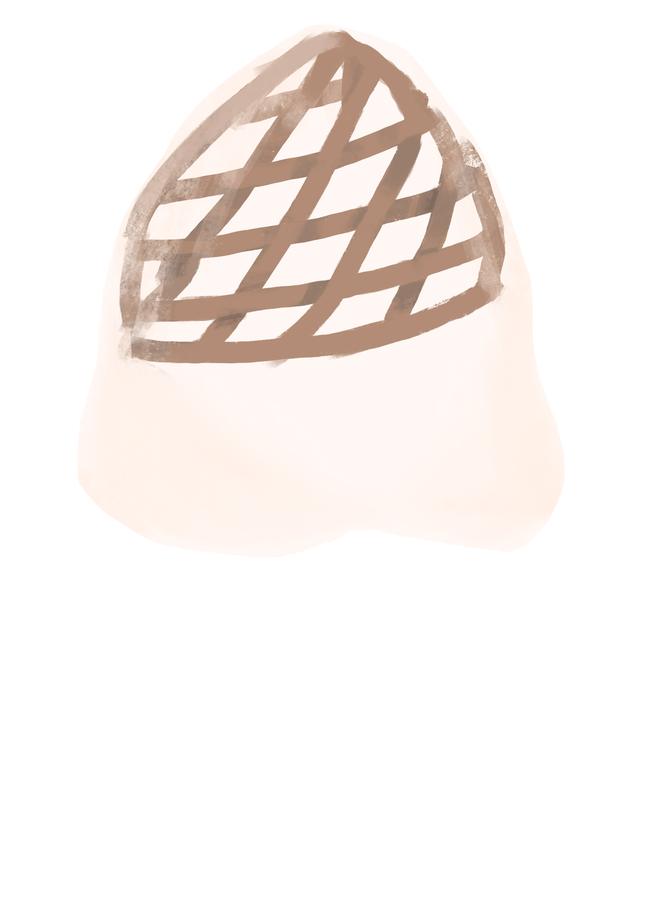

**Brief Visual Description:** Bee mask, portrayed by thick net in brown and transparent milky

white cover over it.

**Dominant Colors:** Brown, transparent white.

**Reasoning for Inclusion within Mibera:**

**General Real World Trait History:**

**Team Anecdotes:**

**Date Created/Uploaded:** July 27, 2024

**Who Introduced the Trait:**

**Trait Conflicts:**

**Ancestor (if applicable):**

**Archetype (if applicable):** Milady

**Swag Score (if applicable):** 3

---

## Plastic Bag Mask

**Name:** Plastic Bag Mask

**Image Files:**

**Brief Visual Description:** Plain white semi-transparent plastic bag mask.

**Dominant Colors:** Brown, transparent white.

**Reasoning for Inclusion within Mibera:**

**General Real World Trait History:** The Rubberbandits is an Irish comedy hip-hop duo from

Limerick, consisting of Blindboy Boatclub (Dave Chambers) and Mr Chrome (Bob McGlynn),

who perform with plastic bag masks to conceal their identities. Their work critiques Irish urban

youth issues like drug abuse and republicanism.

**Team Anecdotes:**

**Date Created/Uploaded:** July 27, 2024

**Who Introduced the Trait:** Jani

**Trait Conflicts:**

**Ancestor (if applicable):** Irish

**Archetype (if applicable):** Chicago Detroit

**Swag Score (if applicable):** 4

**Ancient / Modern:** Modern

**Source:**

- https://youtu.be/ljPFZrRD3J8?si=Xyz_DHATH5nbuQub&t=36

- https://discord.com/channels/1133935527855399053/1161382544617508874/11667276140361

93320

---

## Bera Ski

**Name:** Bera Ski

**Image Files:** SS4_Bera Ski.png

**Brief Visual Description:** Ski mask in darker shades of brown with curved ears and holes

across the eyes-part.

**Dominant Colors:** Brown.

**Reasoning for Inclusion within Mibera:**

**General Real World Trait History:**

**Team Anecdotes:**

**Date Created/Uploaded:** July 28, 2024

**Who Introduced the Trait:**

**Trait Conflicts:**

**Ancestor (if applicable):**

**Archetype (if applicable):**

**Swag Score (if applicable):** 4

**Source:**

- https://discord.com/channels/1133935527855399053/1161382544617508874/11667336495138

11988

---

## Teddy Ski Mask

**Name:** Teddy Ski Mask

**Image Files:** SS3_Teddy Ski Mask.PNG

**Brief Visual Description:** Ski mask in vibrant red with tiny horn-shaped ears and wide holes

across the eyes-part.

**Dominant Colors:** Red.

**Reasoning for Inclusion within Mibera:**

**General Real World Trait History:**

**Team Anecdotes:**

**Date Created/Uploaded:** December 10, 2024

**Who Introduced the Trait:** Jani

**Trait Conflicts:**

**Ancestor (if applicable):**

**Archetype (if applicable):**

**Swag Score (if applicable):** 3

**FOR PARTNERS TRAITS ONLY:**

**Partner:** Steady Teddy

**Link to Partner:** https://x.com/steadyteddys

**Partner Relationship:** NFT on Berachain

**Sources:**

- https://x.com/steadyteddys

**Summary:**

Steady Teddy is one of the biggest, if not the biggest NFT to stand on Berachain when it comes

to hype, community, and volume. The Teddys are known for spreading ‘Tedism’ on the TL,

onboarding dozens of new community members by doing so.

---

## Pink Bera Ski

**Name:** Pink Bera Ski

**Image Files:** SS4_pink bera ski.PNG

**Brief Visual Description:** Ski mask in a very light soft pink with curved ears and holes across

the eyes-part.

**Dominant Colors:** Light soft-pink.

**Reasoning for Inclusion within Mibera:**

**General Real World Trait History:**

**Team Anecdotes:**

**Date Created/Uploaded:** March 26, 2025

**Who Introduced the Trait:**

**Trait Conflicts:**

**Ancestor (if applicable):**

**Archetype (if applicable):**

**Swag Score (if applicable):** 4

**FOR PARTNERS TRAITS ONLY:**

**Partner:**

**Link to Partner:**

**Partner Relationship:**

**Sources:**

- https://discord.com/channels/1133935527855399053/1161382544617508874/11667336495138

11988

---

## White Anonymous

**Name:** White Anonymous

**Image Files:**

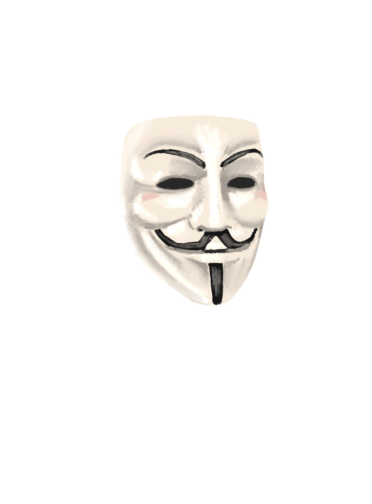

**Brief Visual Description:** Classic white ‘Anonymous’ mask, with a smiling face with blushing

cheeks, a thin mustache, and pointed beard

**Dominant Colors:** White, black.

**Reasoning for Inclusion within Mibera:**

**General Real World Trait History:** The "Anonymous mask," commonly known as the Guy

Fawkes mask, originated from the 1605 Gunpowder Plot, where Guy Fawkes planned to blow

up the British Parliament. Its modern iconic design was created by illustrator David Lloyd for the

1982–1989 graphic novel V for Vendetta by Alan Moore.

**Team Anecdotes:**

**Date Created/Uploaded:** July 27, 2024

**Who Introduced the Trait:**

**Trait Conflicts:**

**Ancestor (if applicable):**

**Archetype (if applicable):** Chicago Detroit

**Swag Score (if applicable):** 4

**Sources:**

- https://en.wikipedia.org/wiki/Guy_Fawkes_mask

---

## Kim Jong Mask

**Name:** Kim Jong Mask

**Image Files:** SS4_acidhouse_Kim Jong Mask.png

**Brief Visual Description:** Pale face of an Asian man (Kim Jong Un) with yellow undertone and

an ‘ambition hairstyle’.

**Dominant Colors:** White with yellow undertone.

**Reasoning for Inclusion within Mibera:**

**General Real World Trait History:** DJ Bus Replacement Service, aka Doris Woo, a retired DJ

known for her eclectic, genre-blending sets and playful persona.

**Team Anecdotes:**

**Date Created/Uploaded:** July 26, 2024

**Who Introduced the Trait:**

**Trait Conflicts:**

**Ancestor (if applicable):**

**Archetype (if applicable):** Acidhouse

**Swag Score (if applicable):** 4

**Sources:**

- https://discord.com/channels/1133935527855399053/1161382544617508874/11696000184753

84842

- https://mixmag.net/feature/dj-bus-replacement-service-interview

- https://ra.co/features/4216?utm_source=newsletter&utm_medium=email&utm_campaign=Globa

lNewsletter-23.10.07

---

## Silver Mask

**Name:** Silver Mask

**Image Files:**

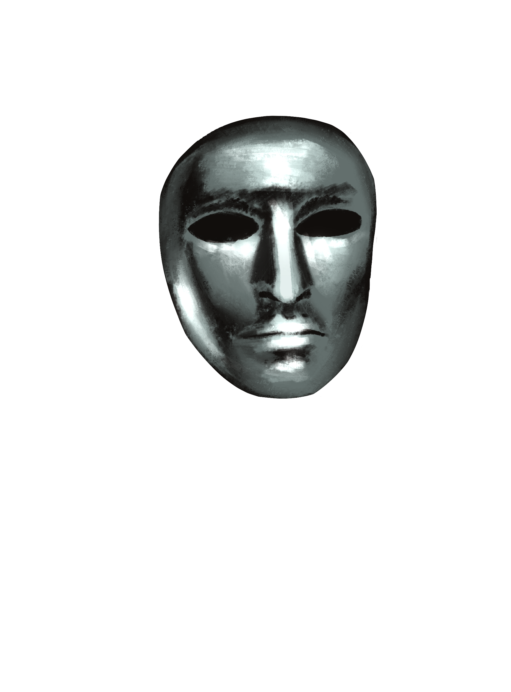

**Brief Visual Description:** Rounded-shaped full-face silver mask with a shape of a face and

metallic complexion.

**Dominant Colors:** Silver.

**Reasoning for Inclusion within Mibera:**

**General Real World Trait History:**

**Team Anecdotes:**

**Date Created/Uploaded:** December 9, 2024

**Who Introduced the Trait:** Jani

**Trait Conflicts:**

**Ancestor (if applicable):**

**Archetype (if applicable):** Freetekno

**Swag Score (if applicable):** 1

**Sources:**

- https://www.dazeddigital.com/music/article/35706/1/uk-drill-artists-and-crews

- https://discord.com/channels/1133935527855399053/1161382544617508874/11667336495138

11988

---

## Surgical Mask

**Name:** Surgical Mask

**Image Files:**

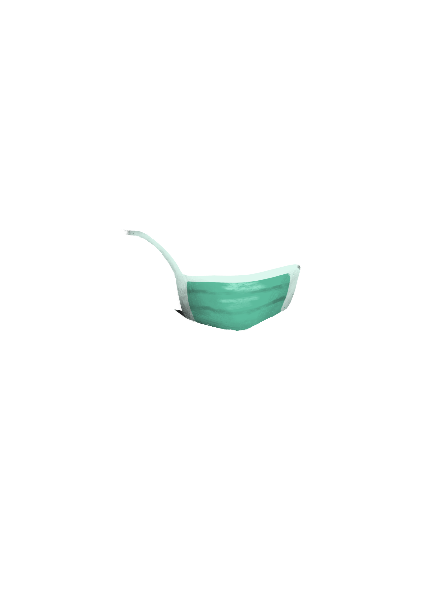

**Brief Visual Description:** Stereotypical green surgical mask, with lighter colored lining.

**Dominant Colors:** Green.

**Reasoning for Inclusion within Mibera:**

**General Real World Trait History:**

**Team Anecdotes:**

**Date Created/Uploaded:** July 24, 2024

**Who Introduced the Trait:** Jani

**Trait Conflicts:**

**Ancestor (if applicable):**

**Archetype (if applicable):** Acidhouse

**Swag Score (if applicable):** 1

**Sources:**

- https://discord.com/channels/1133935527855399053/1143684092467093684/11677936743069

81888

---

## Plastic Bag Red

**Name:** Plastic Bag Red

**Image Files:** SS4_freetekno_modern_irish_Plastic Bag Red.png

**Brief Visual Description:** White bag covering the entire face with holes on the eyes and mouth,

on it are strokes in vibrant red.

**Dominant Colors:** White, red.

**Reasoning for Inclusion within Mibera:**

**General Real World Trait History:** The Blindboy Podcast, hosted by Blindboy Boatclub (Dave

Chambers) of the Rubberbandits, is an eclectic Irish podcast launched in 2017. It blends short

fiction, interviews, and comedy, exploring topics like mental health, politics, culture, and history,

often with personal stories and absurdist commentary. It has since then gained a cult-following.

**Team Anecdotes:**

**Date Created/Uploaded:** July 27, 2024

**Who Introduced the Trait:** Jani

**Trait Conflicts:**

**Ancestor (if applicable):** Irish

**Archetype (if applicable):** Freetekno

**Swag Score (if applicable):** 4

**Ancient / Modern:** Modern

**Sources:**

- https://www.theblindboypodcast.ie/

---

## Cypherpunk 1

**Name:** Cyberphunk 1

**Image Files:**

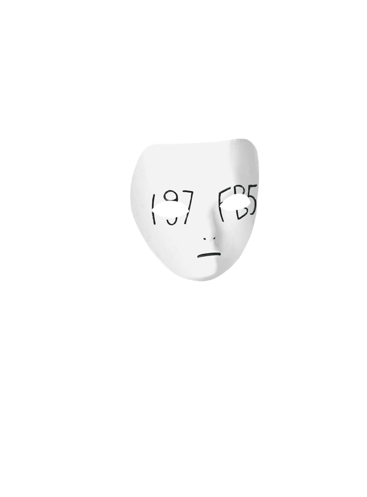

**Brief Visual Description:** White mask with ‘197’ on one eye, and ‘FB5’ on the other eye.

**Dominant Colors:** White

**Reasoning for Inclusion within Mibera:**

**General Real World Trait History:** Cypherpunk.

**Team Anecdotes:**

**Date Created/Uploaded:** July 17, 2024

**Who Introduced the Trait:** Jani

**Trait Conflicts:**

**Ancestor (if applicable):**

**Archetype (if applicable):**

**Swag Score (if applicable):** 4

**FOR PARTNERS TRAITS ONLY:**

**Partner:**

**Link to Partner:**

**Partner Relationship:**

**Sources:**

https://en.wikipedia.org/wiki/Cypherpunk#:~:text=A%20cypherpunk%20is%20one%20who,and

%20freedom%20from%20centralized%20authority.

**Summary:**

Cypherpunk is an individual who uses strong cryptography to enhance privacy and resist

surveillance, rooted in a libertarian philosophy that values decentralization and freedom from

centralized authority. The movement emerged in the late 1980s, gaining traction with the 1992

Cypherpunks mailing list, where activists and technologists discussed privacy tools and

strategies. It has influenced technologies like Bitcoin and Tor, emphasizing practical solutions

through coding over policy debates.

---

## Cypherpunk 2

**Name:** Cyberphunk 2

**Image Files:**

**Brief Visual Description:** White mask with a few short lines that look like a barcode on the

forehead.

**Dominant Colors:** White

**Reasoning for Inclusion within Mibera:**

**General Real World Trait History:** Cypherpunk.

**Team Anecdotes:**

**Date Created/Uploaded:** July 17, 2024

**Who Introduced the Trait:** Jani

**Trait Conflicts:**

**Ancestor (if applicable):**

**Archetype (if applicable):**

**Swag Score (if applicable):** 1

**FOR PARTNERS TRAITS ONLY:**

**Partner:**

**Link to Partner:**

**Partner Relationship:**

**Sources:**

https://en.wikipedia.org/wiki/Cypherpunk#:~:text=A%20cypherpunk%20is%20one%20who,and

%20freedom%20from%20centralized%20authority.

**Summary:**

Cypherpunk is an individual who uses strong cryptography to enhance privacy and resist

surveillance, rooted in a libertarian philosophy that values decentralization and freedom from

centralized authority. The movement emerged in the late 1980s, gaining traction with the 1992

Cypherpunks mailing list, where activists and technologists discussed privacy tools and

strategies. It has influenced technologies like Bitcoin and Tor, emphasizing practical solutions

through coding over policy debates.

---

## MF Doom

**Name:** MF Doom

**Image Files:**

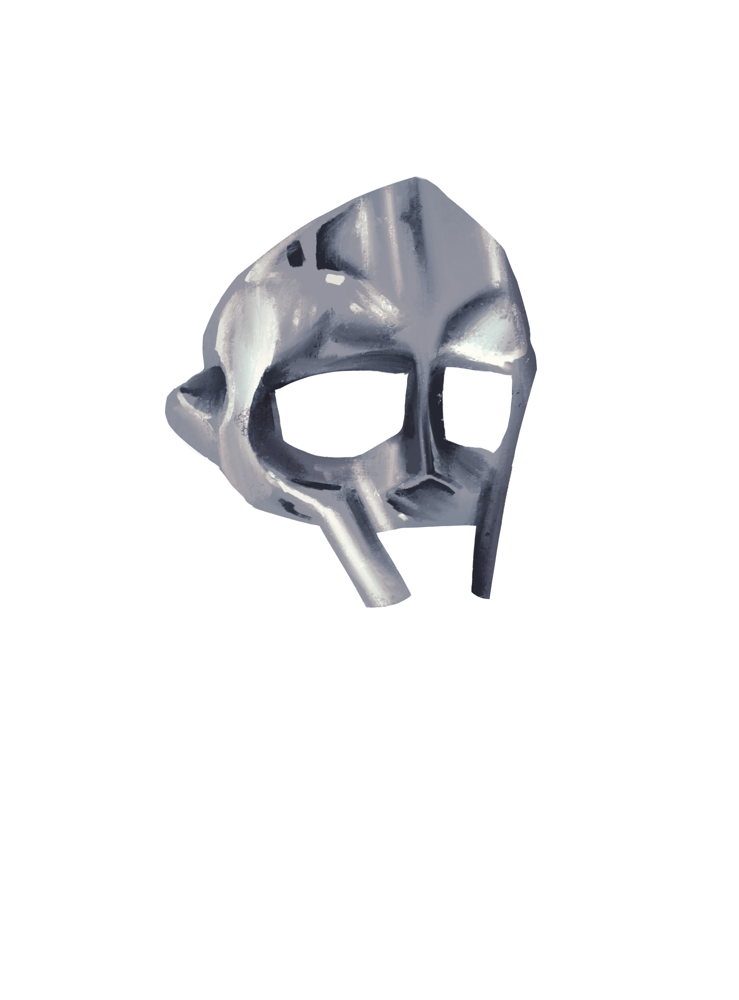

**Brief Visual Description:** Silver mask with a lot of defined edges, depths, and unique shape.

Covering half the face with big eye holes and a rectangular shape on each side extending

towards inner-downwards.

**Dominant Colors:** Silver

**Reasoning for Inclusion within Mibera:** Music and cultural relevance to Mibera’s lore and

identity.

**General Real World Trait History:** MF doom

**Team Anecdotes:**

**Date Created/Uploaded:** July 27, 2024

**Who Introduced the Trait:** Fedor

**Trait Conflicts:**

**Ancestor (if applicable):**

**Archetype (if applicable):** Freetekno

**Swag Score (if applicable):** 4

**Sources:**

- https://discord.com/channels/1133935527855399053/1161382544617508874/11668381810612

14308

---

## Venetian Gold

**Name:** venetian gold

**Image Files:**

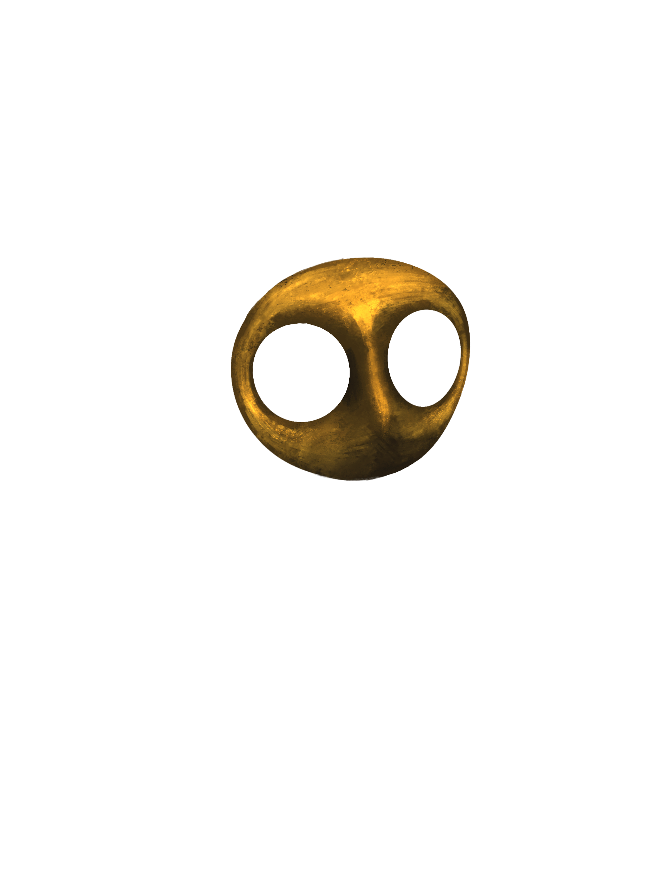

**Brief Visual Description:** Rounded golden mask with much bigger eyeholes compared to usual

masks.

**Dominant Colors:** Vibrant gold.

**Reasoning for Inclusion within Mibera:**

**General Real World Trait History:** The Moretta mask, is a traditional Venetian mask historically

reserved for women, popular in 18th-century Venice. Made of black velvet and round in shape,

also known as the "muta," it fully conceals the wearer’s face, symbolizing seduction and

mystery. Held in place by a button bitten by the teeth, it silenced the wearer, adding to its

enigmatic allure, and is showcased by Ca’ Macana as an authentic paper-mâché carnival mask.

**Team Anecdotes:**

**Date Created/Uploaded:** December 9, 2024

**Who Introduced the Trait:** P1A

- https://x.com/deepname99/status/1933016647281094884?s=46

**Trait Conflicts:**

**Ancestor (if applicable):**

**Archetype (if applicable):**

**Swag Score (if applicable):** 5

---

## Bear Mask

**Name:** Bear Mask

**Image Files:** SS4_freetekno_Bear Mask.PNG

**Brief Visual Description:** Huge face mask in the shape of a bear head.

**Dominant Colors:** Brown.

**Reasoning for Inclusion within Mibera:** Smokey The Bera head

**General Real World Trait History:** Smokey, the founder of Berachain, and Berachain.

**Team Anecdotes:**

**Date Created/Uploaded:** July 27, 2024

**Who Introduced the Trait:**

**Trait Conflicts:**

**Ancestor (if applicable):**

**Archetype (if applicable):** Freetekno

**Swag Score (if applicable):** 4

---

## CFang Face

**Name:** CFang Face (mask)

**Image Files:**

**Brief Visual Description:** Circular milky white mist, solid in color.

**Dominant Colors:** Milky white.

**Reasoning for Inclusion within Mibera:**

**General Real World Trait History:** Charlotte Fang’s Mirror’s profile picture.

**Team Anecdotes:**

**Date Created/Uploaded:** July 27, 2024

**Who Introduced the Trait:**

**Trait Conflicts:**

**Ancestor (if applicable):**

**Archetype (if applicable):** Milady

**Swag Score (if applicable):** 1

---

## Henlo Mask

**Name:** Henlo Mask

**Image Files:** SS5_henlo mask.PNG

**Brief Visual Description:** An army green balaclava with two curved ears, thin silver chains and

the word ‘HENLO’ dangling on one of the chains as charms. two rings above the eye hole, and

four rings on one of the ears.

**Dominant Colors:** Army green.

**Reasoning for Inclusion within Mibera:**

**General Real World Trait History:** Was created for an irl Mibera rave. [look up context gumi]

**Team Anecdotes:**

**Date Created/Uploaded:** March 26, 2025

**Who Introduced the Trait:**

**Trait Conflicts:**

**Ancestor (if applicable):**

**Archetype (if applicable):**

**Swag Score (if applicable):** 5

**FOR PARTNERS TRAITS ONLY:**

**Partner:** Henlo

**Link to Partner:** https://henlo.0xhoneyjar.xyz/

**Partner Relationship:** Part of The Honey Jar.

- https://x.com/t3x000/status/1900107573321162943?s=46

---

## White Mask

**Name:** White Mask

**Image Files:**

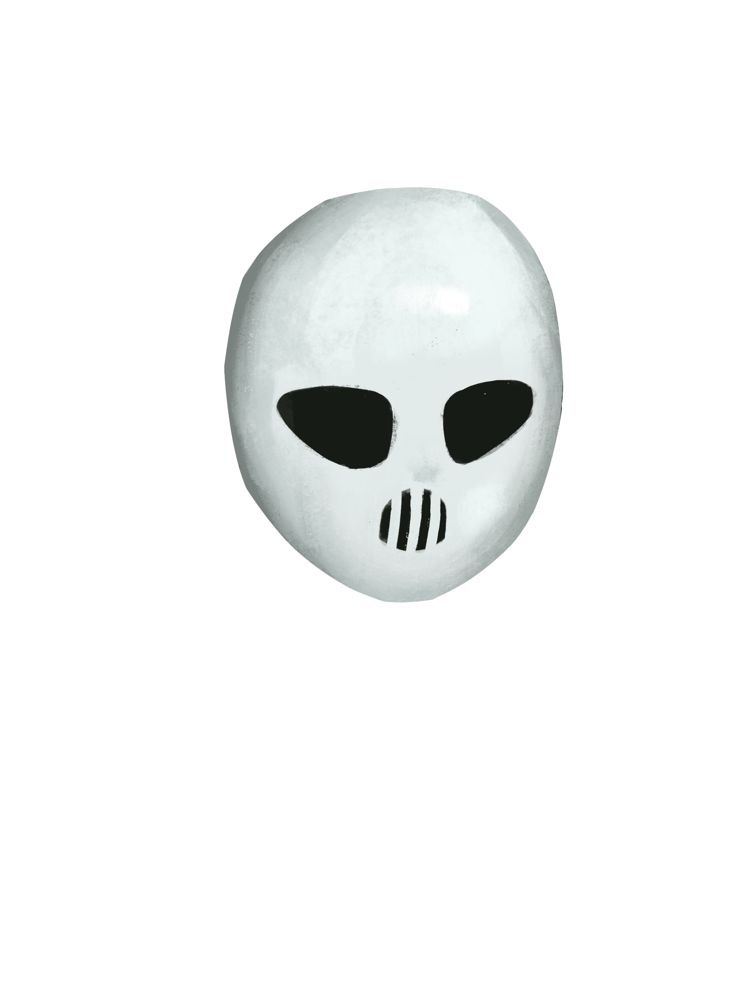

**Brief Visual Description:** Round white mask with 2 eye-holes and stripy holes on the mouth

side.

**Dominant Colors:** White.

**Reasoning for Inclusion within Mibera:**

**General Real World Trait History:**

**Team Anecdotes:**

**Date Created/Uploaded:** December 9, 2024

**Who Introduced the Trait:** Jani

**Trait Conflicts:**

**Ancestor (if applicable):**

**Archetype (if applicable):** Chicago Detroit

**Swag Score (if applicable):** 2

**Source:**

- https://youtu.be/aGvb4Jb0TSg?si=YuZu8bx7jm-GOxV7&t=1

---

## Chulym Beekeper Hat

**Name:** Chulym Beekeeper Hat

**Image Files:**

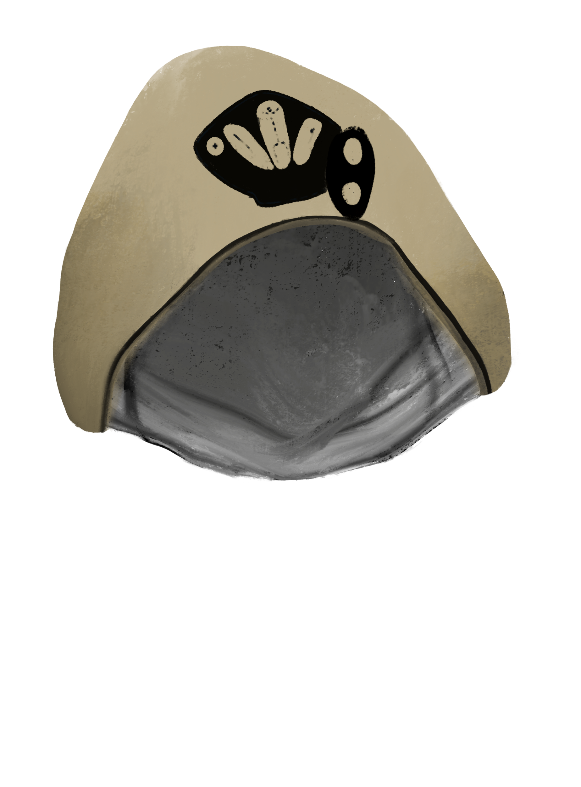

**Brief Visual Description:** Big pale army green hood with black transparent draping down the

hood, semi-transparent with net-like texture.

**Dominant Colors:** Pale army / sandy green, black .

**Reasoning for Inclusion within Mibera:** Otyken influence

OTYKEN - LORD OF HONEY (ВЕРТИКАЛЬНЫЙ КЛИП)

**General Real World Trait History:** Otyken is a Russian Siberian indigenous music group

formed in 2015 by Andrey 'Medonos' Chernetsov, blending local folk music with modern pop

using traditional instruments like the komuz and igil. Featuring members from Chulym, Ket,

Khakas, Dolgan, and Selkup ethnicities, they promote the history and traditions of multinational

Russia through eye-catching homemade costumes.

**Team Anecdotes:**

**Date Created/Uploaded:** July 27, 2024

**Who Introduced the Trait:** Jani

**Trait Conflicts:**

**Ancestor (if applicable):**

**Archetype (if applicable):**

**Swag Score (if applicable):** 3

---

## Founders Mask

**Name:** Founders Mask

**Image Files:** SS5_Founders Mask.PNG

**Brief Visual Description:** Large rounded mask with a pattern constructed of simple diamond

shapes, going outwards from the center, in the color of black.

**Dominant Colors:** Black

**Reasoning for Inclusion within Mibera:** Jani’s mask from Singapore (Token 2024)

**General Real World Trait History:**

**Team Anecdotes:**

**Date Created/Uploaded:** March 15, 2025

**Who Introduced the Trait:**

**Trait Conflicts:**

**Ancestor (if applicable):**

**Archetype (if applicable):**

**Swag Score (if applicable):** 5

---

## Faceless Galaxy

**Name:** Faceless Galaxy

**Image Files:**

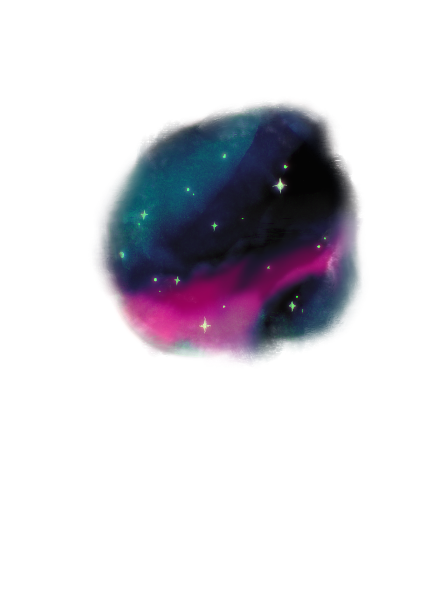

**Brief Visual Description:** Glimpse of a galaxy with stars portrayed by the color of dark blue and

magenta merging together in a circular shape with smudged edges.

**Dominant Colors:** Dark blue, magenta.

**Reasoning for Inclusion within Mibera:**

**General Real World Trait History:**

**Team Anecdotes:**

**Date Created/Uploaded:** July 27, 2024

**Who Introduced the Trait:** Gumi

**Trait Conflicts:**

**Ancestor (if applicable):**

**Archetype (if applicable):** Acidhouse

**Swag Score (if applicable):** 5

---

