# Backgrounds

*Environmental settings and backdrops for Mibera characters.*

---

## Starry

**Name:** Starry

**Image Files:**

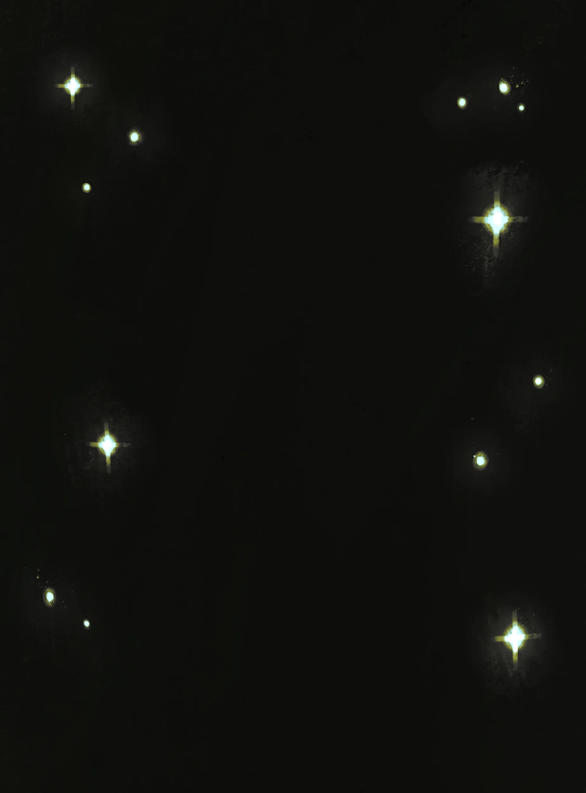

**Brief Visual Description:** Solid black background with four shiny 4-points stars, and 9 glowing

dots.

**Dominant Colors:** Black, white.

**Reasoning for Inclusion within Mibera:**

**General Real World Trait History:**

**Team Anecdotes:** -

**Date Created/Uploaded:** June 7, 2024

**Who Introduced the Trait:** Gumi

---

## Boyco

**Name:** Boyco

**Image Files:**

**Brief Visual Description:** Visual of an online spreadsheet containing a list of Boyco

participants.

**Dominant Colors:** White

**Reasoning for Inclusion within Mibera:**

**General Real World Trait History:** Boyco, https://boyco.berachain.com/

**Team Anecdotes:**

**Date Created/Uploaded:** December 10, 2024

**Who Introduced the Trait:**

---

## Clouds

**Name:** Clouds

**Image Files:**

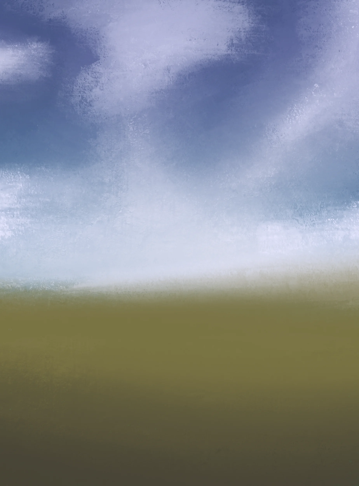

**Brief Visual Description:** Grassfield and cloudy sky.

**Dominant Colors:** Blue, white, and green

**Reasoning for Inclusion within Mibera:** -

**General Real World Trait History:**

**Team Anecdotes:** -

**Date Created/Uploaded:** June 7, 2024

**Who Introduced the Trait:** -

**Note:** Just Gumi drawing ‘shite’ :D

---

## Apdao

**Name:** Apdao

**Image Files:**

**Brief Visual Description:** Plain gradient of dark orange, black, and dark teal (colour in order

from bottom left to top right)

**Dominant Colors:** Dark orange, black, dark teal.

**Reasoning for Inclusion within Mibera:** -

**General Real World Trait History:** (will read more docs for a more accurate BG and history on

this)

**Team Anecdotes:** -

**Date Created/Uploaded:** December 10, 2024

**Who Introduced the Trait:** Jani, with Gods being responsible for the original inspiration.

**Sources:**

- https://www.apiologydao.xyz/

- https://x.com/ApiologyDAO

**Summary:**

ApiologyDAO (apDAO) is a decentralized autonomous organization (DAO) within the Berachain

ecosystem, focused on fostering innovation, liquidity, and collaboration. Incubated by The

Honey Jar (THJ), it operates as a venture studio and community aggregator, directing

investments and resources to support emerging DeFi protocols on Berachain. Inspired by the

study of honeybees (apiology), apDAO aims to enhance liquidity and drive protocol integrations

through a community-driven governance model.

---

## Kaieteur

**Name:** Kaieteur

**Image Files:**

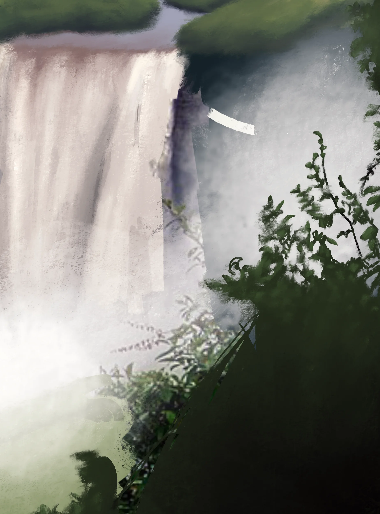

**Brief Visual Description:** Painting-like scenery of a waterfall seen from behind some bushes.

**Dominant Colors:** White, green.

**Reasoning for Inclusion within Mibera:** -

**General Real World Trait History:** The Kaieteur Falls; a stunning single-drop waterfall,

plunging 226 meters with a flow rate of 663 cubic meters per second. Surrounded by the

Amazonian rainforest, it’s a biodiversity hotspot with unique species. Discovered in 1870,

it’s a major tourist attraction, accessible by plane or trek.

**Date Created/Uploaded:** February 27, 2025

**Who Introduced the Trait:** -

**Research source:**

- https://en.wikipedia.org/wiki/Kaieteur_Falls

---

## No More Walls

**Name:** No More Walls

**Image Files:**

**Brief Visual Description:** Glimpse of a starry night sky in dark navy blue with a hue of white.

**Dominant Colors:** Navy blue, white.

**Reasoning for Inclusion within Mibera:** It’s a 1:1 drawing reflecting one of Ross Ulbricht’s

tweets shortly after his release from the prison. Ross is a huge influence to Mibera’s lore and

culture.

**General Real World Trait History:** Ross Ulbricht

**Team Anecdotes:** -

**Date Created/Uploaded:** March 22, 2025

**Who Introduced the Trait:** Jani

**Research source:**

- https://x.com/RealRossU/status/1902450286469509275

---

## Fyre Festival

**Name:** Fyre Festival

**Image Files:**

**Brief Visual Description:** Top point-of-view of the ocean and a huge pool going across the

frame. Almost-white sand and concrete, with a bunch of trees around too..

**Dominant Colors:** Turquoise blue, sandy white, leafy green..

**Reasoning for Inclusion within Mibera:**

**General Real World Trait History:** Fyre Festival; a failed luxury music festival planned for April

2017 in the Bahamas, promoted by Billy McFarland and Ja Rule. Marketed as a high-end event

with luxury accommodations and celebrity performances, it collapsed due to mismanagement,

leaving attendees stranded with inadequate food, shelter, and transportation. It became a

notorious example of fraudulent event planning, leading to lawsuits and McFarland’s

imprisonment.

**Team Anecdotes:** -

**Date Created/Uploaded:** February 27, 2025

**Who Introduced the Trait:**

**Sources:**

- https://en.wikipedia.org/wiki/Fyre_Festival

---

## Ford

**Name:** Ford

**Image Files:**

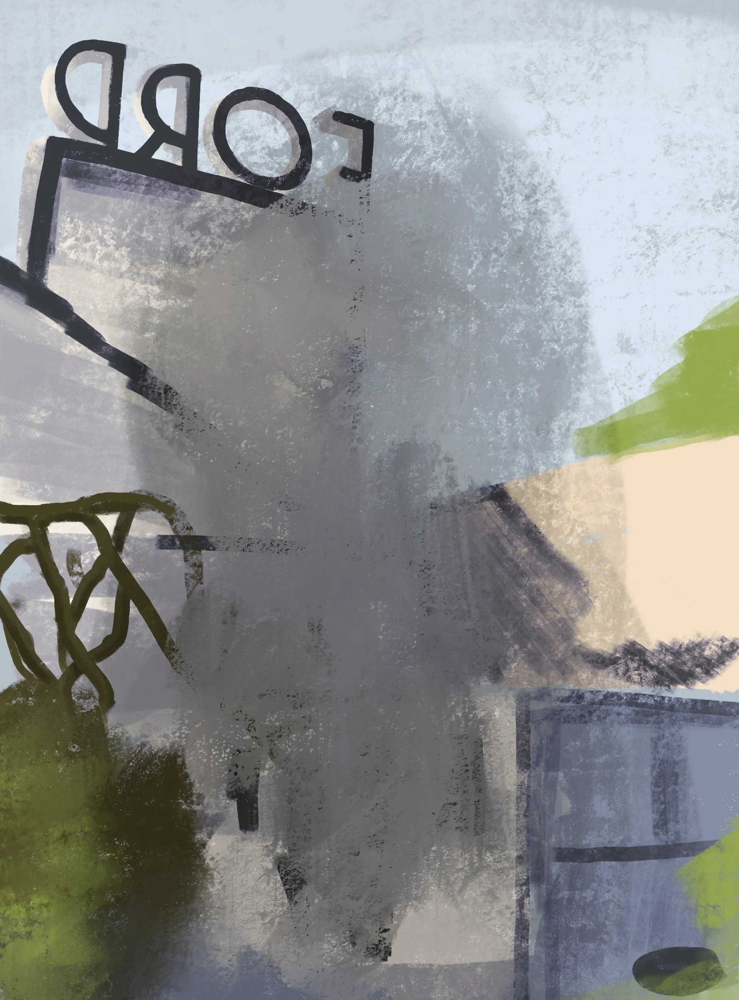

**Brief Visual Description:** View of what looks like the front side of a building with a metallic

gate, and a huge ‘FORD’ sign standing tall.

**Dominant Colors:** Grey, green, light-sky blue.

**Reasoning for Inclusion within Mibera:**

**General Real World Trait History:** Abandoned Ford Factory

**Team Anecdotes:** -

**Date Created/Uploaded:** August 14, 2024

**Who Introduced the Trait:** Jani

**Sources:**

- https://discord.com/channels/1133935527855399053/1143360212842061834/11585142411045

15113

---

## El Dorado

**Name:** El Dorado

**Image Files:**

**Brief Visual Description:** Golden pyramid-like site in the background, red-brown stone

building, warm orange sky, and green trees / bushes.

**Dominant Colors:** Yellow, green.

**Reasoning for Inclusion within Mibera:**

**General Real World Trait History:** El Dorado, meaning "the golden one" in Spanish, is a

legendary city or kingdom of immense wealth, often associated with gold, sought by Spanish

conquistadors in the 16th century. Originating from Muisca rituals in modern-day Colombia,

where a chief covered in gold dust made offerings in Lake Guatavita, the myth grew into tales of

a hidden city.

**Team Anecdotes:** -

**Date Created/Uploaded:** February 27, 2025

**Who Introduced the Trait:**

**Source:**

- https://www.tourism-review.com/travel-tourism-magazine-the-legend-of-el-dorado-article1828

---

## Stonehenge

**Name:** Stonehenge

**Image Files:**

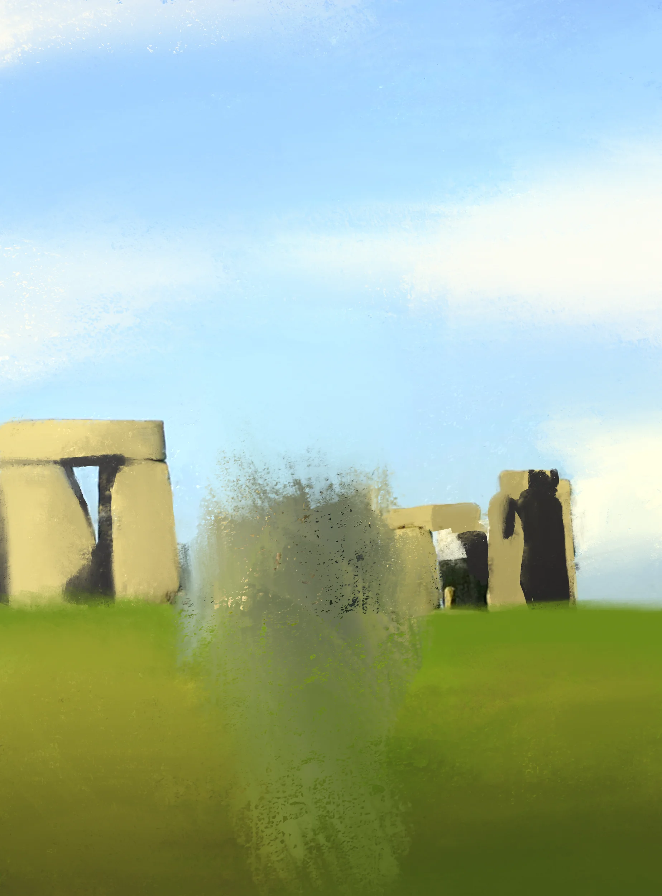

**Brief Visual Description:** Painting-like view of the Stonehenge (basically stacked gigantic

stones) on a fresh field of grass.

**Dominant Colors:** Blue, green, grey.

**Reasoning for Inclusion within Mibera:**

**General Real World Trait History:** The Stonehenge, a prehistoric monument in Wiltshire,

England, built between 3000 and 2000 BCE. It consists of a ring of massive standing stones,

some weighing up to 25 tons, arranged in a circular pattern. Constructed in phases, it likely

served as a ceremonial or religious site, possibly for burial rituals or astronomical observations,

aligning with the solstices.

**Team Anecdotes:** -

**Date Created/Uploaded:** June 7, 2024

**Who Introduced the Trait:** Tez

**Source:**

- https://discord.com/channels/1133935527855399053/1133948695457566760/11572139137048

24842

---

## Factory

**Name:** Factory

**Image Files:**

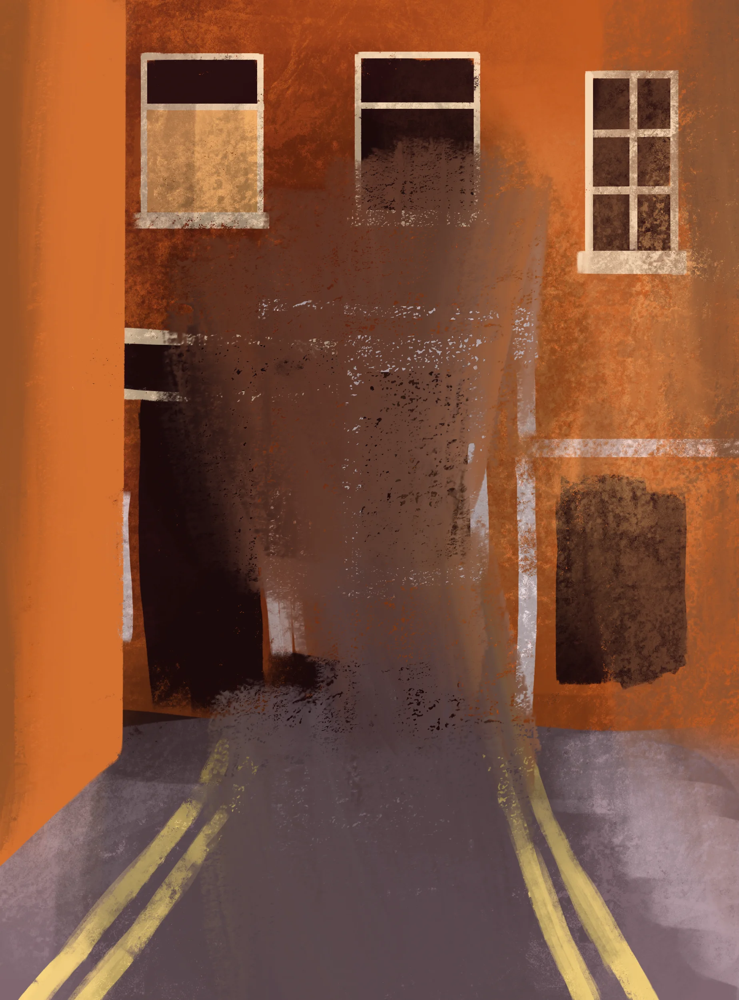

**Brief Visual Description:** Front-view from the street, of a building with windows and orange

walls.

**Dominant Colors:** Orange, grey.

**Reasoning for Inclusion within Mibera:**

**General Real World Trait History:** 80’s Manchester red brick factories & buildings.

**Team Anecdotes:** -

**Date Created/Uploaded:** August 14, 2024

**Who Introduced the Trait:** Tez

**Source:**

- https://discord.com/channels/1133935527855399053/1133948695457566760/11574885540463

98504

---

## Sunrise

**Name:** Sunrise

**Image Files:**

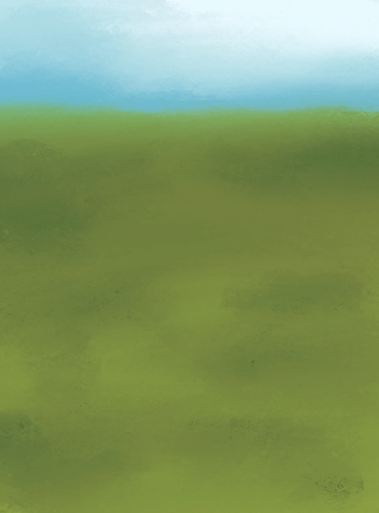

**Brief Visual Description:** Blurry view of what appears to be a huge field of grass meeting a

clear blue sky.

**Dominant Colors:** Green, sky-blue.

**Reasoning for Inclusion within Mibera:** related to Milady

**General Real World Trait History:**

**Team Anecdotes:** -

**Date Created/Uploaded:** June 7, 2024

**Who Introduced the Trait:** Gumi

**Source:**

https://opensea.io/collection/milady?traits=[{%22traitType%22:%22Background%22,%22values

**%22:** [%22sunrise%22]}]

---

## Rave 3

**Name:** Rave 3

**Image Files:**

**Brief Visual Description:** Abstract combination of vibrant color that looks like stroking lights in

red, blue, pink, green, and yellow, with black at the bottom that looks like the crowds.

**Dominant Colors:** Red, hot-pink / magenta, blue, green, yellow.

**Reasoning for Inclusion within Mibera:**

**General Real World Trait History:**

**Team Anecdotes:** -

**Date Created/Uploaded:** August 14, 2024

**Who Introduced the Trait:** Jani

**Source:**

- https://discord.com/channels/1133935527855399053/1133948695457566760/11420537894073

79497

---

## Rave 2

**Name:** Rave 2

**Image Files:**

**Brief Visual Description:** Bright white light in the center with a vibrant turquoise background,

and black shadowy figures filling half the frame.

**Reasoning for Inclusion within Mibera:**

**General Real World Trait History:**

**Team Anecdotes:** -

**Date Created/Uploaded:** August 14, 2024

**Who Introduced the Trait:** Jani

**Source:**

- https://discord.com/channels/1133935527855399053/1133948695457566760/11420537894073

79497

---

## Rave 1

**Name:** Rave 1

**Image Files:**

**Brief Visual Description:** Abstract painterly style with solid black background and large bright

blue spots dominated with white showing its brightness, a blood red stroke can be seen in the

right corner.

**Dominant Colors:** Black, light blue, white.

**Reasoning for Inclusion within Mibera:**

**General Real World Trait History:**

**Team Anecdotes:** -

**Date Created/Uploaded:** August 14, 2024

**Who Introduced the Trait:** Jani

**Source:**

- https://discord.com/channels/1133935527855399053/1133948695457566760/11420537894073

79497

---

## Rock Walls

**Name:** Rock Walls

**Image Files:**

**Brief Visual Description:** Dark tunnel with yellow-ish rock walls with carvings on them.

**Dominant Colors:** Yellow / golden brown, black.

**Reasoning for Inclusion within Mibera:**

**General Real World Trait History:** Irish dry stone walls are mortarless stone structures that

define much of Ireland’s rural landscape, particularly in the west and south, with an estimated

400,000 km across the country. Dating back to the Neolithic period, these walls were built to

clear rocky fields for farming and to create boundaries for livestock and crops.

**Team Anecdotes:** -

**Date Created/Uploaded:** June 8, 2024

**Who Introduced the Trait:** Jani

**Sources:**

- https://discord.com/channels/1133935527855399053/1159213115649560720/11599277445708

59672

- https://www.carrowkeel.com/files/megalithicart.html

---

## Sunset

**Name:** Sunset

**Image Files:**

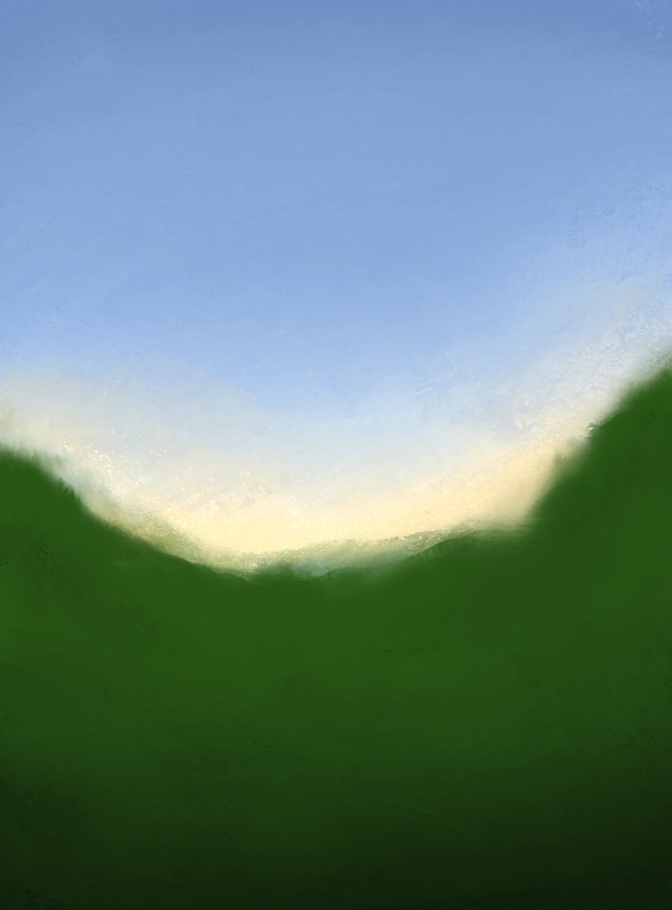

**Brief Visual Description:** Blurry view of greenery in deep green on the half bottom, and a sky

on the top half with a hint of yellowish light where the green ends.

**Dominant Colors:** Green, sky-blue, hue of yellow.

**Reasoning for Inclusion within Mibera:** related to Milady

**General Real World Trait History:**

**Team Anecdotes:** -

**Date Created/Uploaded:** June 7, 2024

**Who Introduced the Trait:** Gumi

**Sources:**

https://opensea.io/collection/milady?traits=[{%22traitType%22:%22Background%22,%22values

**%22:** [%22sunset%22]}]

---

## Undersea Cable

**Name:** Undersea Cable

**Image Files:**

**Brief Visual Description:** Very thick blue cable with thin yellow stripes on it cut / snapped into

two, showing smaller wires poking out of them. The background setting is soft ocean-blue.

**Dominant Colors:** Blue

**Reasoning for Inclusion within Mibera:**

**General Real World Trait History:**

**Team Anecdotes:** -

**Date Created/Uploaded:** February 27, 2025

**Who Introduced the Trait:**

---

## Uluru

**Name:** Uluru

**Image Files:**

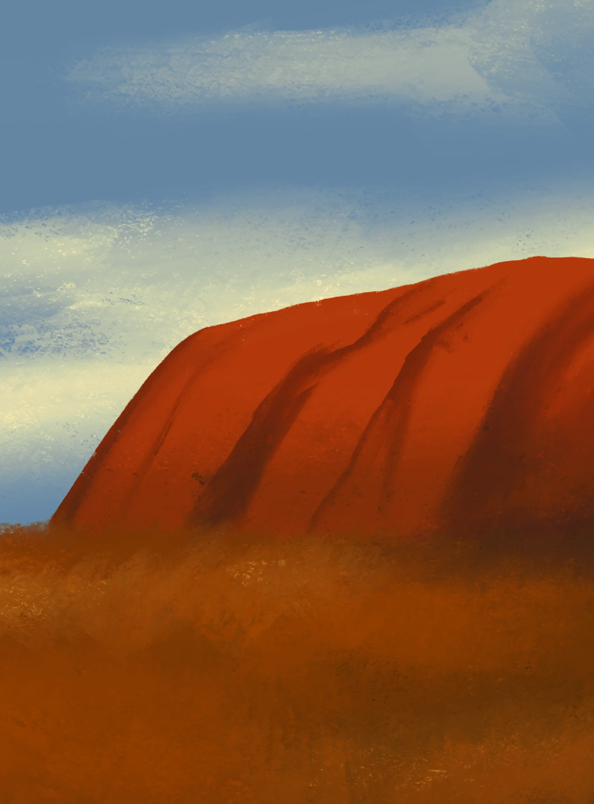

**Brief Visual Description:** Big red mountain of rock / sandstone in a smooth rounded shape,

surrounded by dry grasses, with a clear blue sky with white clouds.

**Dominant Colors:** Reddish brown, blue

**Reasoning for Inclusion within Mibera:**

**General Real World Trait History:** Massive sandstone rock formation in the southern part of

the Northern Territory, Australia. It's a sacred site for the Anangu, the Indigenous custodians. Its

reddish-brown surface changes color with the sunlight, especially at sunrise and sunset.

**Team Anecdotes:** -

**Date Created/Uploaded:** June 7, 2024

**Who Introduced the Trait:**

**Sources:**

- https://en.wikipedia.org/wiki/Uluru

---

## Road Side

**Name:** Roadside

**Image Files:**

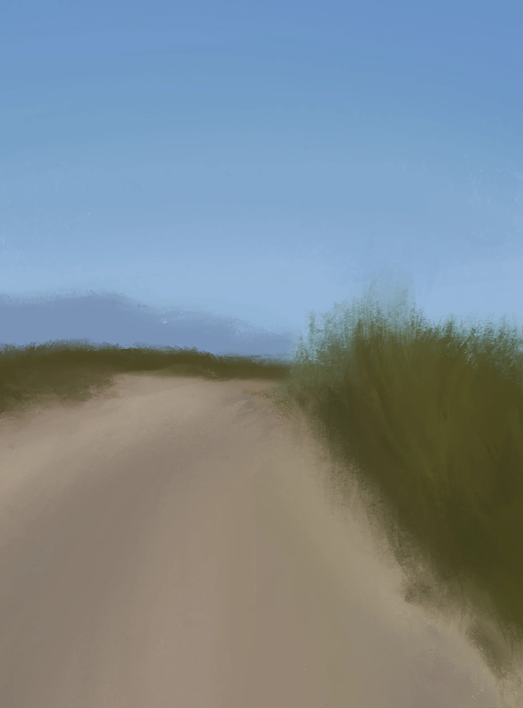

**Brief Visual Description:** Painterly style of a roadside. Grey road with greeneries on each side

of the road, under a clear blue sky.

**Dominant Colors:** Grey, blue, green

**Reasoning for Inclusion within Mibera:**

**General Real World Trait History:** Related to Milady (one of Milady Maker’s assets)

**Team Anecdotes:** -

**Date Created/Uploaded:** June 7, 2024

**Who Introduced the Trait:**

**Sources:**

https://opensea.io/collection/milady?traits=[{%22traitType%22:%22Background%22,%22values

**%22:** [%22roadside%22]}]

---

## Twelve Apostles

**Name:** Twelve Apostles

**Image Files:**

**Brief Visual Description:** Abstract, painterly style of a coastal scene with tall brown rock

formations. Muted blue and gray waves crashing. Sand can be seen on the bottom right.

**Dominant Colors:** Blue, beige, white

**Reasoning for Inclusion within Mibera:** ‘Twelve Apostles’, limestone stacks off the shore of

Port Campbell National Park in Victoria, Australia, along the Great Ocean Road. Despite the

name, there were never twelve stacks. They were originally nine, with seven remaining after

collapses in 2005 and 2009.

**General Real World Trait History:**

**Team Anecdotes:** -

**Date Created/Uploaded:** February 27, 2025

**Who Introduced the Trait:**

**Sources:**

- https://en.wikipedia.org/wiki/The_Twelve_Apostles_(Victoria)

---

## Techno City

**Name:** Techno City

**Image Files:**

**Brief Visual Description:** Front view of a building with many windows and a huge banner in

**blue on top; on it written:** ‘DETROIT TECHNO CITY’ in white.

**Dominant Colors:** Blue, dark grey, dark muted red

**Reasoning for Inclusion within Mibera:**

**General Real World Trait History:**

**Team Anecdotes:** -

**Date Created/Uploaded:** August 14, 2024

**Who Introduced the Trait:**

**Sources:**

- https://mixmag.net/feature/detroit-is-the-birthplace-of-techno-and-it-wont-let-you-forget-it

---

## Mississippi River

**Name:** Mississippi River

**Image Files:**

**Brief Visual Description:** Top view of the Mississippi river.

**Dominant Colors:** Muted green, dark grey

**Reasoning for Inclusion within Mibera:**

**General Real World Trait History:** Mississippi River; the second-longest river in North

America, stretches about 2,340 miles (3,766 km) from Minnesota to the Gulf of Mexico. It drains

31 U.S. states and two Canadian provinces, forming a vast watershed.

**Team Anecdotes:** -

**Date Created/Uploaded:** February 27, 2025

**Who Introduced the Trait:**

**Sources:**

- https://en.wikipedia.org/wiki/Mississippi_River

---

## Freetekno

**Name:** Freetekno

**Image Files:**

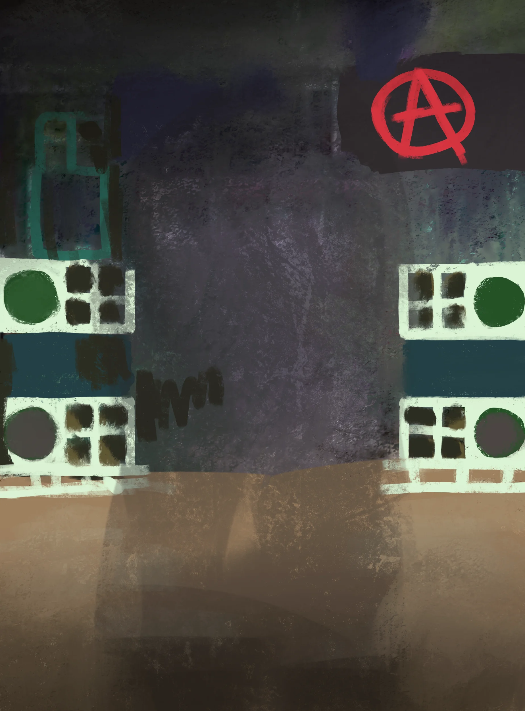

**Brief Visual Description:** Dark background, with a red anarchy symbol on the top right (an ‘A’

inside of a circle) and brown foreground. There are 4 rectangular-shaped items in light teal with

a big circle equivalent to the size of the 4 black squares next to it.

**Dominant Colors:** Dark purple, light sandy brown, light teal, green

**Reasoning for Inclusion within Mibera:**

**General Real World Trait History:**

**Team Anecdotes:** -

**Date Created/Uploaded:** August 14, 2024

**Who Introduced the Trait:**

**Additional Note:** Freetekno

---

## River Boyne

**Name:** River Boyne

**Image Files:**

**Brief Visual Description:** Painterly style scenery of a river, overlooking greeneries and a grey

tall old-school looking building.

**Dominant Colors:** Green, blue, grey

**Reasoning for Inclusion within Mibera:**

**General Real World Trait History:** River Boyne is located in Eastern Ireland, notably as the

site of the 1690 Battle of the Boyne.

**Team Anecdotes:** -

**Date Created/Uploaded:** February 27, 2025

**Who Introduced the Trait:**

**Source:**

- https://en.wikipedia.org/wiki/River_Boyne

---

## Peyote

**Name:** Peyote

**Image Files:**

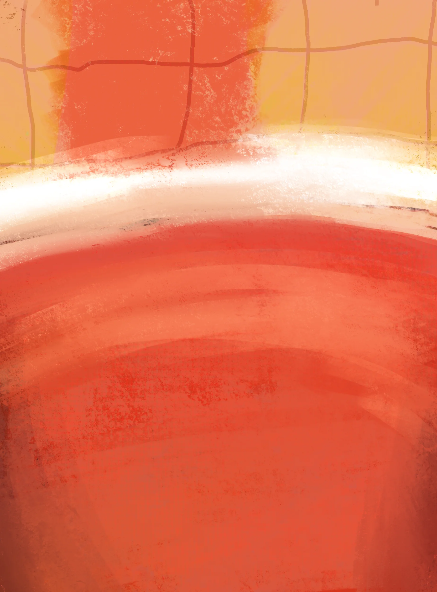

**Brief Visual Description:** Painterly abstract style of a bright red and orange gradient, with white

horizontal smudgy band near top and subtle squiggly grid pattern that’s semi transparent.

**Dominant Colors:** Bright red, orange

**Reasoning for Inclusion within Mibera:**

**General Real World Trait History:** The Native American Church (NAC) is a syncretic religious

organization combining Indigenous spiritual practices with Christianity, primarily among Native

American communities in the United States, Canada, and Mexico. Founded in the late 19th

century, it emphasizes the sacramental use of peyote, a hallucinogenic cactus, in ceremonies to

foster spiritual connection, healing, and community.

**Team Anecdotes:** -

**Date Created/Uploaded:** August 14, 2024

**Who Introduced the Trait:** Jani

**Source:**

- https://en.wikipedia.org/wiki/Native_American_Church

https://en.wikipedia.org/wiki/Native_American_Church#/media/File:Peyote_road.jpg

- https://discord.com/channels/1133935527855399053/1159122178009210890/11591247509630

64922

---

## Constellations

**Name:** Constellations

**Image Files:**

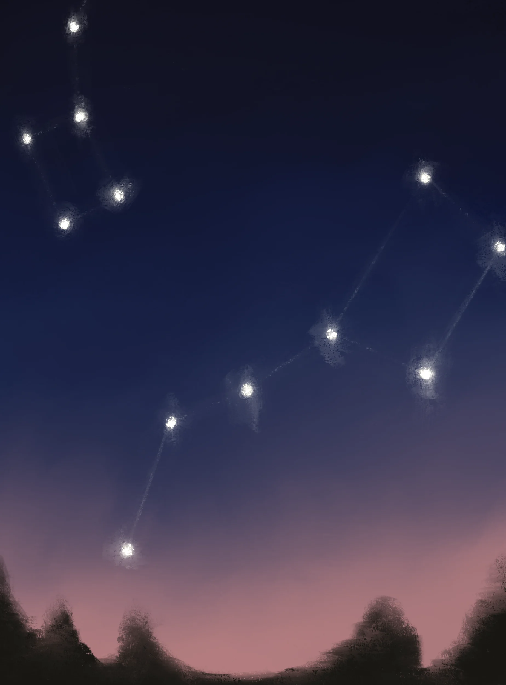

**Brief Visual Description:** Dark blue night sky that meets a pink horizon, with bright

constellations with connected dots (stars) and dark silhouette at the bottom.

**Dominant Colors:** dark blue, pink, white

**Reasoning for Inclusion within Mibera:**

**General Real World Trait History:**

**Team Anecdotes:** -

**Date Created/Uploaded:** June 7, 2024

**Who Introduced the Trait:** Tez

**Source:**

- https://discord.com/channels/1133935527855399053/1133948695457566760/11339521774639

06324

---

## Detroit

**Name:** Detroit

**Image Files:**

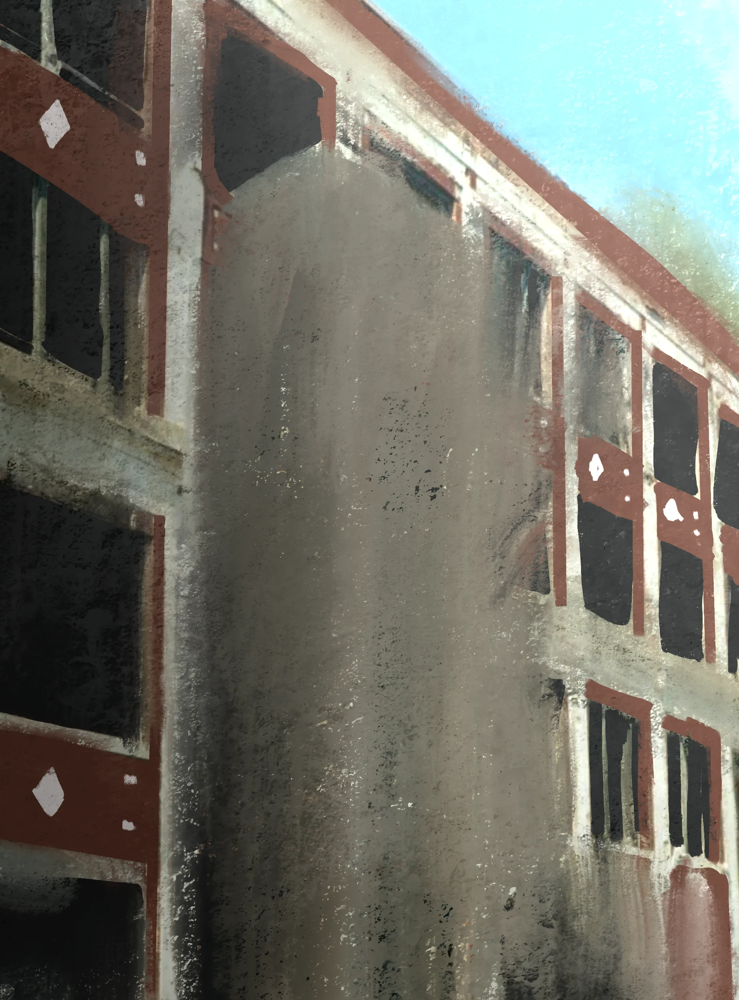

**Brief Visual Description:** Red and white building with many windows in black from front-side

point of view, with bright blue sky on top.

**Dominant Colors:** Brick red, grey, white, bright blue.

**Reasoning for Inclusion within Mibera:**

**General Real World Trait History:**

**Team Anecdotes:** -

**Date Created/Uploaded:** August 14, 2024

**Who Introduced the Trait:**

**Additional Note:** Detroit (mici's summary)

---

## Bullas

**Name:** Bullas

**Image Files:**

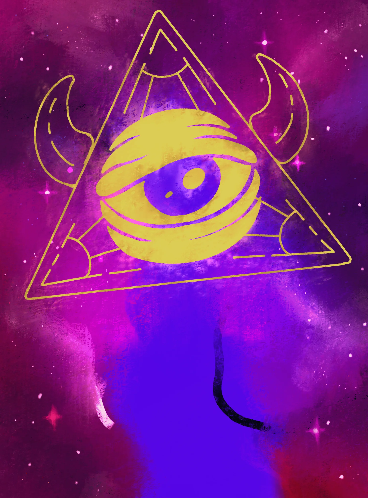

**Brief Visual Description:** Purple cosmic background with stars, in the middle is an outlined

triangle with a pair of bull-horn and an opened eye inside of it, in yellow.

**Dominant Colors:** Shades of purple, yellow.

**Reasoning for Inclusion within Mibera:** Fellow Bera brojekt.

**General Real World Trait History:** Having built a cult-like following, Bullas is one of

Berachain’s OG projects shipping NFT collections and a play-to-earn ponzi web game.

**Team Anecdotes:** -

**Date Created/Uploaded:** February 27, 2025

**Who Introduced the Trait:** Gods, Gumi (for the cosmic concept)

**Note:** Credits for Bullas I would automatically assume go to Gods

**Source:**

- https://x.com/TheBullas_

- https://magiceden.io/collections/berachain/bullas-5

- https://game.bullas.xyz/

---

## Great Bear Lake

**Name:** Great Bear Lake

**Image Files:**

**Brief Visual Description:** Large snowy landscape with a few houses in terracotta and brown in

the background, extending to what looks like a forest.

**Dominant Colors:** White with a hint of blue, terracotta, brown

**Reasoning for Inclusion within Mibera:**

**General Real World Trait History:** Great Bear Lake, located in Canada’s Northwest Territories

on the Arctic Circle, is the largest lake entirely within Canada and the fourth largest in North

America. The lake, frozen from November to July, supports the Sahtu Dene community of

**Délı̨nę and features five arms:** Smith, Dease, McTavish, McVicar, and Keith.

**Team Anecdotes:** -

**Date Created/Uploaded:** February 27, 2025

**Who Introduced the Trait:**

**Sources:**

- https://kids.britannica.com/students/article/Great-Bear-Lake/274637

---

## Panama

**Name:** Panama

**Image Files:**

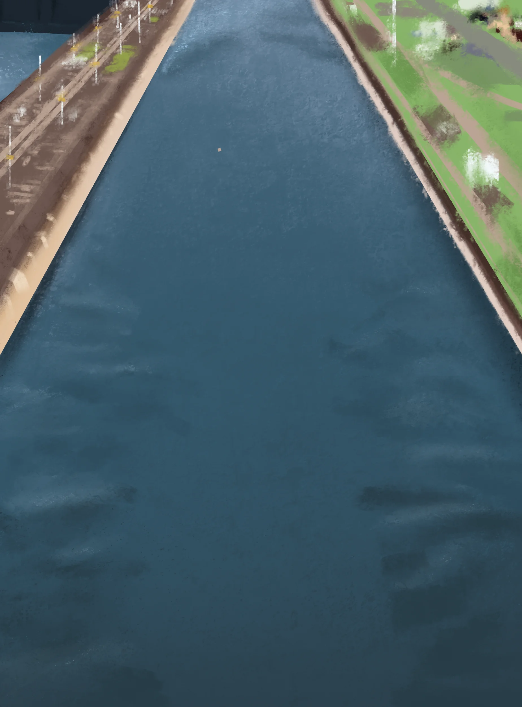

**Brief Visual Description:** Large deep blue area that looks like water that stretches across the

frame in between a pavement road and a grassy park.

**Dominant Colors:** Muted dark navy blue

**Reasoning for Inclusion within Mibera:**

**General Real World Trait History:** The Panama Canal is a 50-mile, man-made waterway

connecting the Atlantic and Pacific Oceans, pivotal for global trade. Completed in 1914 by the

U.S. after Panama’s independence from Colombia, it uses a lock system to handle 14,000+

ships annually, carrying over 300 million tons of cargo.

**Team Anecdotes:** -

**Date Created/Uploaded:** February 27, 2025

**Who Introduced the Trait:**

**Sources:**

- https://www.peek.com/farallon-panama/r04bd9r/panama-city-tour-discover-top-attractions/a0e46

q63

- https://www.history.com/articles/panama-canal

---

## Yeet

**Name:** Yeet

**Image Files:**

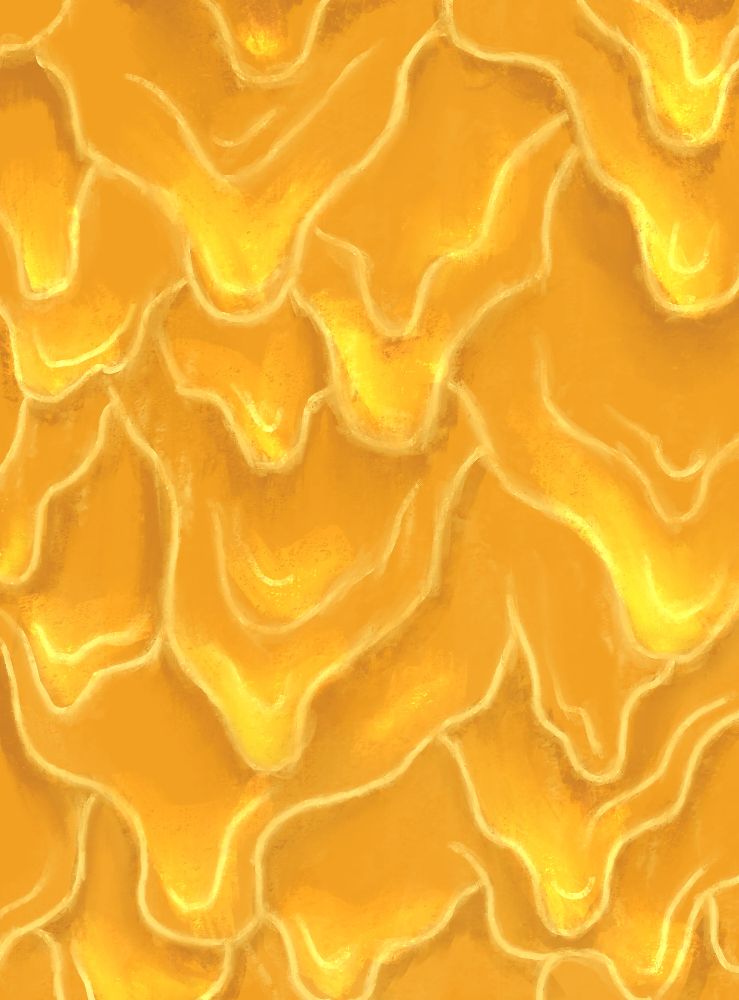

**Brief Visual Description:** Golden yellow liquid dripping down in a few chunks.

**Dominant Colors:** golden yellow

**Reasoning for Inclusion within Mibera:** Fellow Bera brojekt

**General Real World Trait History:** Highly engaging chaotic project with a cult-like community,

founded by Lord Pemberton, the project launched an NFT collection and a ponzi game design.

**Team Anecdotes:** -

**Date Created/Uploaded:** June 6, 2024

**Who Introduced the Trait:**

**Sources:**

- https://x.com/eatsleepyeet

- https://yeetit.xyz/

---

## Cave Art

**Name:** Cave Art

**Image Files:**

**Brief Visual Description:** Brown and beige gradient background with central lighting and 3

vague human figures in darker shade.

**Dominant Colors:** Brown, light brown / beige

**Reasoning for Inclusion within Mibera:**

**General Real World Trait History:** Indigenous Australian art, one of the world's oldest art

traditions, dates back over 40,000 years and includes rock paintings, carvings, sculptures, and

contemporary forms like acrylic paintings. Rooted in cultural and spiritual storytelling, it often

depicts Dreamtime narratives, using symbols and patterns unique to different regions.

**Team Anecdotes:** -

**Date Created/Uploaded:** August 14, 2024

**Who Introduced the Trait:** Jani

**Sources:**

- https://discord.com/channels/1133935527855399053/1158511884706779227/11585204469212

20146

- https://en.wikipedia.org/wiki/Indigenous_Australian_art

---

## Great Barrier Reef

**Name:** Great Barrier Reef

**Image Files:**

**Brief Visual Description:** Different shades of blue as the ocean with a linear beige sandy

ground cutting across the middle, and a blue sky.

**Dominant Colors:** Shades of blue, sandy beige

**Reasoning for Inclusion within Mibera:**

**General Real World Trait History:** The Great Barrier Reef, off Australia's northeastern coast, is

the world's largest coral reef system, spanning over 2,300 km with thousands of reefs and

islands. A UNESCO World Heritage Site, it supports immense biodiversity, including corals, fish,

and marine life.

**Team Anecdotes:** -

**Date Created/Uploaded:** February 27, 2025

**Who Introduced the Trait:**

**Sources:**

- https://en.wikipedia.org/wiki/Great_Barrier_Reef

---

## Tree

**Name:** Tree

**Image Files:**

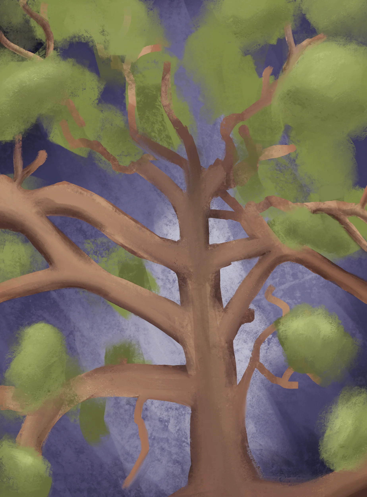

**Brief Visual Description:** Big tree from below / bottom point of view (looking up). Dark navy

background with white in the middle right behind the tree.

**Dominant Colors:** Soft brown, green, dark navy, white

**Reasoning for Inclusion within Mibera:**

**General Real World Trait History:**

**Team Anecdotes:** -

**Date Created/Uploaded:** June 7, 2024

**Who Introduced the Trait:**

**Sources:**

- https://discord.com/channels/1133935527855399053/1158511884706779227/11585204469212

20146

- https://theconversation.com/an-open-letter-from-1-200-australian-academics-on-the-djab-wurrun

g-trees-149147

---

## Mountain

**Name:** Mountain

**Image Files:**

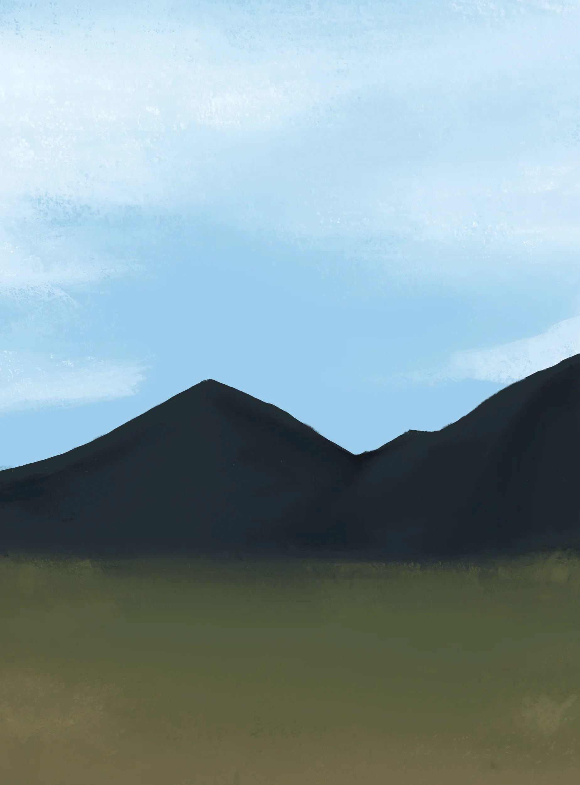

**Brief Visual Description:** Big mountain in dark grey / black, on top of a grassy ground and

under a bright blue sky.

**Dominant Colors:** Black / dark grey, green, blue

**Reasoning for Inclusion within Mibera:** Related to Milady (it’s one of the background assets)

**General Real World Trait History:**

**Team Anecdotes:** -

**Date Created/Uploaded:** December 10, 2024

**Who Introduced the Trait:**

**Sources:**

https://opensea.io/collection/milady?traits=[{%22traitType%22:%22Background%22,%22values

**%22:** [%22roadside%22,%22mountain%22]}]

---

## Milady Rave

**Name:** Milady Rave

**Image Files:**

**Brief Visual Description:** Light pale green tone, with abstract figures, and a small female

doll-like figure with big eyes being held on the far right side within the frame. Bright white light

from the top.

**Dominant Colors:** Light pale green, white.

**Reasoning for Inclusion within Mibera:**

**General Real World Trait History:**

**Team Anecdotes:** -

**Date Created/Uploaded:** June 6, 2024

**Who Introduced the Trait:**

**Source:**

---

## Milady Rave 2

**Name:** Milady Rave 2

**Image Files:**

**Brief Visual Description:** Human face with big eyes and small mouth, short hair, in a suit. The

figure is radiating light in contrast to the room's dark setting.

**Dominant Colors:** Black, muted brown, bright light yellow.

**Reasoning for Inclusion within Mibera:**

**General Real World Trait History:**

**Team Anecdotes:** -

**Date Created/Uploaded:** June 7, 2024

**Who Introduced the Trait:**

---

## Midas in Pactolus

**Name:** Midas in Pactolus

**Image Files:**

**Brief Visual Description:** Painterly scenery of a pond / lake with greenish water, surrounded by

rocks and greeneries. An old man wearing all earthy-brown clothing can be seen scooping the

water.

**Dominant Colors:** Black, muted brown, bright light yellow.

**Reasoning for Inclusion within Mibera:**

**General Real World Trait History:** King Midas, granted his wish to turn everything he touched

to gold, found it a curse as he could neither eat nor drink. Bacchus instructed him to wash in the

Pactolus River to reverse it. In Poussin’s painting, a humbled Midas stands behind a river god

and putti, symbolizing the river’s source and Bacchus. Created after Poussin’s arrival in Rome, it

was among the first artworks acquired by The Met in 1871.

**Team Anecdotes:** -

**Date Created/Uploaded:** February 27, 2025

**Who Introduced the Trait:** Fedor / Jani

**Sources:**

https://www.metmuseum.org/art/collection/search/437328#:~:text=According%20to%20ancient

%20myth%2C%20King,enter%20The%20Met%20in%201871.

- https://discord.com/channels/1133935527855399053/1150328747908677654/12020332755568

59905

---

## Mobile Records

**Name:** Mobile Records

**Image Files:**

**Brief Visual Description:** Black car with yellow stripe lining at the bottom, and an extending

shack as the half part of the car. The car is parked / static.

**Dominant Colors:** Black, yellow, hues of muted purple

**Reasoning for Inclusion within Mibera:**

**General Real World Trait History:** Charlie Ace, born Valdene Dixon in 1945, was a pivotal

figure in Jamaican music, known for his work as a DJ, producer, and entrepreneur. His

Swing-A-Ling Mobile Record Shack, a converted Morris van, brought reggae and dancehall

records directly to Kingston's streets in the 1970s, becoming a cultural icon. It promoted new

music and artists, featured in media like Jamaican tourist magazines and a Channel 4

documentary.

**Team Anecdotes:** -

**Date Created/Uploaded:** June 7, 2024

**Who Introduced the Trait:** Jani

**Sources:**

- https://discord.com/channels/1133935527855399053/1159838989872803870/11598399802360

66887

- https://conesonic.com/2024/07/02/charlie-ace-and-the-swing-a-ling-mobile-record-shack/

- https://jamaicans.com/brief-history-reggae/

---

## 7Eleven

**Name:** 7Eleven

**Image Files:**

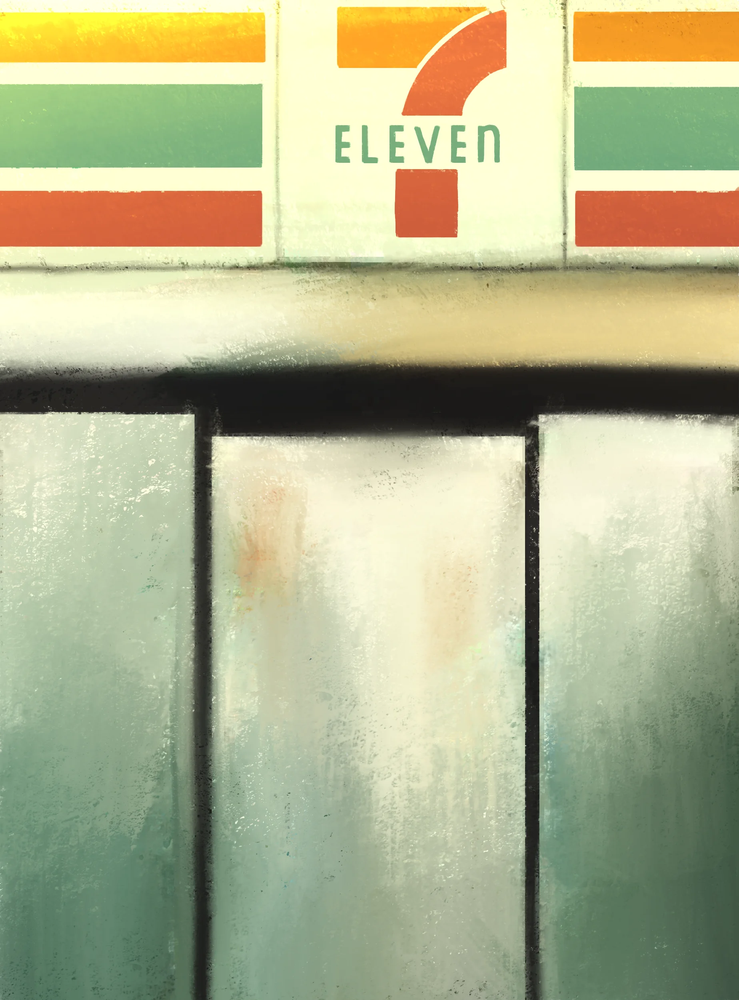

**Brief Visual Description:** Front view of a minimart with ‘7eleven’ sign on top with 3 thick stripes

going across in orange, green, and red. Under it are a light beige wall and glass windows /

doors.

**Dominant Colors:** White / grey, orange, green, reed

**Reasoning for Inclusion within Mibera:**

**General Real World Trait History:** 7-Eleven is a global convenience store chain, originating in

the U.S. in 1927 as Tote'm Stores. Known for Slurpee drinks and 24/7 operations in many

locations, it has over 80,000 stores worldwide.

**Team Anecdotes:** -

**Date Created/Uploaded:** December 10, 2024

**Who Introduced the Trait:** Tez

**Source:**

- https://discord.com/channels/1133935527855399053/1133948695457566760/11339521774639

06324

---

## Simple Backgrounds

**Image Files:**

.webp)

**Brief Visual Description:** a stereotypical TV glitch in vibrant colors.

**Dominant Colors:** white, neon yellow, turquoise, green, fuschia, red, blue, and black.

---

**Image Files:**

.webp)

**Brief Visual Description:** a textured plain black / dark grey background with central light

positioning.

**Dominant Colors:** black / dark grey.

---

**Image Files:**

.webp)

**Brief Visual Description:** light gray misty upper half and gradually turns to black towards the

bottom, with textured, weathered surface and central light positioning.

**Dominant Colors:** black / dark grey.

---

**Image Files:**

.webp)

**Brief Visual Description:** dark grey fading to light grey downwards with textured weathered

surface and subtle speckles.

**Dominant Colors:** dark grey, light grey.

---

**Image Files:**

.webp)

**Brief Visual Description:** vibrant teal textured background with strong vignette effect framing it.

**Dominant Colors:** vibrant teal, dark navy / blue.

---

**Image Files:**

.webp)

**Brief Visual Description:** vibrant rainbow color from top to bottom.

**Dominant Colors:** vibrant rainbow color; red, orange, yellow, green, blue, indigo, purple.

---

**Image Files:**

.webp)

**Brief Visual Description:** golden background that grows gradually brighter towards the middle

showcasing a bright circular golden hue, with the strokes going towards a circular / spiral-y

direction.

**Dominant Colors:** dark gold, bright gold

---

**Image Files:**

**Brief Visual Description:** vibrant warm pink textured background with strong vignette effect

framing it.

**Dominant Colors:** vibrant warm pink, dark grey / black.

---

## Honeyroad

**Name:** Honeyroad

**Image Files:**

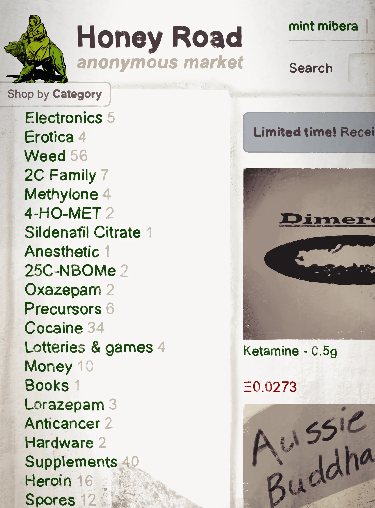

**Brief Visual Description:** Snap of a website page called ‘Honey Road’ anonymous market,

offering wide selections of drugs.

**Dominant Colors:** White, grey, green

**Reasoning for Inclusion within Mibera:**

**General Real World Trait History:** The ‘official’ website for Mibera Maker.

**Team Anecdotes:** -

**Date Created/Uploaded:** March 21, 2025

**Who Introduced the Trait:**

**Sources:**

- http://honeyroad.xyz/

---

## Volcano

**Name:** Volcano

**Image Files:**

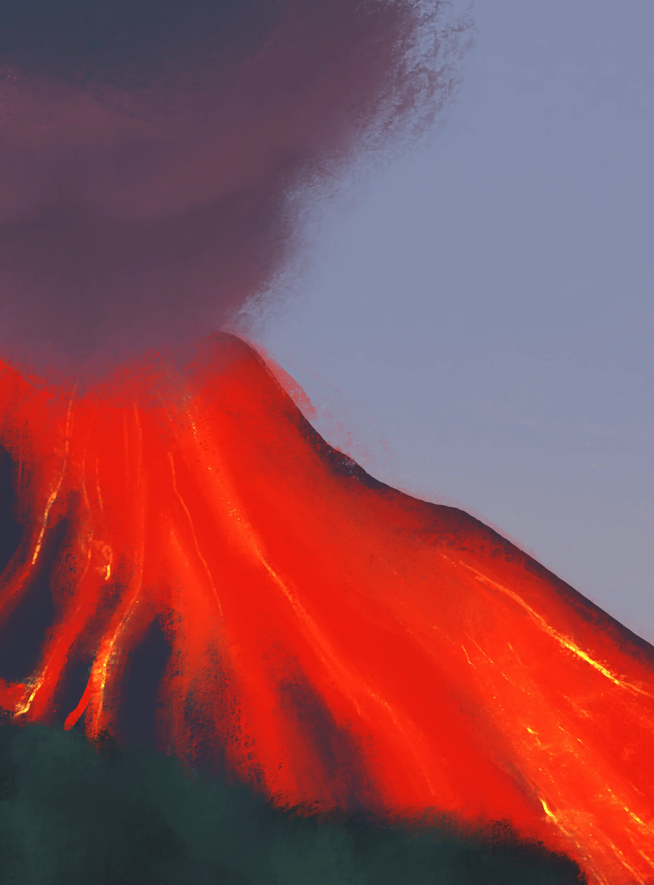

**Brief Visual Description:** An erupted volcanic mountain. Bright red lava puking out of the

mountain as a big ball of smoke in dark grey can be seen in the sky.

**Dominant Colors:** Bright red, dark grey, muted pale blue

**Reasoning for Inclusion within Mibera:**

**General Real World Trait History:**

**Team Anecdotes:** -

**Date Created/Uploaded:** February 28, 2025

**Who Introduced the Trait:**

---

## Bear Cave

**Name:** Bear Cave

**Image Files:**

**Brief Visual Description:** Flat stone grey wall with a hint of brown, a few thick branches

dangling down / poking in. bright orange brushes are stroked around the surface.

**Dominant Colors:** Stone grey, beige, bright orange

**Reasoning for Inclusion within Mibera:**

**General Real World Trait History:**

**Team Anecdotes:** -

**Date Created/Uploaded:** August 14, 2024

**Who Introduced the Trait:**

---

## Swirly

**Name:** Swirly

**Image Files:**

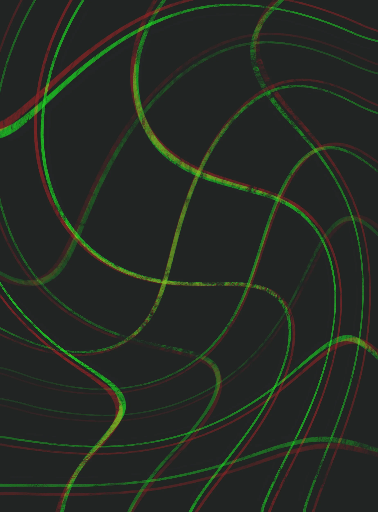

**Brief Visual Description:** Dark grey background with green and red semi-transparent wavy

lines overlapping each other in a swirly / flowy manner.

**Dominant Colors:** Black, neon green, red

**Reasoning for Inclusion within Mibera:**

**General Real World Trait History:**

**Team Anecdotes:** -

**Date Created/Uploaded:** August 14, 2024

**Who Introduced the Trait:**

**Note:** I feel like one of Gods’ old poster / creation was a big inspiration for this piece.

- https://discord.com/channels/1133935527855399053/1152388368865431582/11546755052415

30411

---

## Record Store

**Name:** Record Store

**Image Files:**

**Brief Visual Description:** Vague monochrome painterly shot of a room with a few downlights,

hanging decoration, and racks of items in square shapes.

**Dominant Colors:** Black and white with a slight hue of sepia.

**Reasoning for Inclusion within Mibera:**

**General Real World Trait History:**

**Team Anecdotes:** -

**Date Created/Uploaded:** December 10, 2024

**Who Introduced the Trait:** Jani

**Sources:**

- https://discord.com/channels/1133935527855399053/1143360212842061834/11608814206512

12840

- https://daily.redbullmusicacademy.com/2016/11/importes-etc-feature/

---

## Aquarius

**Name:** Aquarius

**Image Files:**

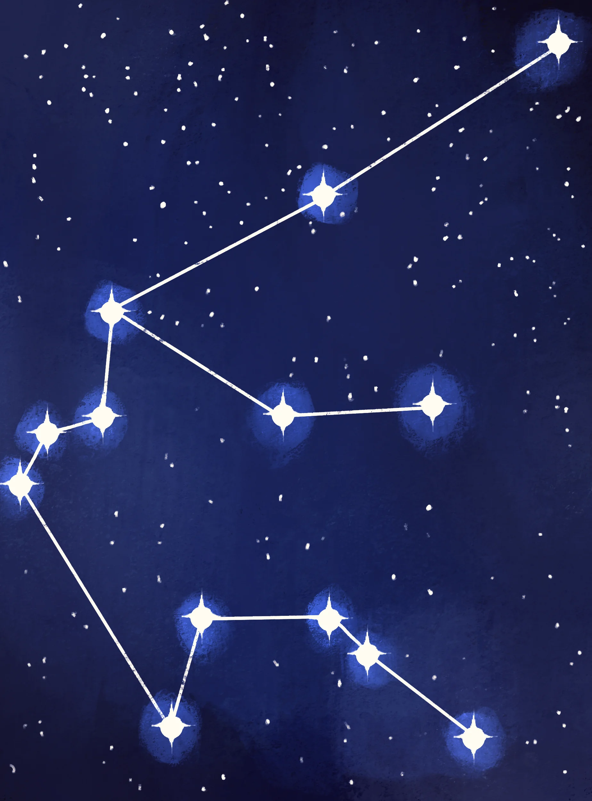

**Brief Visual Description:** Deep blue night sky with bright white 4-points-stars connected by thin

white lines forming a constellation (Aquarius). Smaller stars in white dots are scattered in the

background.

**Dominant Colors:** Deep blue, white.

**Reasoning for Inclusion within Mibera:**

**General Real World Trait History:** Aquarius, the eleventh zodiac sign (January 20 - February

18), is an air sign ruled by Uranus. Symbolized by the Water Bearer, it represents innovation,

independence, and humanitarianism. Aquarians are known for their progressive, intellectual,

and unconventional nature, often valuing freedom and social causes. They can be eccentric yet

aloof, with a strong focus on individuality and community betterment.

**Team Anecdotes:** -

**Date Created/Uploaded:** November 23, 2024

**Who Introduced the Trait:**

---

## Pisces

**Name:** Pisces

**Image Files:**

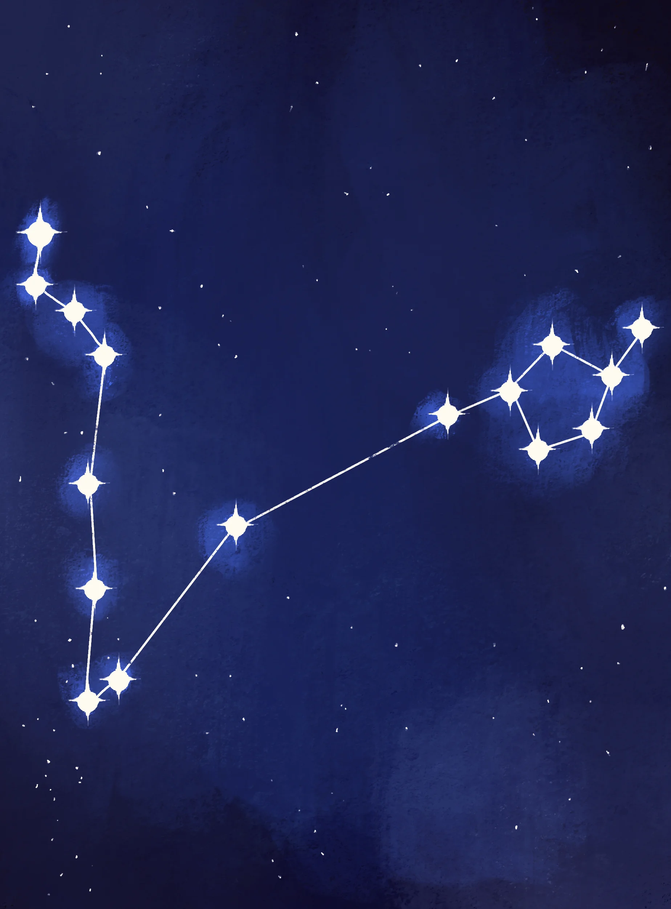

**Brief Visual Description:** Deep blue night sky with bright white 4-points-stars connected by thin

white lines forming a constellation (Pisces). Smaller stars in white dots are scattered in the

background.

**Dominant Colors:** Deep blue, white.

**Reasoning for Inclusion within Mibera:**

**General Real World Trait History:** Pisces, the twelfth zodiac sign (February 19 - March 20), is

a water sign ruled by Neptune. Symbolized by two fish, it embodies intuition, empathy, and

creativity. Pisceans are known for their compassionate, dreamy, and artistic nature, often deeply

emotional and adaptable. They can be idealistic but sometimes escapist, with a strong

connection to spirituality and imagination.

**Team Anecdotes:** -

**Date Created/Uploaded:** November 23, 2024

**Who Introduced the Trait:**

---

## Poppy Field

**Name:** Poppy Field

**Image Files:**

**Brief Visual Description:** Simple scenery of a field of poppies that are yet to bloom. Bright blue

sky in the background.

**Dominant Colors:** Green, blue.

**Reasoning for Inclusion within Mibera:**

**General Real World Trait History:**

**Team Anecdotes:** -

**Date Created/Uploaded:** March 11, 2025

**Who Introduced the Trait:**

---

## Capricornus

**Name:** Capricornus

**Image Files:**

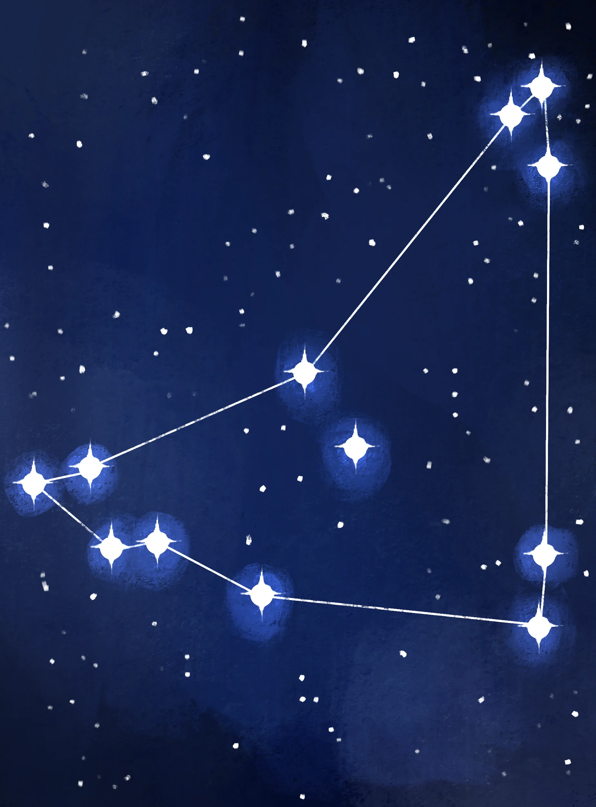

**Brief Visual Description:** Deep blue night sky with bright white 4-points-stars connected by thin

white lines forming a constellation (Capricorn). Smaller stars in white dots are scattered in the

background.

**Dominant Colors:** Deep blue, white.

**Reasoning for Inclusion within Mibera:**

**General Real World Trait History:** Capricorn, the tenth zodiac sign (December 22 - January

19), is an earth sign ruled by Saturn. Symbolized by the Goat, it represents ambition, discipline,

and practicality. Capricorns are known for their hardworking, responsible, and goal-oriented

nature, often striving for success and stability. They can be serious and reserved but are deeply

loyal and pragmatic.

**Team Anecdotes:** -

**Date Created/Uploaded:** November 23, 2024

**Who Introduced the Trait:**

---

## Prison

**Name:** Prison

**Image Files:**

**Brief Visual Description:** Simple grey background with prison bars in front with 3D effect.

**Dominant Colors:** Dark grey, grey.

**Reasoning for Inclusion within Mibera:**

**General Real World Trait History:**

**Team Anecdotes:** -

**Date Created/Uploaded:** March 11, 2025

**Who Introduced the Trait:**

**Note:** a lot of things can be related to prison within the Mibera lore, from Ross to Pickard. So I

am thinking of writing a thorough breakdown on this.

---

## Sasha

**Name:** Sasha

**Image Files:**

**Brief Visual Description:** Room in mainly the colour of beige / light brown, with a door in the

background with a sign saying “PRIVATE ROAD”. Flasks and other ‘equipment’ with a gauge

can also be seen in the background. In front is a table full of bottles in a variety of sizes, as well

as papers and small brushes in a cup.

**Dominant Colors:** Beige / brown.

**Reasoning for Inclusion within Mibera:**

**General Real World Trait History:**

**Team Anecdotes:** -

**Date Created/Uploaded:** March 11, 2025

**Who Introduced the Trait:**

---

## Castlemorton

**Name:** Castlemorton

**Image Files:**

**Brief Visual Description:** Field of grass with a bus or some sort in the background with a

painting of a pink man wearing neon green t-shirt and a magenta bottom, as well as the writing

“party people”. In front is a sheriff’s hat resting on a fence’s corner.

**Dominant Colors:** Green, black, white, pink.

**Reasoning for Inclusion within Mibera:** Rave culture

**General Real World Trait History:** In May 1992, Castlemorton Common hosted the UK's

largest illegal rave, drawing 20,000-40,000 people for a week-long free festival sparked by New

Age travellers and ravers. Sound systems like Spiral Tribe and DiY set up, fueled by acid house

and word-of-mouth. The event’s scale led to the Criminal Justice and Public Order Act 1994,

banning unlicensed raves with “repetitive beats.” Photographer Alan Lodge, a former paramedic

turned traveller, documented the vibrant subculture and police tensions, capturing a pivotal

moment in UK dance music history

**Team Anecdotes:** -

**Date Created/Uploaded:** March 11, 2025

**Who Introduced the Trait:**

**Sources:**

- https://discord.com/channels/1133935527855399053/1143360154734174308/11540776932231

20976

- https://djmag.com/features/castlemorton-1992-photographing-illegal-rave-changed-uk-dance-m

usic-forever

---

## Owsley Lab

**Name:** Owsley Lab

**Image Files:**

**Brief Visual Description:** Room in mainly the colour of beige / light brown. A poster is seen on

the wall; along with a book, a few bottles, and a big jar on top of the table by the wall. On the

front table, a jar, a big bottle, and a few smaller bottles / flasks can also be seen standing

around an open book.

**Dominant Colors:** Light brown, reddish brown.

**Reasoning for Inclusion within Mibera:**

**General Real World Trait History:** Augustus Owsley Stanley III, known as "Bear," was a key

figure in the 1960s counterculture, producing over a million doses of pure LSD, fueling the

Summer of Love and events like the Monterey Pop Festival. As the Grateful Dead’s sound

engineer and financial backer, he pioneered live stereo mixing and recorded their performances,

preserving them in the “Dick’s Picks” series. He also designed the band’s iconic dancing bear

logo. After serving prison time for LSD production, he crafted jewelry and lived off-grid in

Australia until his death in a 2011 car accident at age 76

**Team Anecdotes:** -

**Date Created/Uploaded:** March 11, 2025

**Who Introduced the Trait:** Jani / Tez

**Sources:**

- https://www.rollingstone.com/feature/owsley-stanley-the-king-of-lsd-82181/

---

## Home Lab

**Name:** Home Lab

**Image Files:**

**Brief Visual Description:** Empty room with brownish accent and a half=opened curtain in the

**background. On the table in front can be seen:** a funnel on a lab glass / flask, two dark bottles

labeled "Hydrogen Peroxide Solution", a clear tray with blue liquid in it, and a pack of matches.

**Dominant Colors:** Shades of brown, golden brown.

**Reasoning for Inclusion within Mibera:**

**General Real World Trait History:**

**Team Anecdotes:** -

**Date Created/Uploaded:** March 11, 2025

**Who Introduced the Trait:**

---

## Pacioli

**Name:** Pacioli

**Image Files:**

**Brief Visual Description:** Black room that includes a black board in the background. In front is

a green table with an open book, some geometrical tools, and a dodecahedron model resting on

top of a red book; a clear / transparent rhombicuboctahedron half-filled with water is hanging

from the ceiling.

**Dominant Colors:** Black, gold, green.

**Reasoning for Inclusion within Mibera:**

**General Real World Trait History:** Luca Pacioli, an Italian mathematician and Franciscan friar,

is known as the "Father of Accounting" for publishing the first detailed description of

double-entry bookkeeping in his 1494 work, Summa de Arithmetica. Born in Sansepolcro,

Tuscany, he studied mathematics and worked as a tutor and university professor across Italy.

Pacioli collaborated with Leonardo da Vinci in Milan, teaching him mathematics and

co-authoring De Divina Proportione (1509), which explored the golden ratio.

**Team Anecdotes:** -

**Date Created/Uploaded:** March 11, 2025

**Who Introduced the Trait:**

---

## Cancer

**Name:** Cancer

**Image Files:**

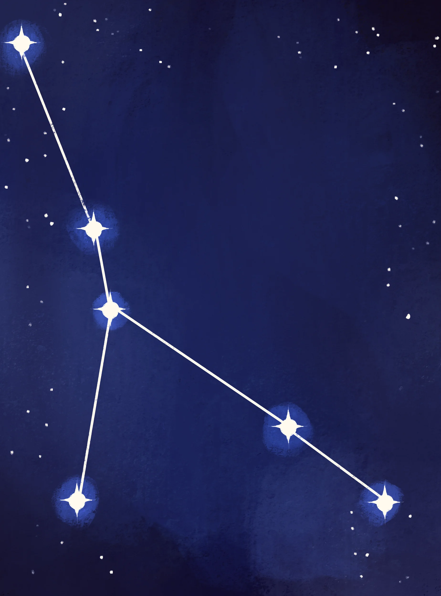

**Brief Visual Description:** Deep blue night sky with bright white 4-points-stars connected by thin

white lines forming a constellation (Cancer). Smaller stars in white dots are scattered in the

background.

**Dominant Colors:** Deep blue, white.

**Reasoning for Inclusion within Mibera:**

**General Real World Trait History:** Cancer, the fourth zodiac sign (June 22 - July 22), is a water

sign ruled by the Moon. Symbolized by the Crab, it represents emotion, intuition, and nurturing.

Cancers are known for their caring, empathetic, and protective nature, often deeply connected

to family and home. Generally, they can be sensitive and moody but are loyal and intuitive, with

a strong sense of security and tradition.

**Team Anecdotes:** -

**Date Created/Uploaded:** November 23, 2024

**Who Introduced the Trait:**

---

## Virgo

**Name:** Virgo

**Image Files:**

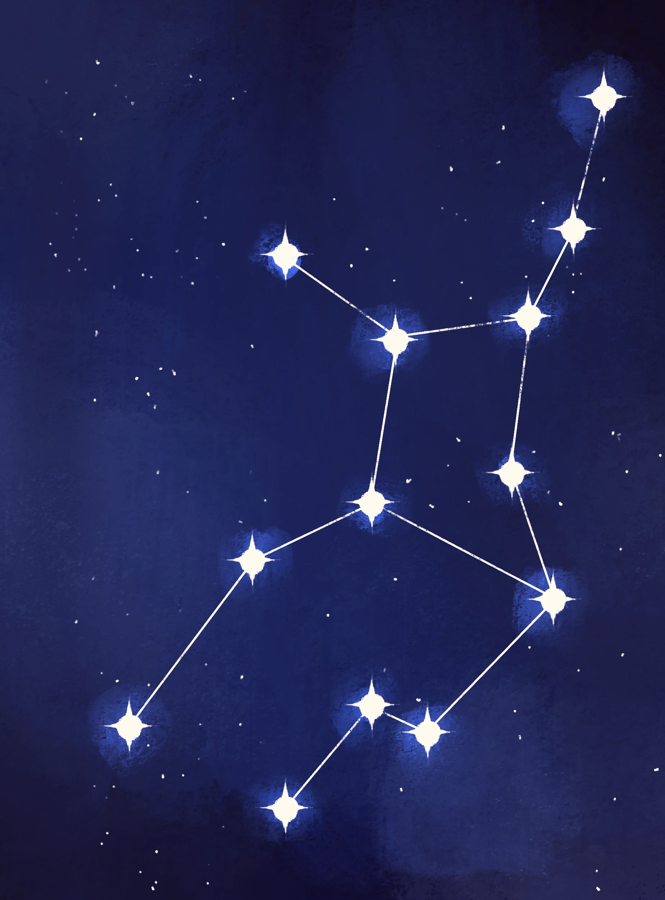

**Brief Visual Description:** Deep blue night sky with bright white 4-points-stars connected by thin

white lines forming a constellation (Virgo). Smaller stars in white dots are scattered in the

background.

**Dominant Colors:** Deep blue, white.

**Reasoning for Inclusion within Mibera:** Mibera visually and astrologically explores all 12

zodiac signs.

**General Real World Trait History:** Virgo, the sixth zodiac sign (August 23 - September 22), is

an earth sign ruled by Mercury. Symbolized by the Virgin, it represents precision, practicality,

and service.

**Team Anecdotes:** -

**Date Created/Uploaded:** November 23, 2024

**Who Introduced the Trait:**

–

Consider including more direct info about the virgin, need to decide how in depth we want to go

for astro entries in general.

---

## Newgrange

**Name:** Newgrange

**Image Files:**

**Brief Visual Description:** Background made of sandy-colored stones with some carvings on

them, including 3 connected spirals. In front is a wood / thick branch with moss and mushrooms

growing on it.

**Dominant Colors:** Beige, sandy brown

**Reasoning for Inclusion within Mibera:**

**General Real World Trait History:** Newgrange is a prehistoric monument in County Meath,

Ireland. Constructed with large stones, some decorated with megalithic art, it reflects advanced

Neolithic engineering and cultural significance.

**Team Anecdotes:** -

**Date Created/Uploaded:** March 11, 2025

**Who Introduced the Trait:**

**Sources:**

- https://www.newgrange.com/

---

## Libra

**Name:** Libra

**Image Files:**

**Brief Visual Description:** Deep blue night sky with bright white 4-points-stars connected by thin

white lines forming a constellation (Libra). Smaller stars in white dots are scattered in the

background.

**Dominant Colors:** Deep blue, white.

**Reasoning for Inclusion within Mibera:**

**General Real World Trait History:** Libra, the seventh zodiac sign (September 23 - October 22),

is an air sign ruled by Venus. Symbolized by the Scales, it represents balance, harmony, and

justice. Libras are known for their diplomatic, charming, and sociable nature, often seeking

fairness and beauty in relationships and surroundings. Generally, they can be indecisive but are

cooperative and value partnerships.

**Team Anecdotes:** -

**Date Created/Uploaded:** November 23, 2024

**Who Introduced the Trait:**

---

## Leo

**Name:** Leo

**Image Files:**

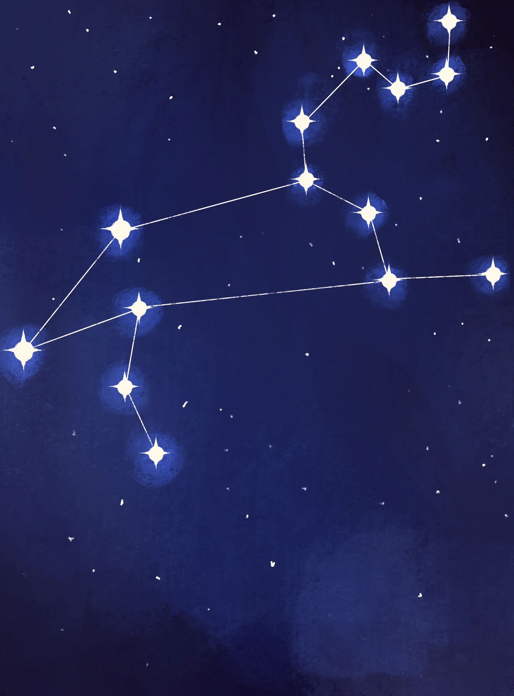

**Brief Visual Description:** Deep blue night sky with bright white 4-points-stars connected by thin

white lines forming a constellation (Leo). Smaller stars in white dots are scattered in the

background.

**Dominant Colors:** Deep blue, white.

**Reasoning for Inclusion within Mibera:**

**General Real World Trait History:** Leo, the fifth zodiac sign (July 23 - August 22), is a fire sign

ruled by the Sun. Symbolized by the Lion, it represents confidence, ambition, and leadership.

Leos are known for their bold, charismatic, and warm-hearted nature, often thriving in the

spotlight. Generally, they can be proud or dramatic but are loyal, generous, and inspire others

with their enthusiasm.

**Team Anecdotes:** -

**Date Created/Uploaded:** November 23, 2024

**Who Introduced the Trait:**

---

## Super Lab

**Name:** Super Lab

**Image Files:**

**Brief Visual Description:** The room has dim lighting, with 2 control panels attached to a

metallic piece. One is bigger with a green light indicator (off) and a red light indicator (on).

In front is a clear container with very light blue powder inside and a scale; with the scoop placed

on the scale indicating the weighing process.

**Dominant Colors:** Silver / grey

**Reasoning for Inclusion within Mibera:**

**General Real World Trait History:**

**Team Anecdotes:** -

**Date Created/Uploaded:** March 11, 2025

**Who Introduced the Trait:**

---

## Jungle Lab

**Name:** Jungle Lab

**Image Files:**

**Brief Visual Description:** Jungle setting with four blue drums / barrels, a black tarp on the

ground, a snake wrapped around one of the trees, and a pair of bright yellow eyes peeking from

the dark. In front are mountains of white powder and an empty glass jar. Thin log and some

leaves are framing the scene nicely.

**Dominant Colors:** Silver / grey

**Reasoning for Inclusion within Mibera:**

**General Real World Trait History:**

**Team Anecdotes:** -

**Date Created/Uploaded:** March 11, 2025

**Who Introduced the Trait:**

---

## Acid Test

**Name:** Acid Test

**Image Files:**

**Brief Visual Description:** Room full of speakers / sound systems, with a drum-set on the right

side in the background; two big old cameras are placed in front, from a first-person point of view.

**Dominant Colors:** Dark grey, dark copper.

**Reasoning for Inclusion within Mibera:**

**General Real World Trait History:**

**Team Anecdotes:** -

**Date Created/Uploaded:** March 11, 2025

**Who Introduced the Trait:**

---

## Ophiuchus

**Name:** Ophiuchus

**Image Files:**

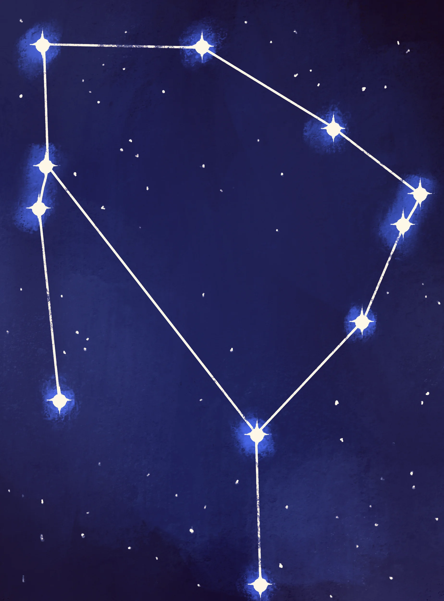

**Brief Visual Description:** Deep blue night sky with bright white 4-points-stars connected by thin

white lines forming a constellation (Ophiuchus).Smaller stars in white dots are scattered in the

background.

**Dominant Colors:** Deep blue, white.

**Reasoning for Inclusion within Mibera:**

**General Real World Trait History:** Ophiuchus, sometimes called the 13th zodiac sign

(November 29 - December 17), is not officially recognized in traditional Western astrology.

Represented by a serpent-bearer, it’s linked to the constellation of the same name and

associated with healing, wisdom, and transformation, inspired by the mythological figure

Asclepius, the Greek god of medicine. Those born under Ophiuchus are said to be intuitive,

curious, and seekers of knowledge, though its inclusion in astrology remains debated and

uncommon.

**Team Anecdotes:** -

**Date Created/Uploaded:** November 23, 2024

**Who Introduced the Trait:**

---

## Hor Berlin

**Name:** Hor Berlin

**Image Files:**

**Brief Visual Description:** Dim moody room with yellow tiled walls, black grid, and red door at

the back. In front is a DJ set.

**Dominant Colors:** Dark grey, dark copper.

**Reasoning for Inclusion within Mibera:**

**General Real World Trait History:** HÖR Berlin, founded in 2019 by DJ duo TV.OUT in

Berlin-Kreuzberg, is an independent online music platform and cultural space streaming DJ sets

and live acts six days a week. Known for its distinctive bathroom-like studio, it gained

prominence during the COVID-19 pandemic, showcasing diverse electronic music from artists

like Rødhåd, KI/KI, and Nina Kraviz. HÖR supports emerging and underrepresented artists,

emphasizing inclusivity and experimental sound.

**Team Anecdotes:** -

**Date Created/Uploaded:** March 11, 2025

**Who Introduced the Trait:**

**Sources:**

- https://hoer.live/

- https://www.youtube.com/channel/UCmfF7JZv26UUKyRedViGIlw

---

## Gemini

**Name:** Gemini

**Image Files:**

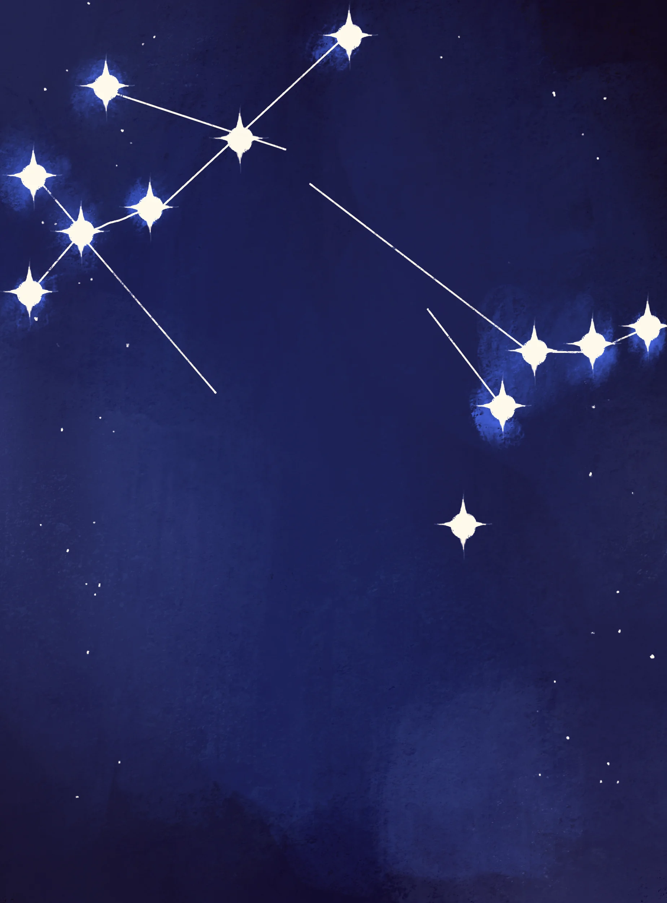

**Brief Visual Description:** Deep blue night sky with bright white 4-points-stars connected by thin

white lines forming a constellation (Gemini). Smaller stars in white dots are scattered in the

background.

**Dominant Colors:** Deep blue, white.

**Reasoning for Inclusion within Mibera:**

**General Real World Trait History:** Gemini, the third zodiac sign (May 21 - June 21), is an air

sign ruled by Mercury. Symbolized by the Twins, it represents adaptability, curiosity, and

communication. Geminis are known for their witty, versatile, and sociable nature, often thriving

in dynamic environments. Generally, they can be indecisive or restless but are quick-thinking,

charming, and excel at connecting ideas and people.

**Team Anecdotes:** -

**Date Created/Uploaded:** November 23, 2024

**Who Introduced the Trait:**

---

## Taurus

**Name:** Taurus

**Image Files:**

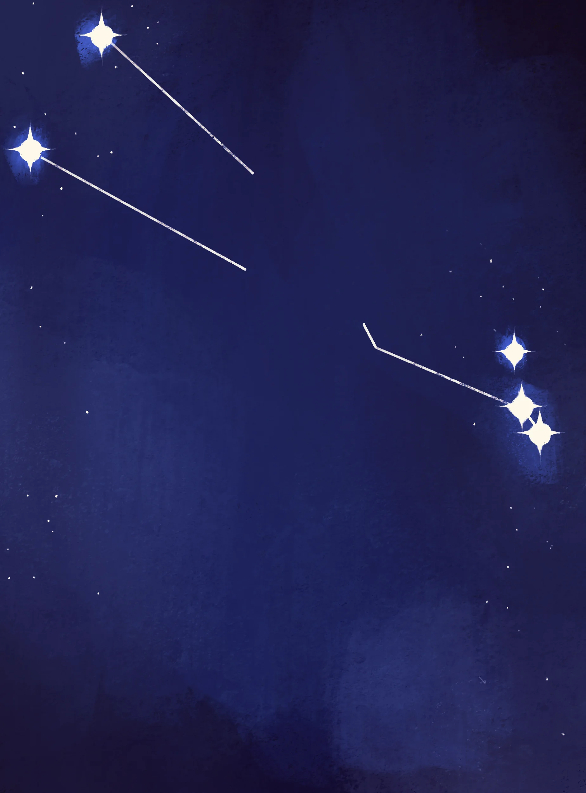

**Brief Visual Description:** Deep blue night sky with bright white 4-points-stars connected by thin

white lines forming a constellation (Taurus). Smaller stars in white dots are scattered in the

background.

**Dominant Colors:** Deep blue, white.

**Reasoning for Inclusion within Mibera:**

**General Real World Trait History:** Taurus, the second zodiac sign (April 20 - May 20), is an

earth sign ruled by Venus. Symbolized by the Bull, it represents stability, practicality, and

sensuality. Taureans are known for their reliable, patient, and determined nature, often valuing

comfort and beauty. Generally, they can be stubborn but are loyal, hardworking, and enjoy life’s

pleasures.

**Team Anecdotes:** -

**Date Created/Uploaded:** November 23, 2024

**Who Introduced the Trait:**

---

## Sagittarius

**Name:** Sagittarius

**Image Files:**

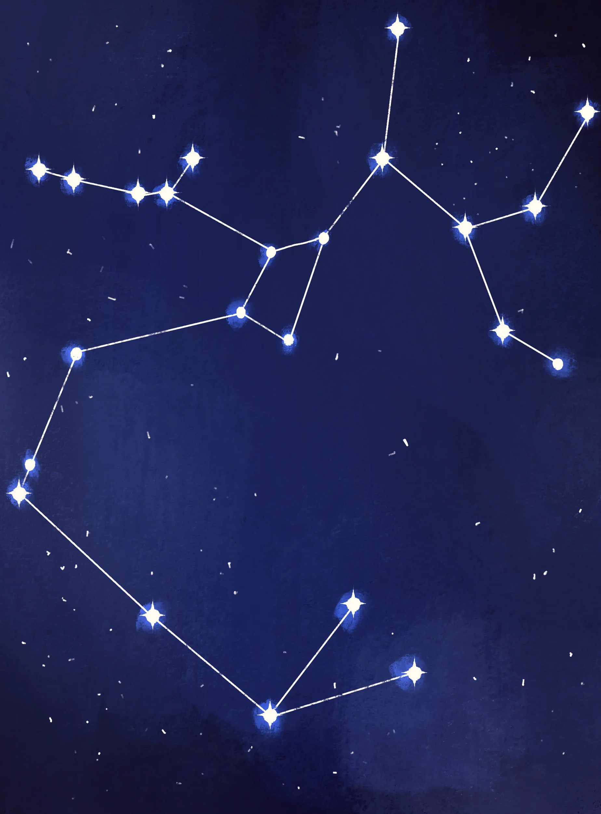

**Brief Visual Description:** Deep blue night sky with bright white 4-points-stars connected by thin

white lines forming a constellation (Sagittarius). Smaller stars in white dots are scattered in the

background.

**Dominant Colors:** Deep blue, white.

**Reasoning for Inclusion within Mibera:**

**General Real World Trait History:** Sagittarius, the ninth zodiac sign (November 22 - December

21), is a fire sign ruled by Jupiter. Symbolized by the Archer, it represents adventure, optimism,

and freedom. Sagittarians are known for their enthusiastic, open-minded, and philosophical

nature, often seeking truth and new experiences. Generally, they can be restless or blunt but are

generous, honest, and love exploring diverse cultures and ideas.

**Team Anecdotes:** -

**Date Created/Uploaded:** November 23, 2024

**Who Introduced the Trait:**

---

## Scorpius

**Name:** Scorpius

**Image Files:**

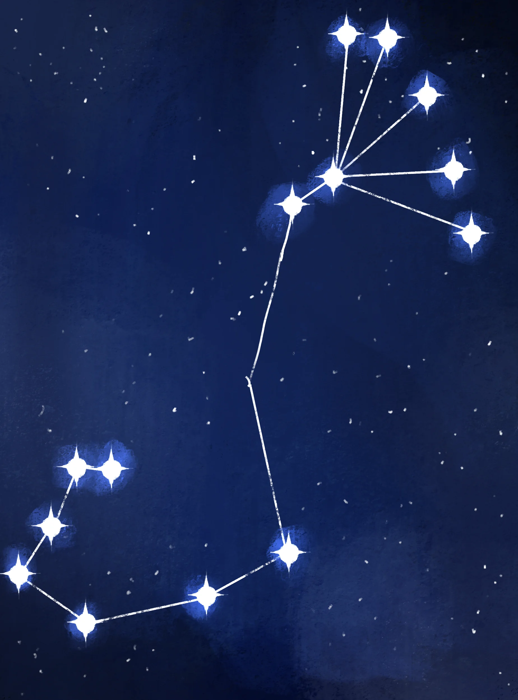

**Brief Visual Description:** Deep blue night sky with bright white 4-points-stars connected by thin

white lines forming a constellation (Scorpius). Smaller stars in white dots are scattered in the

background.

**Dominant Colors:** Deep blue, white.

**Reasoning for Inclusion within Mibera:**

**General Real World Trait History:** Scorpio, the eighth zodiac sign (October 23 - November

21), is a water sign ruled by Pluto and Mars. Symbolized by the Scorpion, it represents intensity,

passion, and transformation. Scorpios are known for their determined, secretive, and deeply

emotional nature, often possessing strong intuition and loyalty. Generally, they can be secretive

or intense but are resourceful and fiercely protective of loved ones.

**Team Anecdotes:** -

**Date Created/Uploaded:** November 23, 2024

**Who Introduced the Trait:**

---

## Aries

**Name:** Aries

**Image Files:**

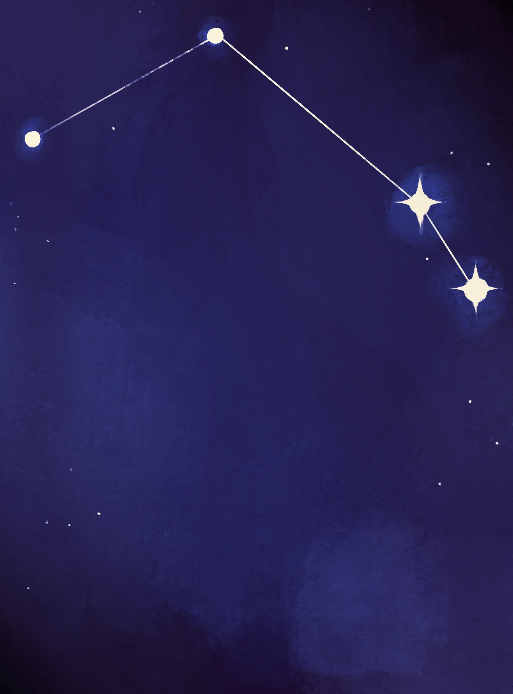

**Brief Visual Description:** Deep blue night sky with bright white 4-points-stars connected by thin

white lines forming a constellation (Aries). Smaller stars in white dots are scattered in the

background.

**Dominant Colors:** Deep blue, white.

**Reasoning for Inclusion within Mibera:**

**General Real World Trait History:** Aries, the first zodiac sign (March 21 - April 19), is a fire

sign ruled by Mars. Symbolized by the Ram, it represents boldness, energy, and initiative. Aries

individuals are known for their courageous, enthusiastic, and competitive nature, often taking on

leadership roles. Generally, they can be impulsive or headstrong but are dynamic, honest, and

thrive on action and challenges.

**Team Anecdotes:** -

**Date Created/Uploaded:** November 23, 2024

**Who Introduced the Trait:**

---

## Speakers

**Name:** Speakers

**Image Files:**

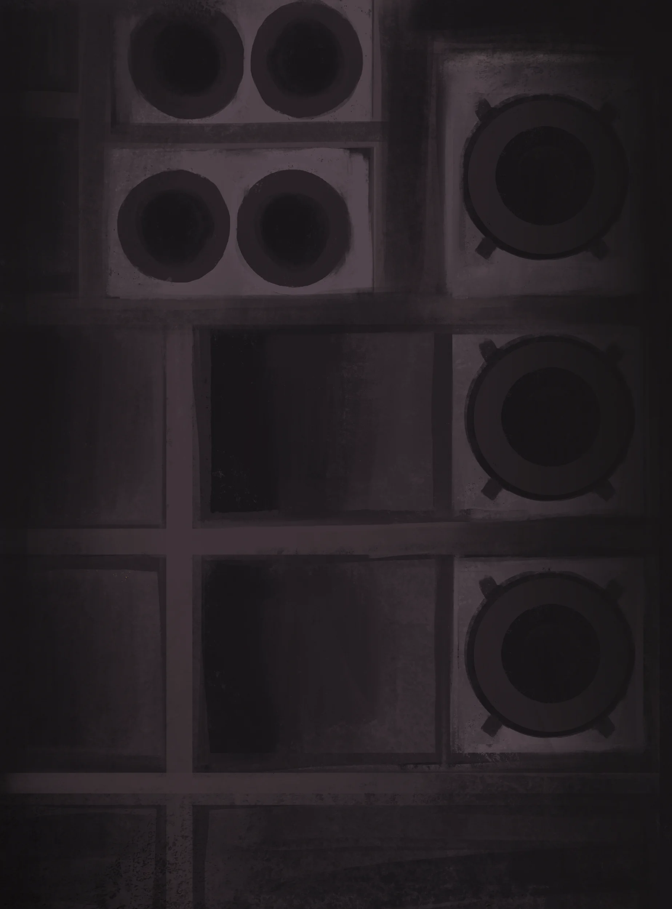

**Brief Visual Description:** Dark room with sound systems / speakers stacked in the

background.

**Dominant Colors:** Dark grey, black.

**Reasoning for Inclusion within Mibera:**

**General Real World Trait History:**

**Team Anecdotes:** -

**Date Created/Uploaded:** December 10, 2024

**Who Introduced the Trait:**

---

