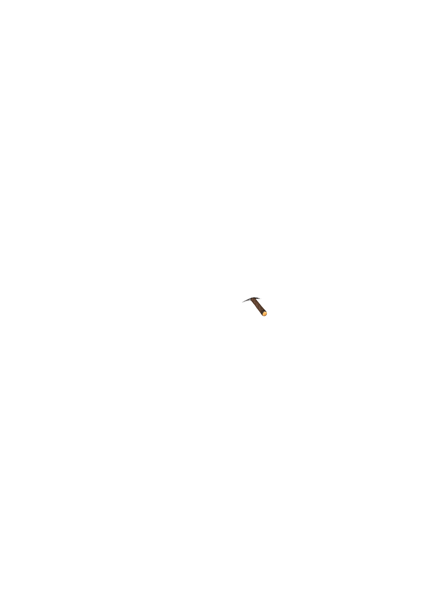
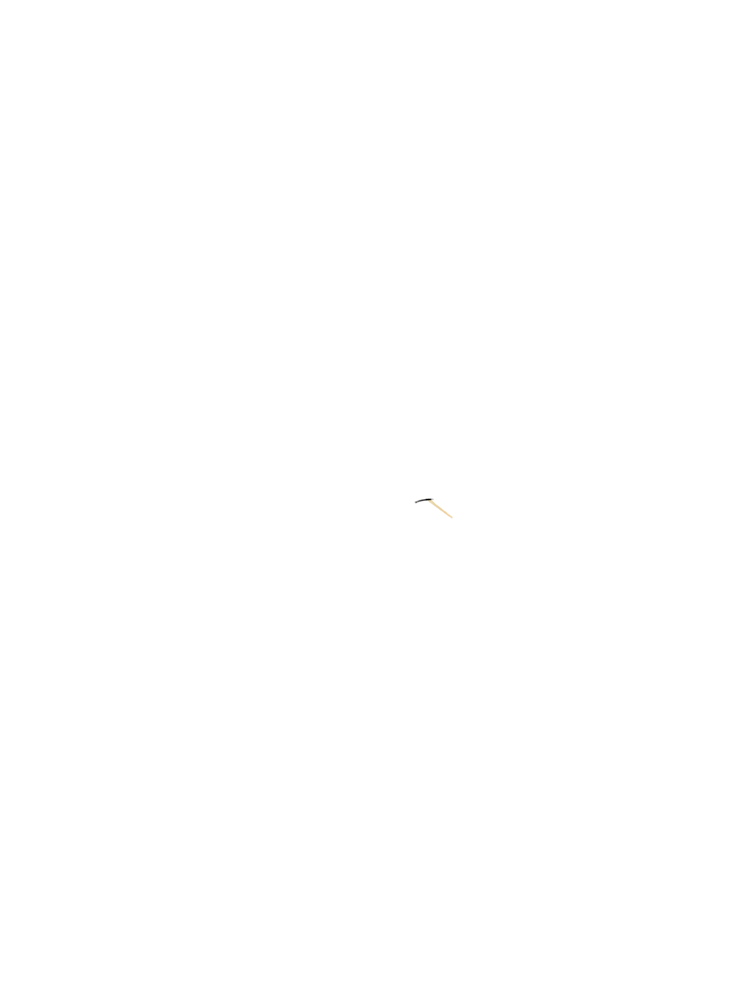
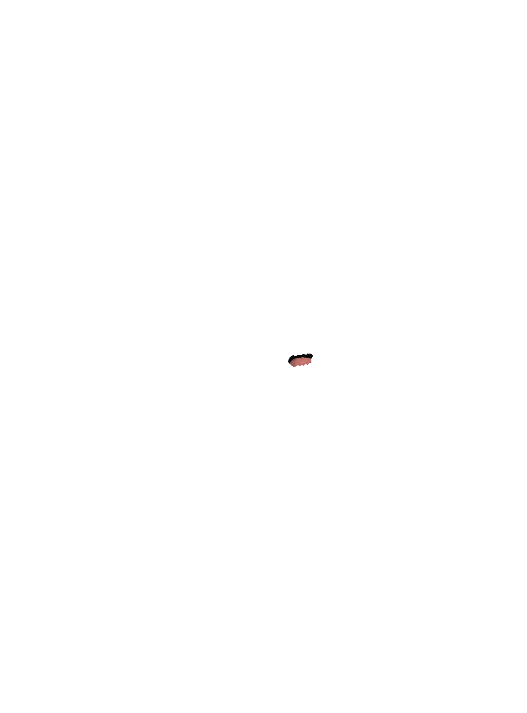
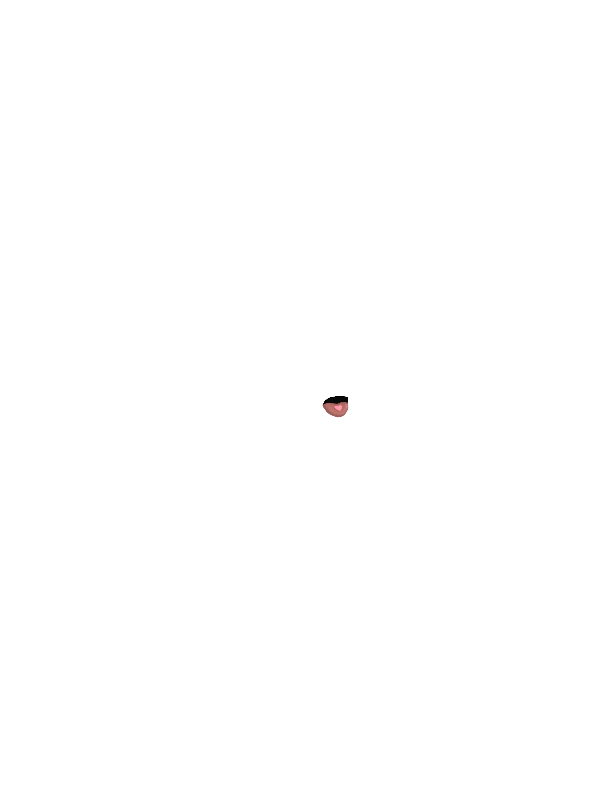
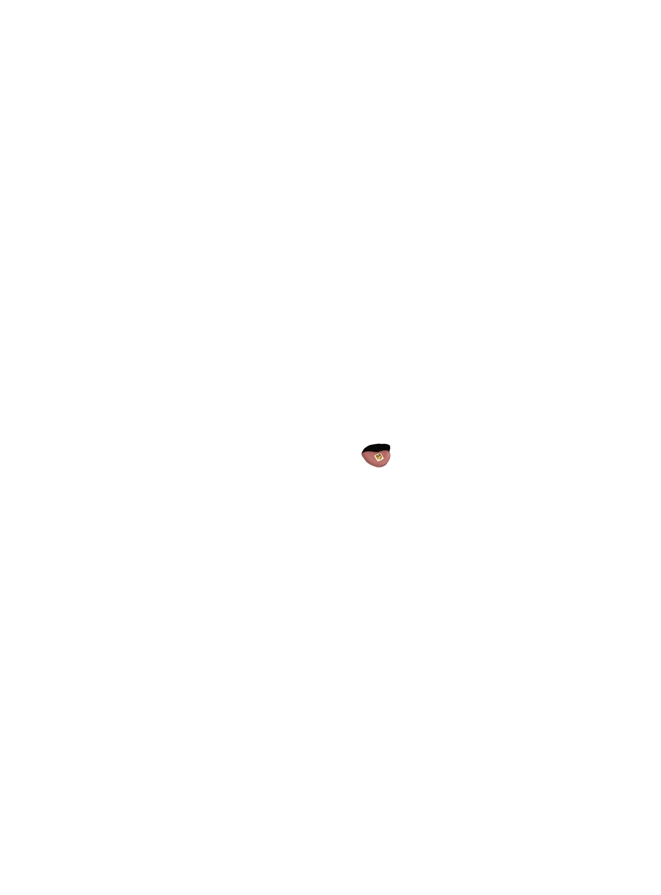
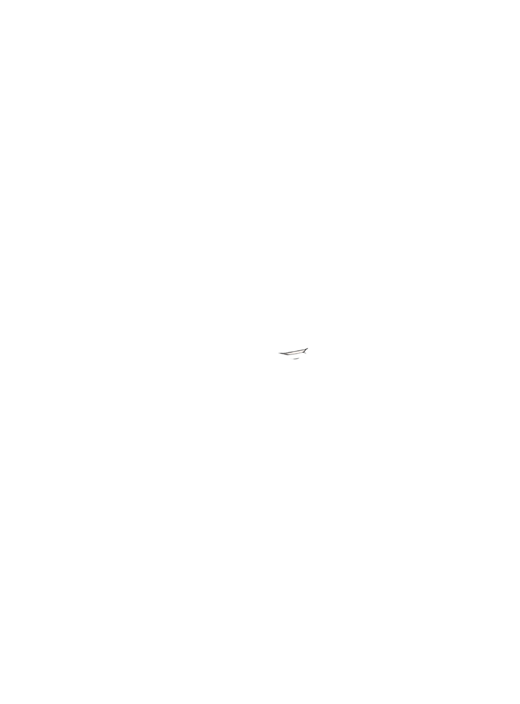

# Mouth

*Mouth expressions and styles.*

---

## queasy

MOUTH

**Name:** queasy

**Image Files:**

**Brief Visual Description:** a mouth made of a squiggly / trembly line.

**Dominant Colors:** black

**Reasoning for Inclusion within Mibera:**

**General Real World Trait History:** Not applicable

**Team Anecdotes:**

**Date Created / Uploaded:** June 5, 2024

**Who Introduced the Trait:** Fedor

**Trait Conflicts:**

---

## tongue

MOUTH

**Name:** tongue

**Image Files:**

**Brief Visual Description:** a small tongue, out of an open mouth.

**Dominant Colors:** dark pink

**Reasoning for Inclusion within Mibera:**

**General Real World Trait History:** Not applicable

**Team Anecdotes:**

**Date Created / Uploaded:** August 1st, 2024

**Who Introduced the Trait:** Gumi

**Trait Conflicts:**

---

## normal

MOUTH

**Name:** normal

**Image Files:**

**Brief Visual Description:** a mouth portrayed by a short thin stroke.

**Dominant Colors:** black

**Reasoning for Inclusion within Mibera:**

**General Real World Trait History:** Not applicable

**Team Anecdotes:**

**Date Created / Uploaded:** December 10, 2024

**Who Introduced the Trait:** Gumi

**Trait Conflicts:**

---

## smile

MOUTH

**Name:** smile

**Image Files:**

**Brief Visual Description:** a smile portrayed by a thin short curved line.

**Dominant Colors:** black

**Reasoning for Inclusion within Mibera:**

**General Real World Trait History:** Not applicable

**Team Anecdotes:**

**Date Created / Uploaded:** June 5, 2024

**Who Introduced the Trait:** Gumi

**Trait Conflicts:**

---

## content

**Name:** Content

**Image Files:**

**Brief Visual Description:** Subtle smile portrayed by a thin, short, slightly-curved line.

**Dominant Colors:** Black

**Reasoning for Inclusion within Mibera:**

**General Real World Trait History:** Not applicable

**Team Anecdotes:**

**Date Created / Uploaded:** June 5, 2024

**Who Introduced the Trait:** Gumi

**Trait Conflicts:**

---

## sad

MOUTH

**Name:** sad

**Image Files:**

**Brief Visual Description:** a sad portrayed by a short thin line with a pronounced downward

curve at one corner.

**Dominant Colors:** black

**Reasoning for Inclusion within Mibera:**

**General Real World Trait History:** Not applicable

**Team Anecdotes:**

**Date Created / Uploaded:** June 5, 2024

**Who Introduced the Trait:** Gumi

**Trait Conflicts:**

---

## blunted

MOUTH

**Name:** blunt

**Image Files:**

**Brief Visual Description:** a mouth portrayed by a line that’s slightly curved downward holding a

lighted blunt.

**Dominant Colors:** dark brown

**Reasoning for Inclusion within Mibera:**

**General Real World Trait History:** Not applicable

**Team Anecdotes:**

**Date Created / Uploaded:** June 5, 2024

**Who Introduced the Trait:** Gumi

**Trait Conflicts:**

---

## cig

MOUTH

**Name:** cig

**Image Files:**

**Brief Visual Description:** a mouth portrayed by a line that’s slightly curved downward holding a

lighted-up cigarette.

**Dominant Colors:** white

**Reasoning for Inclusion within Mibera:**

**General Real World Trait History:** Not applicable

**Team Anecdotes:**

**Date Created / Uploaded:** June 5, 2024

**Who Introduced the Trait:** Gumi

**Trait Conflicts:**

---

## toothpick

MOUTH

**Name:** toothpick

**Image Files:**

**Brief Visual Description:** a mouth portrayed by a nearly-straight line, holding a toothpick..

**Dominant Colors:** black, yellow

**Reasoning for Inclusion within Mibera:**

**General Real World Trait History:** Not applicable

**Team Anecdotes:**

**Date Created / Uploaded:** June 5, 2024

**Who Introduced the Trait:** Fedor

**Trait Conflicts:**

---

## blehhh

MOUTH

**Name:** blehhh

**Image Files:**

**Brief Visual Description:** tongue out of a thin mouth in a playful manner.

**Dominant Colors:** pink

**Reasoning for Inclusion within Mibera:**

**General Real World Trait History:** Not applicable

**Team Anecdotes:**

**Date Created / Uploaded:** June 5, 2024

**Who Introduced the Trait:** Gumi

**Trait Conflicts:**

---

## gasp

MOUTH

**Name:** gasp

**Image Files:**

**Brief Visual Description:** a gasping mouth, forming an oval shape, showing the teeth and the

tongue.

**Dominant Colors:** pink, white

**Reasoning for Inclusion within Mibera:**

**General Real World Trait History:** Not applicable

**Team Anecdotes:**

**Date Created / Uploaded:** June 5, 2024

**Who Introduced the Trait:** Gumi

**Trait Conflicts:**

---

## grit

MOUTH

**Name:** grit

**Image Files:**

**Brief Visual Description:** a tightly closed mouth with the teeth pressed firmly together.

**Dominant Colors:** white

**Reasoning for Inclusion within Mibera:**

**General Real World Trait History:** Not applicable

**Team Anecdotes:**

**Date Created / Uploaded:** June 5, 2024

**Who Introduced the Trait:** Gumi

**Trait Conflicts:**

---

## chuffed

MOUTH

**Name:** chuffed

**Image Files:**

**Brief Visual Description:** a short curved line showcasing a puffing cheek, and another one

portraying a smile.

**Dominant Colors:** black

**Reasoning for Inclusion within Mibera:**

**General Real World Trait History:** Not applicable

**Team Anecdotes:**

**Date Created / Uploaded:** June 5, 2024

**Who Introduced the Trait:** Gumi

**Trait Conflicts:**

---

## belch

MOUTH

**Name:** belch

**Image Files:**

**Brief Visual Description:** an open mouth with squiggly outline, portraying air movement.

**Dominant Colors:** pink

**Reasoning for Inclusion within Mibera:**

**General Real World Trait History:** Not applicable

**Team Anecdotes:**

**Date Created / Uploaded:** June 5, 2024

**Who Introduced the Trait:** Gumi

**Trait Conflicts:**

---

## drool

MOUTH

**Name:** drool

**Image Files:**

**Brief Visual Description:** a slightly open mouth with a visible tongue and drool dripping off of it.

**Dominant Colors:** pink

**Reasoning for Inclusion within Mibera:**

**General Real World Trait History:** Not applicable

**Team Anecdotes:**

**Date Created / Uploaded:** June 5, 2024

**Who Introduced the Trait:** Gumi

**Trait Conflicts:**

---

## gurn

MOUTH

**Name:** gurn

**Image Files:**

**Brief Visual Description:** a slightly open mouth showing teeth, heavily tilted.

**Dominant Colors:** white

**Reasoning for Inclusion within Mibera:**

**General Real World Trait History:** Not applicable

**Team Anecdotes:**

**Date Created / Uploaded:** June 5, 2024

**Who Introduced the Trait:** Jani

**Trait Conflicts:**

---

## heart

MOUTH

**Name:** heart

**Image Files:**

**Brief Visual Description:** a mouth with the tongue out with a heart shaped item on it.

**Dominant Colors:** pink

**Reasoning for Inclusion within Mibera:**

**General Real World Trait History:** Not applicable

**Team Anecdotes:**

**Date Created / Uploaded:** August 1st, 2024

**Who Introduced the Trait:** Gumi

**Trait Conflicts:**

---

## acid

MOUTH

**Name:** acid

**Image Files:**

**Brief Visual Description:** a mouth with the tongue out with a square-shaped item on it.

**Dominant Colors:** pink

**Reasoning for Inclusion within Mibera:**

**General Real World Trait History:** Not applicable

**Team Anecdotes:**

**Date Created / Uploaded:** August 1st, 2024

**Who Introduced the Trait:**

**Trait Conflicts:**

---

## biting lip

MOUTH

**Name:** biting lip

**Image Files:**

**Brief Visual Description:** a mouth showing the bottom lip being bitten, with a bit of teeth

exposed through the gap.

**Dominant Colors:** white

**Reasoning for Inclusion within Mibera:**

**General Real World Trait History:** Not applicable

**Team Anecdotes:**

**Date Created / Uploaded:** June 5, 2024

**Who Introduced the Trait:** Fedor

**Trait Conflicts:**

---

## meta mouth

MOUTH

**Name:** meta mouth

**Image Files:**

**Brief Visual Description:** a mouth made of the writing of the word ‘mouth’.

**Dominant Colors:** black

**Reasoning for Inclusion within Mibera:**

**General Real World Trait History:** Not applicable

**Team Anecdotes:**

**Date Created / Uploaded:** June 5, 2024

**Who Introduced the Trait:** Gumi

**Trait Conflicts:**

---

